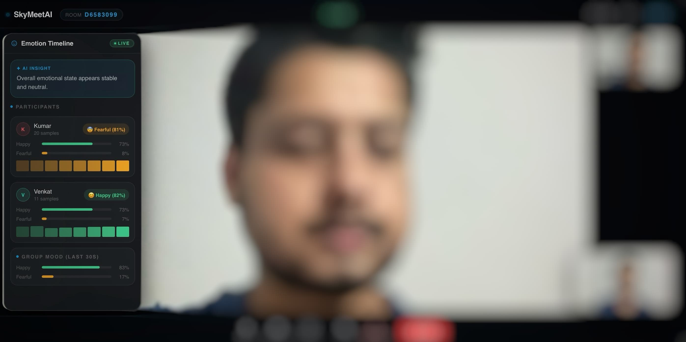

# SkyMeetAI

<div align="center">


> Real-time collaboration platform with a custom WebRTC engine, in-browser voice activity detection, and self-hosted multimodal emotion AI — achieving ~1.2–1.7s end-to-end inference latency (compute-bound).

A distributed, latency-sensitive video conferencing system designed for real-time analytics.
  - Decentralized P2P media (no SFU) for low-latency communication  
  - Horizontally scalable signaling (Node.js + Redis + Nginx)  
  - Self-hosted multimodal ML pipeline (Transformer + XGBoost)
  
[Live Demo](https://skymeetai.onrender.com) · [Report Bug](https://github.com/AnupamKumar-1/skymeetai/issues) · [Request Feature](https://github.com/AnupamKumar-1/skymeetai/issues)

</div>

---

## System Overview

> Designed for real-world conditions: unstable networks, packet loss, and cross-browser inconsistencies.

Most video conferencing tools tell you *what* was said. SkyMeetAI reveals *how people felt* while saying it.

SkyMeetAI is a distributed video conferencing system combining WebRTC mesh networking with a custom multimodal emotion recognition pipeline.

Unlike most systems, SkyMeetAI does not rely on external AI APIs — all emotion inference is performed using self-hosted models. This enables meeting hosts to understand participant engagement, sentiment shifts, and emotional dynamics in real time — something traditional conferencing tools lack.

The system consists of four independent services: a React frontend (Render), a Node.js signaling backend, an Emotion Service, and a Transcript Service. All backend services run on AWS EC2.

> Real-time pipelines use WebSocket streaming, while post-processing pipelines use HTTP-based batch workflows.

---

## Why SkyMeetAI?

Most video conferencing platforms optimize for communication — not understanding.

SkyMeetAI is built to answer a deeper question:

> "What is the emotional state of a meeting in real-time?"

This unlocks:
- Better remote collaboration (detect disengagement early)
- Data-driven meeting insights (emotion trends over time)
- Applications in hiring, education, and team analytics

### When to Use SkyMeetAI

- Small group meetings (≤6 participants) where low latency matters
- Scenarios requiring real-time behavioral insights (interviews, classrooms, team syncs)
- Systems where self-hosted AI and data privacy are required

---

## Key Highlights

- P2P WebRTC mesh architecture (serverless media path, TURN relay only when required)
- Real-time in-meeting chat with optimistic UI, ACK-based delivery, retry mechanism, and persistence
- Real-time emotion inference (video-first, multimodal, extensible architecture)
- Custom ML pipeline (Transformer + XGBoost ensemble + IsolationForest) — **73.0% test accuracy**
- Sliding window temporal modeling (8-frame sequence per inference)
- Speaker-attributed transcription using Whisper with per-segment emotion tagging
- Horizontally scalable signaling layer (Node.js + Redis pub/sub, 3 PM2 instances)
- Latency-first design: inference always runs on freshest frame via overwrite buffer (no queue buildup)
- Fault-tolerant architecture with automatic reconnection and graceful degradation
- Idempotent event handling and retry-safe messaging across reconnects

---

## Core Engineering Highlights

- In-browser Voice Activity Detection (RMS + noise gating + speech qualification)
- WebRTC Perfect Negotiation (collision-safe multi-peer signaling)
- Stateful meeting engine with reconnection + lifecycle recovery
- Idempotent real-time messaging (ACK + retry + deduplication)
- Bounded-latency streaming via overwrite buffer (O(1) memory)
- Capability-based host authorization (no session dependency)
- Distributed Redis lock on room join (Lua CAS script) — prevents race conditions
- Dual-path emotion ingestion (direct WebSocket + backend proxy fallback)

---

## Product Overview

A real-time meeting where **emotion, speech, and interaction are analyzed live and post-call**.

---

## Screenshots

### Real-time Emotion Analysis



> Real-time emotion inference with per-participant tracking and group mood aggregation

---

### Meeting Interface


> Low-latency WebRTC mesh with in-meeting controls, chat, and media orchestration

---

### Transcript & Post-Meeting Insights


> Speaker-attributed transcripts enriched with segment-level emotion classification

---

## Architecture

```
+-----------------------------------------------------------------------------------+
|                              CLIENT (React 18)                                    |
|-----------------------------------------------------------------------------------|
|  WebRTC Mesh (P2P)  |  Socket.IO (Signaling + Chat)  |  REST API  |  Emotion WS   |
+----------+-----------+-----------+-----------+-----------+-----------+------------+
           |                       |                       |           |
           v                       v                       v           v

   P2P Media (Direct)     +-------------------------------+    +-------------------------------+
   (No server in path)    |       Node.js Backend         |    |        Emotion Service        |
                          |  Express + Socket.IO          |    |      FastAPI + ASGI           |
                          |                               |    |                               |
                          |  - Stateless (Redis-backed)   |    |  - WebSocket Ingest           |
                          |  - 3 PM2 Instances            |    |  - Frame Pump                 |
                          |    (8000 / 8001 / 8002)       |    |  - Overwrite buffer           |
                          |  - Nginx Load Balancer        |    |    (latest-frame only)        |
                          |                               |    |  - Frame skip (7x)            |
                          |  - Signaling (SDP/ICE relay)  |    |  - Sequence buffer            |
                          |                               |    |    (8-frame sliding window)   |
                          |  - Chat (Socket.IO)           |    |                               |
                          |     • ACK + retry             |    |  - PyFeat (face)              |
                          |     • Rate limiting (Redis)   |    |  - Transformer                |
                          |     • Deduplication           |    |  - XGBoost                    |
                          |     • MongoDB persistence     |    +-------------------------------+
                          |                               |
                          |  - Transcript Proxy           |
                          |  - Redis Pub/Sub              |
                          |  - WS Proxy (/emotion-socket) |
                          +---------------+---------------+
                                          |
                                          | HTTP (POST /process_meeting)
                                          v
                          +-----------------------------------------------+
                          |            Transcript Service                 |
                          |            FastAPI (stateless)                |
                          |                                               |
                          |  - Whisper ASR                                |
                          |  - DistilRoBERTa Emotion NLP                  |
                          |  - Speaker-attributed merging                 |
                          |  - Segment-level filtering                    |
                          +----------------------+------------------------+
                                                 |
                                                 | POST /api/v1/transcripts
                                                 v
                          +-----------------------------------------------+
                          |                 MongoDB                        |
                          |   meetings + chat + history + transcripts     |
                          +-----------------------------------------------+
```

Emotion inference supports dual ingestion paths:
- Direct client → Emotion Service WebSocket (primary, low latency)
- Client → Node.js → Emotion Service proxy (fallback, controlled routing)

---

## Performance

> Metrics collected using high-resolution timers across AWS EC2 and macOS (M1).

### Core Latency

| Metric | Value |
|--------|-------|
| WebRTC signaling latency | ~0.02–4.3 ms |
| Room join latency (client-perceived) | ~65–420 ms |
| Capture → inference → emit (steady-state) | ~1.2–1.7 s |
| Cold start latency | up to ~4–5 s |

### Emotion Pipeline Breakdown

| Stage | Latency |
|-------|---------|
| Frame decode | ~1–5 ms |
| Face detection + feature extraction | ~1.1–1.7 s |
| Model inference | ~5–20 ms |

> Feature extraction accounts for >95% of pipeline latency. The system is compute-bound — GPU deployment would reduce end-to-end latency significantly.

### Key Properties

- **O(1) memory** per participant (overwrite buffer, no queue)
- Latency **stays stable** under high frame rates — does not grow with input rate
- **8-frame sliding window** for temporal consistency

---

## Tradeoffs & Limitations

- **WebRTC Mesh (O(N²))** — limits scalability to 4–6 participants; chosen for simplicity and low latency
- **Video-first real-time inference** — audio excluded at runtime due to latency constraints; full multimodal available in batch only
- **CPU-based inference** — ~1.2–1.7s per frame; GPU deployment would significantly reduce latency
- **Emotion accuracy (~73.0% test)** — limited by RAVDESS dataset size; real-world performance may vary under noise

---


## Quick Start

**Prerequisites:** Node.js 20, Python 3.11, MongoDB, Redis 7, ffmpeg

```bash
git clone https://github.com/AnupamKumar-1/skymeetai.git
cd skymeetai
```

**Backend:**
```bash
cd backend
cp .env.example .env
npm install
npm run dev
```

**Frontend:**
```bash
cd frontend
cp .env.example .env
npm install
npm start
```

**Emotion Service:**
```bash
cd emotion_service
python -m venv venv && source venv/bin/activate
pip install -r requirements.txt
uvicorn app:app --host 0.0.0.0 --port 5002 --reload
```

**Transcript Service:**
```bash
cd transcript_service
python -m venv venv && source venv/bin/activate
pip install -r requirements.txt
uvicorn app:app --host 0.0.0.0 --port 5001 --reload
```

---

## Documentation

### 1. System Overview
| Doc | Description |
|-----|-------------|
| [Architecture](docs/architecture.md) | High-level system design, services, infrastructure, deployment |
| [Data Flow](docs/data-flow.md) | End-to-end flow: room join, signaling, chat, emotion, transcripts |

---

### 2. Client & Interaction Layer
| Doc | Description |
|-----|-------------|
| [Frontend](docs/frontend.md) | React architecture, hooks, media handling, UI state orchestration |
| [Chat System](docs/chat-system.md) | Real-time messaging, ACK, retry, deduplication |

---

### 3. Intelligence Layer
| Doc | Description |
|-----|-------------|
| [ML Pipeline](docs/ml-pipeline.md) | Dataset, feature extraction, model architecture, ensemble, results |

---

### 4. Interfaces & Contracts
| Doc | Description |
|-----|-------------|
| [API Reference](docs/api.md) | REST APIs, Socket.IO events, service contracts |

---

### 5. System Qualities
| Doc | Description |
|-----|-------------|
| [Performance](docs/performance.md) | Latency, throughput, streaming design, scalability limits |
| [Reliability](docs/reliability.md) | Fault tolerance, reconnection, idempotency, backpressure handling |
| [Security](docs/security.md) | Auth, authorization, validation, rate limiting, threat model |

---

## License

MIT — see [LICENSE](LICENSE) for details.