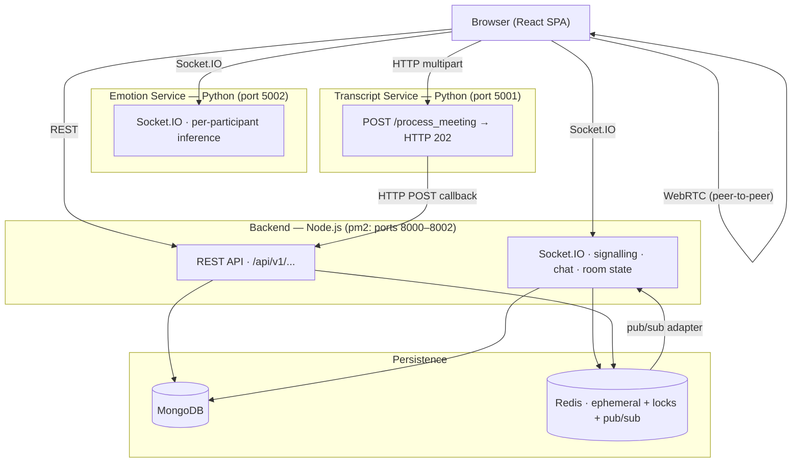
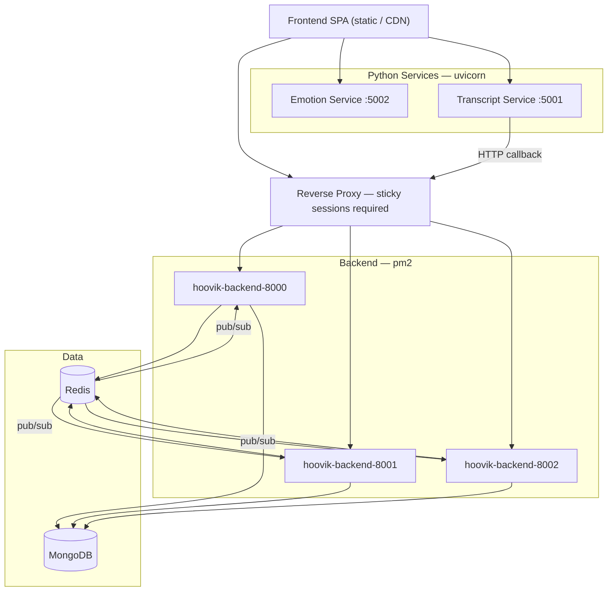

<div align="center">

<br/>


<h1>
  <picture>
    <source media="(prefers-color-scheme: dark)" srcset="https://readme-typing-svg.demolab.com?font=Syne&weight=800&size=52&pause=1000&color=FFFFFF&center=true&vCenter=true&width=400&height=70&lines=Hoovik" />
    
  </picture>
</h1>

<p align="center">
  
  &nbsp;
  
  &nbsp;
  
</p>

<p align="center">
  <em>Open-source, AI-powered video meeting platform with real-time emotion analysis, meeting transcription, and distributed backend architecture.</em>
</p>

<br/>

<p align="center">
  <a href="https://github.com/AnupamKumar-1/Hoovik/actions/workflows/ci.yml">
    
  </a>
  &nbsp;
  <a href="https://github.com/AnupamKumar-1/Hoovik/stargazers">
    
  </a>
  &nbsp;
  
  &nbsp;
  
</p>

<p align="center">If you find this project useful, a ⭐ goes a long way — thank you!</p>

<br/>

<a href="https://hoovik.onrender.com">
  
</a>

<br/><br/>


<br/>

<table>
  <thead>
    <tr>
      <th align="center">Frontend</th>
      <th align="center">Backend (Node.js)</th>
      <th align="center">Emotion Service</th>
      <th align="center">Transcript Service</th>
    </tr>
  </thead>
  <tbody>
    <tr>
      <td align="center"></td>
      <td align="center"></td>
      <td align="center"></td>
      <td align="center"></td>
    </tr>
  </tbody>
</table>

</div>

---

## What Hoovik Does

Hoovik is an open-source AI-powered video meeting platform built as four independently deployed services with a distributed backend architecture:

- **WebRTC peer-to-peer video/audio** — audio/video streams are exchanged directly between participants; backend handles signalling only
- **Real-time multimodal emotion inference** — per-participant facial + audio analysis with ~300–500 ms observed P50 latency during local testing with 10 concurrent participants
- **Async meeting transcription + AI summaries** — Whisper ASR → per-segment emotion → Groq LLM summary with NLP-vs-live discrepancy detection
- **Multi-process Node.js backend** — 3 pm2 instances unified via Redis pub/sub; distributed join locks; JWT auth with refresh token rotation
- **25-test Redis suite** — distributed cache, locks, rate limiting, pub/sub, reconnection recovery

### Stack

<p>
  
  
  
  
  
  
  
  
</p>

> **[Detailed architecture ↓](#system-architecture)**

---

## Table of Contents

- [What Hoovik Does](#what-hoovik-does)
  - [Stack](#stack)
- [Table of Contents](#table-of-contents)
- [Key Technical Highlights](#key-technical-highlights)
- [Services Overview](#services-overview)
  - [Transports](#transports)
- [System Architecture](#system-architecture)
  - [State Map](#state-map)
- [Deployment Topology](#deployment-topology)
- [Running the System](#running-the-system)
  - [Quick start](#quick-start)
  - [Step by step](#step-by-step)
- [Engineering Challenges](#engineering-challenges)
- [Known Limitations](#known-limitations)
- [Dataset](#dataset)
- [Contributing](#contributing)
- [License](#license)
- [Documentation](#documentation)

---

## Key Technical Highlights

| Area | What was built |
|---|---|
| **WebRTC signalling** | SDP/ICE relay over Socket.IO; Redis adapter fans events across 3 pm2 processes; distributed join lock (`SET NX PX 10000` + Lua CAS) serialises concurrent joins |
| **Multimodal emotion inference** | Per-participant: MediaPipe face landmarks + Wav2Vec2 audio → `EmotionTransformer` (PyTorch) + XGBoost → EMA smoothing + anomaly detection; **~300–500 ms observed P50 latency during local testing with 10 concurrent participants**; server-side backpressure; live P50/P90/P95 at `GET /stats` |
| **Browser media pipeline** | `AudioWorklet` + `AnalyserNode` for RMS-gated noise detection; `MediaRecorder` per participant; JPEG frames from `<video>` at self-throttled rates; SSRC-based active speaker with RMS fallback |
| **Async transcript pipeline** | HTTP 202 immediately; background: ffmpeg → Whisper (`small`) → DistilRoBERTa per-segment emotion → speaker merge → HTTP POST callback to backend (3 retries, 5 s → 15 s → 30 s) |
| **Multi-process backend** | 3 pm2 instances unified by `@socket.io/redis-adapter`; all room state in Redis — no in-process state; participant map as Redis Hash (`HSET`/`HDEL` per event) |
| **Auth & rate limiting** | JWT + HttpOnly refresh token rotation; per-IP and per-username rate limiting via Redis Lua INCR+EXPIRE; account lockout after 10 failed logins; uniform `401` prevents username enumeration |
| **Chat** | Server-assigned timestamps; `chat-ack` delivery confirmation; 5,000 ms ACK timeout with user-initiated retry; capped at 500 messages |
| **Host verification** | `declare-host` verified server-side against `hostSecretHash` (SHA-256); `isHost` state set only after server ACK; `end-meeting` guard on `socket.data.isHost` |
| **AI summary** | `POST /transcripts/:id/summary` annotates Whisper segments with live facial/audio emotion per speaker; returns `discrepancies` array (NLP-vs-live mismatches); rate-limited 2× per 2 hours |
| **Redis test suite** | **25 tests** covering distributed cache, locks, rate limiting, pub/sub, batch ops, reconnection recovery; CI runs 20 via `npm run test:redis:ci` |

---

## Services Overview

| Service | Runtime | Role |
|---|---|---|
| **Frontend** | React SPA | UI, WebRTC, emotion capture, chat, transcript viewer |
| **Backend** | Node.js / Express + Socket.IO | Signalling, auth, room management, transcript storage |
| **Emotion Service** | Python / FastAPI + Socket.IO | Real-time multimodal emotion inference |
| **Transcript Service** | Python / FastAPI | Post-meeting ASR, per-segment emotion, callback delivery |

### Transports

| Transport | Between | Purpose |
|---|---|---|
| WebRTC | Browser ↔ Browser (via backend signalling) | Live audio/video — never proxied through backend |
| Socket.IO / WS | Frontend ↔ Backend | SDP/ICE relay, chat, participant state, room lifecycle |
| Socket.IO / WS | Frontend ↔ Emotion Service | `emotion.frame` (JPEG), `audio_chunk` (Float32 PCM), `emotion.result` |
| HTTP multipart POST | Frontend → Transcript Service | Audio blob upload after meeting ends |
| HTTP REST | Frontend ↔ Backend | Auth, rooms, transcripts, meeting history |

---

## System Architecture



### State Map

| Store | What lives there |
|---|---|
| **MongoDB** | Users, rooms, meetings, chat history (cap: 500), transcripts, AI summaries |
| **Redis** | Participant maps (Hash), socket-ID arrays, join locks, rate limit counters, account lock flags, TTL caches |
| **In-process — Backend** | Nothing — all room state is in Redis |
| **In-process — Emotion Service** | Embedding buffers, EMA state, pump coroutine handles (not shared across instances) |
| **Browser localStorage** | JWT, `host:<code>` secret, `emotions:<code>` + `emotionNames:<code>` for AI summary |

---

## Deployment Topology



| Service | Notes |
|---|---|
| **Backend (pm2)** | 3 instances on ports 8000–8002; 512 MiB `max_memory_restart`; exponential-backoff restart; `merge_logs: true` |
| **Emotion Service** | Single uvicorn process; in-process participant state — no horizontal scaling without Redis-backed externalisation |
| **Transcript Service** | Single uvicorn process; models loaded at startup; uploads deleted after 120 s |
| **MongoDB + Redis** | Both required at startup — connection failure → `process.exit(1)` |

> Docker / Kubernetes / cloud autoscaling not implemented.

---

## Running the System

### Quick start

```bash
chmod +x dev.sh   # one-time
./dev.sh          # starts all 4 services in parallel with colour-coded output
```

| Prefix | Service | Port |
|---|---|---|
| `FRONTEND` | React SPA | `3000` |
| `BACKEND` | Node.js / Express + Socket.IO | `8000` |
| `EMOTION` | FastAPI emotion inference | `5002` |
| `TRANSCRIPT` | FastAPI transcription pipeline | `5001` |

> Python venvs must exist at `emotion_service/venv` and `transcript_service/venv`. Start MongoDB and Redis first. `Ctrl+C` shuts down all services cleanly.

### Step by step

**1 — MongoDB + Redis**
```bash
mongod --dbpath /data/db
redis-server
```

**2 — Backend**
```bash
cd backend && npm install
pm2 start ecosystem.config.cjs          # production (3 processes)
PORT=8000 node src/app.js               # single-process dev
```

Redis tests:
```bash
npm run test:redis      # 25 tests (kills + restarts local Redis)
npm run test:redis:ci   # 20 tests (no recovery tests — safe for CI)
```

**3 — Emotion Service**
```bash
cd emotion_service && pip install -r requirements.txt
uvicorn app:app --host 0.0.0.0 --port 5002
```
> `models/` must contain `best_modal.pt`, `xgb_model.joblib`, `weights.json`, and anomaly detectors.

**4 — Transcript Service**
```bash
cd transcript_service && pip install -r requirements.txt
uvicorn app:app --host 0.0.0.0 --port 5001
```
> `ffmpeg` must be in `PATH` — validated at startup. Whisper + DistilRoBERTa downloaded from HuggingFace on first run.

**5 — Frontend**
```bash
cd frontend && npm install
npm start        # dev
npm run build    # production
```

---

## Engineering Challenges

**1 — Multi-process Socket.IO fan-out** — `@socket.io/redis-adapter` uses Redis pub/sub to deliver events across all 3 pm2 instances. All room state lives in Redis so any process can serve any client. Sticky sessions at the load balancer are still required for the Socket.IO handshake.

**2 — Concurrent join races** — Without coordination, parallel joins produce lost updates. A Redis distributed lock (`SET NX PX 10000`, Lua CAS release) serialises participant state mutations within a 10-second window per room.

**3 — CPU-bound inference without blocking** — The emotion service runs PyTorch and MediaPipe inside per-participant async pump coroutines, offloading to a thread-pool executor. Backpressure events throttle the client when the face queue depth hits 3, preventing memory growth.

**4 — Async transcript delivery with no shared state** — Services share no DB or queue. The transcript service delivers via HTTP POST callback to the backend. The frontend polls every 20 s (up to 30 attempts) rather than waiting for a push — fully decoupled but eventually consistent.

**5 — Parallel media capture in the browser** — Host simultaneously plays WebRTC video, captures frames for emotion analysis, and records audio for transcription. Three separate tap points avoid interference: `captureStream()` for frames, cloned `MediaStream` + `AudioWorklet` for recording, standard `<video>` for playback.

**6 — Reconnect state gap** — Backend reconstructs participant records from Redis on reconnect. The emotion service holds per-participant inference state in process memory. The two stores are not reconciled — stale buffers may persist in the emotion service after a reconnect.

---

## Known Limitations

| Area | Limitation |
|---|---|
| **Inference scaling** | Emotion service in-process state cannot be horizontally scaled without externalising to Redis. Transcript service model singletons have the same constraint. |
| **Transcript delivery** | A crashed transcription process or empty merged-segment result causes silent data loss. Network/5xx failures are retried (3×) and the user is alerted on final failure. |
| **Cleanup timer** | `cleanupOldMeetings` runs in all 3 pm2 processes independently every hour — no distributed leader election. |
| **Transcription language** | Whisper hardcoded to `language="en"`. Multilingual meetings produce degraded output. |
| **Orchestration** | No unified supervisor across 4 services. Only the emotion service exposes `GET /health` and `GET /ready`. |
| **CORS** | Backend allows `localhost:3000` + one `CLIENT_ORIGIN`. Additional origins require a code change. |
| **Frontend — camera mute diff** | `cameraEnabled` always passed as `true` in remote mute sync; camera state is not tracked in the diff. |
| **Frontend — hot reload** | `_activeRooms` module-level `Set` persists across React hot-reloads in dev, which can suppress room re-entry. |
| **Chat history** | Capped at 500 messages; no archival or export. |

---

## Dataset

The `EmotionTransformer` + XGBoost ensemble was trained on a custom dataset of paired audio/video embedding sequences with ground-truth emotion labels, collected across multiple participants and lighting conditions.

**Download**: [dataset.npz — Google Drive](https://drive.google.com/file/d/135wYH7DB8_10Jc8g08MfC6Poews_Lkgp/view?usp=sharing)

Place under `emotion_service/extracted_dataset/` before running the training pipeline. Not required to run the inference server — only pre-trained model files under `models/` are needed. See [`docs/emotion-service.md`](docs/emotion-service.md) for the full training procedure.

---

## Contributing

See [`docs/CONTRIBUTING.md`](docs/CONTRIBUTING.md) — covers prerequisites, local setup, env configuration, load testing, and PR checklist.

---

## License

MIT — see [LICENSE](LICENSE).

---

## Documentation

| File | Contents |
|---|---|
| [`docs/frontend.md`](docs/frontend.md) | Hook architecture, WebRTC lifecycle, emotion pipeline, event contracts, error handling |
| [`docs/backend.md`](docs/backend.md) | Routes, Socket.IO handlers, Redis lock design, pm2 config, API contracts, security |
| [`docs/realTimeEmotionService.md`](docs/realTimeEmotionService.md) | Inference pipeline, model training, configuration schema, performance |
| [`docs/transcript_service.md`](docs/transcript_service.md) | ASR pipeline, segment merging, callback schema, error handling |
| [`docs/CONTRIBUTING.md`](docs/CONTRIBUTING.md) | Setup guide, prerequisites, contribution workflow |