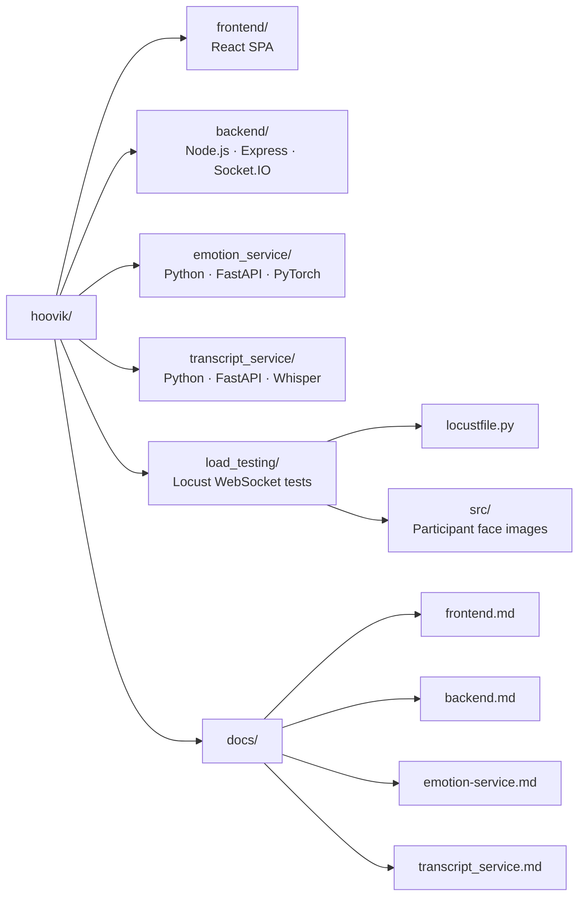
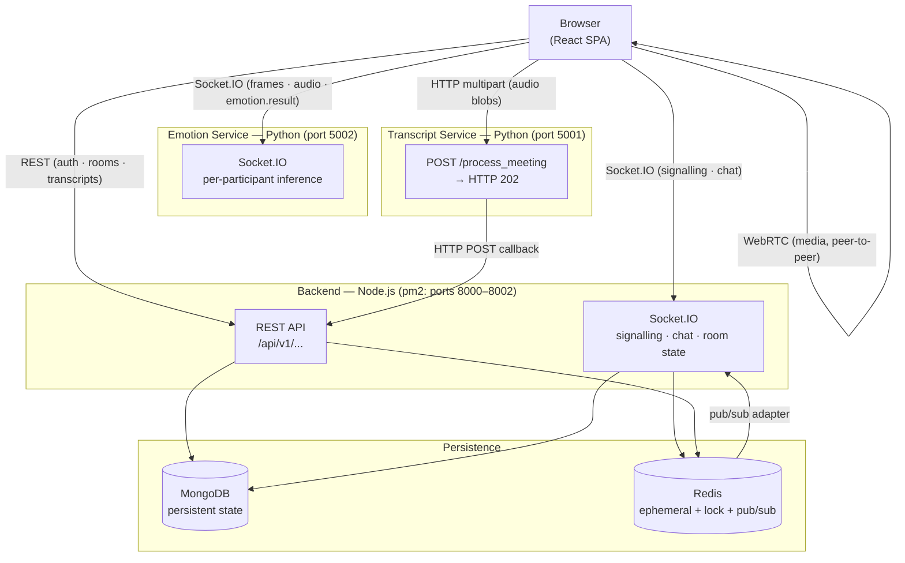
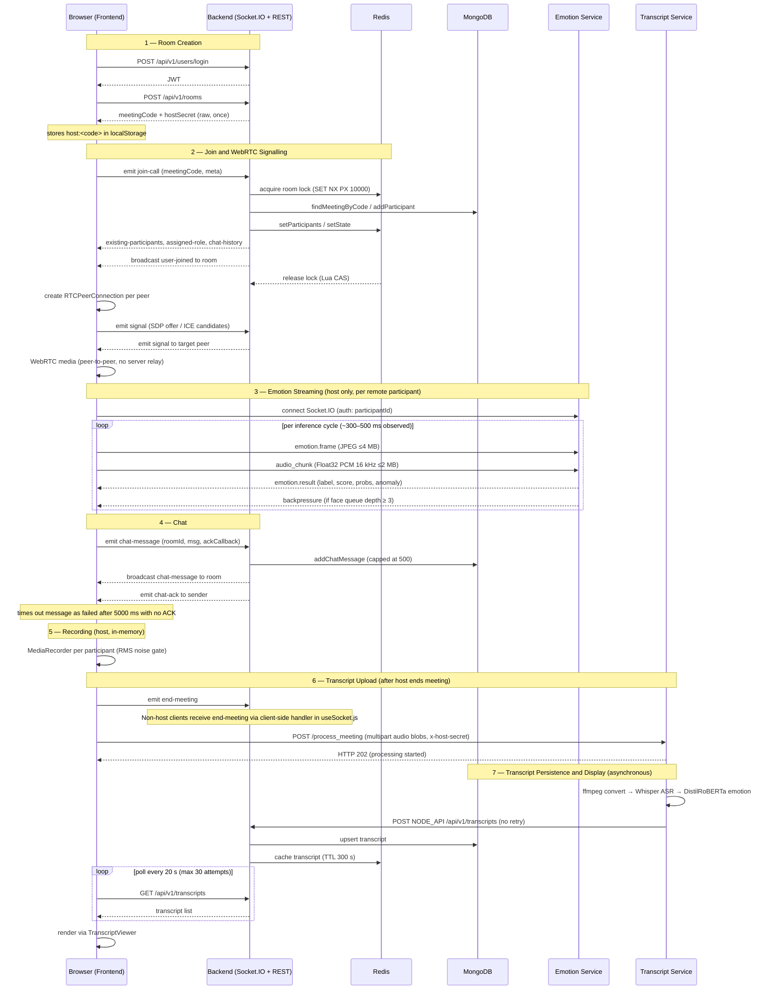
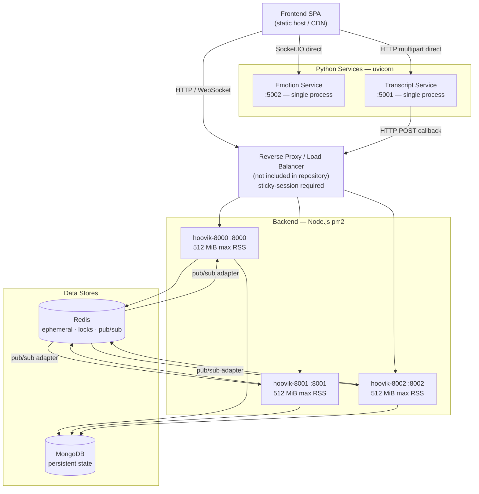
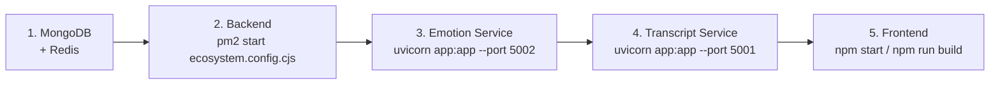
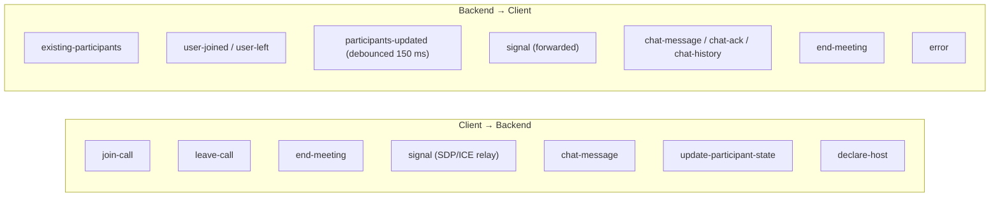
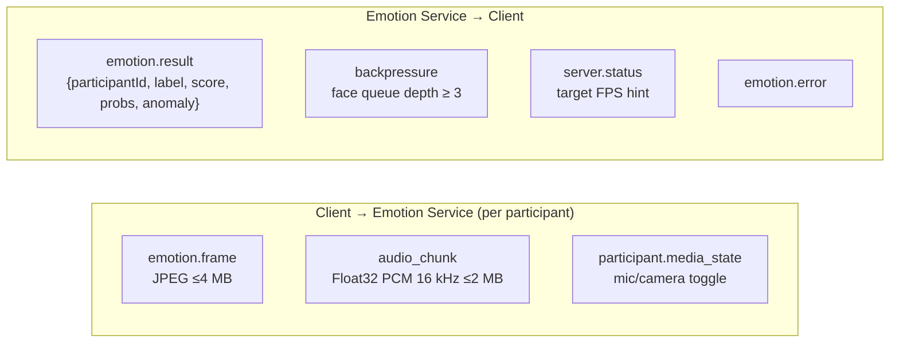
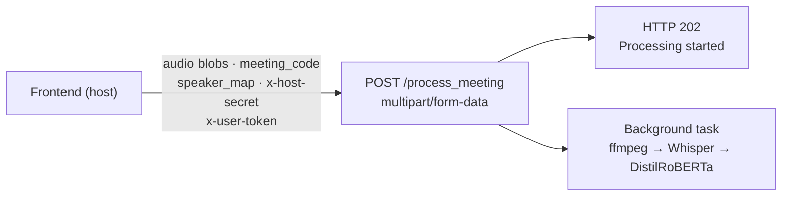
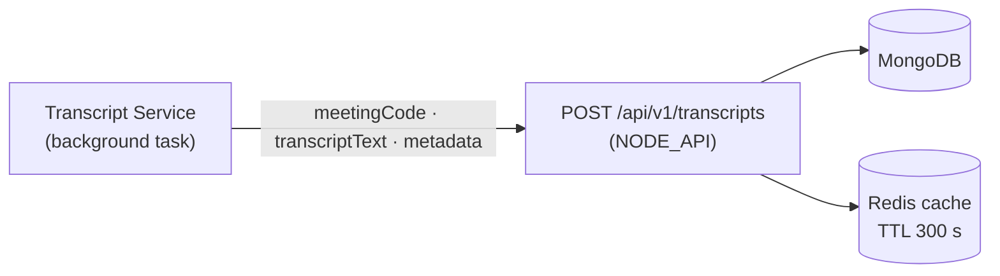

# Hoovik

> A distributed, full-stack video meeting platform combining WebRTC peer-to-peer media, real-time multimodal emotion inference, in-meeting chat, and asynchronous transcript analysis — implemented as four independently deployed services.


[](https://github.com/AnupamKumar-1/Hoovik/stargazers)

If you find this project useful, a ⭐ goes a long way — thank you!

**Live Demo:** https://hoovik.onrender.com

| Frontend | Backend (Node.js) | Emotion Service | Transcript Service |
|----------|------------------|-----------------|-------------------|
| Render | Render | Azure | Azure |


Hoovik was built from scratch to explore:
- real-time communication systems,
- distributed backend coordination,
- browser media pipelines,
- and multimodal ML inference.

The platform includes:
- a React/WebRTC frontend,
- a multi-process Node.js + Socket.IO backend,
- a Python emotion inference service,
- and a Whisper-based transcription pipeline.

This repository documents the system at an implementation-grounded architectural level, including service boundaries, transport contracts, runtime behaviour, and operational limitations.

---

## Table of Contents

1. [Key Technical Highlights](#key-technical-highlights)
2. [Overview](#overview)
3. [Repository Structure](#repository-structure)
4. [System Architecture](#system-architecture)
5. [Subsystems](#subsystems)
6. [End-to-End Runtime Flow](#end-to-end-runtime-flow)
7. [Deployment Topology](#deployment-topology)
8. [Configuration](#configuration)
9. [Dataset](#dataset)
10. [Running the System](#running-the-system)
11. [Inter-Service Contracts](#inter-service-contracts)
12. [Engineering Challenges](#engineering-challenges)
13. [Operational Notes](#operational-notes)
14. [Known Limitations](#known-limitations)
15. [Contributing](#contributing)
16. [License](#license)
17. [Documentation](#documentation)

---

## Key Technical Highlights

These are the non-trivial engineering decisions made across the stack, grounded in the implemented code.

| Area | What was built |
|---|---|
| **WebRTC signalling** | Full SDP/ICE relay over Socket.IO with Redis-adapter fan-out across three pm2 processes; distributed join lock (Redis `SET NX PX`) prevents race conditions when multiple participants join simultaneously |
| **Multimodal emotion inference** | Per-participant ensemble pipeline: MediaPipe face landmarks + Wav2Vec2 audio embeddings → custom `EmotionTransformer` (PyTorch) + XGBoost → EMA smoothing + modality-stratified anomaly detection; served over Socket.IO with server-side backpressure signalling; live per-modality latency percentiles exposed at `GET /stats` and `GET /stats/json` |
| **Browser media pipeline** | `AudioWorklet` + `AnalyserNode` for RMS-gated noise detection; `MediaRecorder` per participant for post-meeting audio; `RTCPeerConnection` lifecycle managed per remote peer in React; JPEG frames captured from `<video>` elements at self-throttled rates |
| **Asynchronous transcript pipeline** | HTTP 202 accepted immediately; background FastAPI task runs ffmpeg → Whisper (`small`) → DistilRoBERTa per-segment emotion → multi-speaker segment merge → HTTP POST callback to backend |
| **Multi-process backend** | Three pm2 instances on separate ports, unified by `@socket.io/redis-adapter` pub/sub; all room state externalised to Redis so no instance holds authoritative in-process state |
| **Rate limiting and account locking** | Per-IP and per-user rate limiting via Redis counters; account lock after `ACCOUNT_LOCK_THRESHOLD` consecutive failed logins with a fixed TTL (`ACCOUNT_LOCK_SEC`, default 900 s) implemented in the auth layer |
| **Chat with client-side ACK timeout** | Backend appends sanitised messages to MongoDB (capped at 500), broadcasts, and emits `chat-ack`; client marks message failed after 5 000 ms with no acknowledgement |
| **Load testing** | Locust-based WebSocket stress tests in `load_testing/locustfile.py`; participant face images placed in `load_testing/src/*.jpg`; run against the emotion service at `http://localhost:5002` |

---

## Overview

Hoovik is composed of four services, each with its own runtime, dependency graph, and configuration:

| Service | Runtime | Primary Role |
|---|---|---|
| **Frontend** | React SPA (browser) | UI, WebRTC peer management, emotion capture, chat |
| **Backend** | Node.js / Express + Socket.IO | Signalling, auth, room management, transcript storage |
| **Emotion Service** | Python / FastAPI + Socket.IO | Real-time multimodal emotion inference |
| **Transcript Service** | Python / FastAPI | Post-meeting ASR, per-segment emotion, transcript delivery |

### Transport map

- **WebRTC** (browser-to-browser, negotiated via backend) — live audio/video media between participants. The backend acts only as a signalling relay; media is never proxied through it.
- **Socket.IO over WebSocket** (frontend ↔ backend) — signalling (SDP/ICE relay), chat, participant state, room lifecycle events.
- **Socket.IO over WebSocket** (frontend ↔ emotion service) — continuous `emotion.frame` (JPEG) and `audio_chunk` (Float32 PCM) upload per remote participant; `emotion.result` events returned per inference cycle.
- **HTTP multipart POST** (frontend → transcription service) — audio blob upload after a meeting ends; results are delivered asynchronously via an HTTP callback to the backend.
- **HTTP REST** (frontend ↔ backend) — authentication, room creation, transcript retrieval, meeting history.

The backend exposes both a REST API and a Socket.IO namespace on the same HTTP server. The emotion service and transcription service are separate processes with no shared memory or file system with the backend.

---

## Repository Structure



Each subsystem is self-contained with its own dependency manifest, configuration, and README.

---

## System Architecture

### Component Interaction



### State Classification

| Store | What lives there |
|---|---|
| **MongoDB** | Users, rooms, meetings, chat history (capped at 500 messages), transcripts |
| **Redis** | Per-room participant maps, socket-ID arrays, distributed join locks, rate limit counters, account lock flags, transcript/user/history caches (TTL-bounded) |
| **In-process (Backend)** | None — room state is externalised to Redis to support multi-process Socket.IO fan-out |
| **In-process (Emotion Service)** | Per-participant audio/video embedding buffers, EMA state, pump coroutine handles — not shared across instances |
| **Browser localStorage** | JWT, `host:<code>` secret, meeting history fallback |

---

## Subsystems

### Frontend

**Responsibility**: Renders the meeting UI; manages local media via `getUserMedia`; negotiates WebRTC peer connections for all remote participants; streams video frames and audio to the emotion service; handles in-meeting chat; records participant audio for post-meeting transcription; submits recorded blobs to the transcription service after the host ends the meeting.

**Key technologies**: React, React Router, WebRTC (`RTCPeerConnection`), Web Audio API (`AudioWorklet`, `AnalyserNode`), `MediaRecorder`, Socket.IO client.

**Protocols used**: Socket.IO (signalling and emotion service), WebRTC (peer media), HTTP multipart POST (transcript upload), HTTP REST (auth, room/transcript API).

**See**: [`docs/frontend.md`](docs/frontend.md)

---

### Backend

**Responsibility**: Authenticates users (JWT via `passport-jwt`); manages meeting room lifecycle; relays WebRTC signalling (SDP/ICE) between peers; delivers and persists chat; stores and retrieves transcripts; proxies transcript upload requests to the transcription service.

**Key technologies**: Node.js, Express, Socket.IO with `@socket.io/redis-adapter`, Mongoose (MongoDB), `redis` v5, `passport-jwt`, pm2.

**Protocols used**: Socket.IO (browser signalling, chat, participant state), HTTP REST (auth, rooms, transcripts, meetings), HTTP proxy (transcript service forwarding via `Ts_SERVICE_URL`).

**See**: [`docs/backend.md`](docs/backend.md)

---

### Emotion Service

**Responsibility**: Accepts a per-participant Socket.IO connection from the browser host; decodes incoming JPEG video frames and PCM audio chunks; runs face landmark extraction (MediaPipe) and audio embedding (Wav2Vec2); performs ensemble inference (EmotionTransformer + XGBoost) with EMA smoothing and modality-stratified anomaly detection; emits `emotion.result` events back to the client. Exposes live inference latency telemetry via HTTP.

**Key technologies**: Python, FastAPI, Socket.IO (python-socketio), PyTorch (`EmotionTransformer`), XGBoost, MediaPipe, HuggingFace `wav2vec2-large-robust`, APScheduler, uvicorn.

**Protocols used**: Socket.IO — client sends `emotion.frame`, `audio_chunk`, `participant.media_state`; service returns `emotion.result`, `backpressure`, `server.status`. HTTP GET — `GET /health` (liveness probe), `GET /ready` (readiness probe), `GET /stats` (HTML dashboard), `GET /stats/json` (programmatic snapshot).

**Observed inference latency**: median 300–500 ms at 10 concurrent participants (runtime log, 2026-05-07); hardware-dependent. Live per-modality percentiles (P50/P90/P95) are visible at `/stats` while the server is running.

**See**: [`docs/emotion-service.md`](docs/emotion-service.md)

---

### Transcript Service

**Responsibility**: Accepts a multipart audio upload after a meeting ends; converts audio to mono 16 kHz WAV via ffmpeg; runs OpenAI Whisper (`small`) for speech-to-text; classifies per-segment emotion using `j-hartmann/emotion-english-distilroberta-base`; merges and sorts segments across speakers; delivers the structured transcript JSON to the backend via an HTTP POST callback.

**Key technologies**: Python, FastAPI, OpenAI Whisper, HuggingFace Transformers (DistilRoBERTa), ffmpeg, uvicorn.

**Protocols used**: HTTP multipart POST (`POST /process_meeting`, returns HTTP 202 immediately); HTTP POST callback to `NODE_API` — asynchronous, no retry.

**See**: [`docs/transcript_service.md`](docs/transcript_service.md)

---

## End-to-End Runtime Flow



---

## Deployment Topology

The four services are deployed as separate processes with no shared runtime. A reverse proxy or load balancer (not included in this repository) is required to route traffic to the correct service.



- **Frontend**: Static SPA built with `react-scripts build`. Served by any static file host or CDN. Connects to all three backend services via environment-variable-configured URLs.
- **Backend**: Three pm2 instances (`hoovik-8000`, `hoovik-8001`, `hoovik-8002`) defined in `ecosystem.config.cjs`, each binding a distinct port. Socket.IO events are fanned out across processes via the Redis adapter. Each process is configured with a 512 MiB `max_memory_restart` threshold and exponential-backoff restart delay. An external reverse proxy with sticky-session support is required.
- **Emotion Service**: Single uvicorn process on port 5002. Participant state (embedding buffers, pump handles, EMA) is held in in-process Python dicts; no horizontal scaling is implemented.
- **Transcript Service**: Single uvicorn process on port 5001. Whisper and DistilRoBERTa models are loaded as module-level singletons at startup. File uploads are written to a local `uploads/` directory and deleted after 120 seconds.
- **MongoDB**: Required before any backend process starts; connection failure causes `process.exit(1)`.
- **Redis**: Required before any backend process starts; connection failure causes `process.exit(1)`. Used for Socket.IO adapter pub/sub, room state, distributed locks, rate limiting, and TTL caches.

Docker, Kubernetes, and cloud-native autoscaling are not currently implemented or configured in any subsystem.

---

## Configuration

Each subsystem is configured independently. Only high-level categories are listed here; refer to subsystem documentation for the full variable tables.

### Frontend environment variables

Configured via `.env` files (standard Create React App convention):

| Variable | Purpose |
|---|---|
| `REACT_APP_SIGNALING_URL` | Backend Socket.IO and REST base URL (default: `localhost:8000`) |
| `REACT_APP_EMOTION_SOCKET_URL` | Emotion service Socket.IO URL |
| `REACT_APP_TRANSCRIPT_URL` | Transcription service base URL (default: `localhost:5001`) |

TURN credentials are currently hardcoded in `meetConfig.js` (`openrelayproject`). Dynamic provisioning is not implemented.

### Backend environment variables

| Variable | Notes |
|---|---|
| `MONGO_URI` | Required; no default |
| `JWT_SECRET` | Required; warned if shorter than 32 characters |
| `REDIS_URL` | Defaults to `redis://localhost:6379` |
| `PORT` | Per-process port; set by pm2 `ecosystem.config.cjs` |
| `Ts_SERVICE_URL` | Upstream URL for the transcript proxy route |

See [`docs/backend.md`](docs/backend.md) for the full table including cache TTLs, rate limit parameters, and lock configuration.

### Emotion service configuration

Configuration is read from `emotion_service/config/config.json` (model paths, sequence length, EMA alpha, rate-limit interval) and is not driven by environment variables. CORS is currently set to `cors_allowed_origins="*"` and must be restricted before exposing the service externally.

See [`docs/emotion-service.md`](docs/emotion-service.md) for the full config schema.

### Transcription service environment variables

| Variable | Default | Notes |
|---|---|---|
| `NODE_API` | `http://localhost:8000/api/v1/transcripts` | Backend callback URL |
| `ALLOWED_ORIGINS` | `""` (no origins) | Comma-separated CORS allowlist |

See [`docs/transcript_service.md`](docs/transcript_service.md) for runtime path constants.

---

## Dataset

The training dataset used for the `EmotionTransformer` and XGBoost ensemble is provided as a compressed NumPy archive (`dataset.npz`). It contains the paired audio/video embedding sequences and ground-truth emotion labels used to train and evaluate the multimodal inference pipeline.

**Download**: [dataset.npz — Google Drive](https://drive.google.com/file/d/135wYH7DB8_10Jc8g08MfC6Poews_Lkgp/view?usp=sharing)

After downloading, place the file under `emotion_service/` before running the training pipeline. See [`docs/emotion-service.md`](docs/emotion-service.md) for the full training procedure.

---

## Running the System

Start services in this order. Later services depend on earlier ones being reachable.



### Single-command development start

After MongoDB and Redis are running, all four services (frontend, backend, emotion service, transcription service) can be started together from the repository root:

```bash
npm install        # install concurrently (one-time)
npm run dev
```

This runs the following processes in parallel, each with a colour-coded prefix in the terminal output:

| Prefix | Service | Command |
|---|---|---|
| `FRONTEND` | React SPA | `cd frontend && npm start` |
| `BACKEND` | Node.js / Express + Socket.IO | `cd backend && npm run dev` |
| `EMOTION` | FastAPI emotion inference | `uvicorn app:app --app-dir emotion_service --port 5002` |
| `TRANSCRIPT` | FastAPI transcription pipeline | `uvicorn app:app --app-dir transcript_service --port 5001` |

> **Note**: Python virtual environments must already be set up under `emotion_service/venv` and `transcript_service/venv`. Start MongoDB and Redis before running this command.

---

### 1. MongoDB and Redis

Start both before any other service. The backend will `process.exit(1)` if either is unreachable at startup.

```bash
mongod --dbpath /data/db
redis-server
```

### 2. Backend

```bash
cd backend
npm install
pm2 start ecosystem.config.cjs
```

Single-process development:

```bash
PORT=8000 node src/app.js
```

See [`docs/backend.md`](docs/backend.md) for full pm2 lifecycle commands and configuration.

### 3. Emotion Service

```bash
cd emotion_service
pip install -r requirements.txt
uvicorn app:app --host 0.0.0.0 --port 5002
```

Trained model files (`best_modal.pt`, `xgb_model.joblib`, `weights.json`, anomaly detectors) must be present under `models/` before starting. If any model fails to load, the server refuses to start. See [`docs/emotion-service.md`](docs/emotion-service.md) for the training pipeline.

### 4. Transcript Service

```bash
cd transcript_service
pip install -r requirements.txt
uvicorn app:app --host 0.0.0.0 --port 5001
```

Note: the `uvicorn.run` call inside `app.py` references `"main:app"`; invoke via `uvicorn app:app` directly rather than `python app.py`. Whisper and DistilRoBERTa models are downloaded from HuggingFace on first run if not cached. ~~`ffmpeg` must be available in `PATH`.~~ *(fixed: ffmpeg is now checked on startup — [#8](https://github.com/AnupamKumar-1/Hoovik/pull/8))*

### 5. Frontend

```bash
cd frontend
npm install
npm start          # development
npm run build      # production build
```

Ensure `.env` variables point to the correct backend, emotion service, and transcription service URLs before building.

---

## Inter-Service Contracts

### Signalling — Frontend ↔ Backend (Socket.IO)



See [`docs/frontend.md`](docs/frontend.md) and [`docs/backend.md`](docs/backend.md) for full event payload schemas.

### Emotion Inference — Frontend ↔ Emotion Service (Socket.IO)



### Transcript Upload — Frontend → Transcript Service (HTTP)



### Transcript Persistence — Transcript Service → Backend (HTTP)



---

## Engineering Challenges

This section documents the concrete technical problems encountered during development and how they were addressed. These decisions are reflected in the current implementation.

### 1. Multi-process Socket.IO without sticky routing

Running three pm2 processes on separate ports means a Socket.IO client connecting to one process cannot receive events emitted by another. The solution is `@socket.io/redis-adapter`, which uses Redis pub/sub to fan events across all instances. Room state (participant maps, socket-ID arrays) is stored entirely in Redis so any process can read and write authoritative state. No instance holds room state in process memory.

The remaining constraint: a reverse proxy must provide sticky sessions so that the Socket.IO handshake and subsequent requests from the same client land on the same process. This is not enforced by the application; it is a deployment requirement.

### 2. Concurrent join race conditions

When multiple participants join a room at the same time, each backend process reads, modifies, and writes the participant list to Redis. Without coordination this produces lost updates. The implementation uses a Redis distributed lock: `SET NX PX 10000` acquires the lock; a Lua compare-and-swap script releases it. The join handler holds the lock for the duration of participant state mutation, serialising concurrent joins within a 10-second window.

### 3. Multimodal inference without blocking the event loop

The emotion service runs CPU-bound PyTorch and MediaPipe operations inside a per-participant async pump coroutine. Each pump reads from bounded queues (frame queue, audio queue) and submits work to a thread-pool executor, yielding control between inference cycles. A server-side `backpressure` event is emitted to the client when the face executor queue depth reaches 3, signalling the client to reduce its frame submission rate. This prevents memory growth under sustained load without dropping the Socket.IO connection.

### 4. Asynchronous transcript delivery with no shared state

The transcription service and backend share no database, file system, or message queue. After processing, the transcription service delivers results via a single HTTP POST to a backend endpoint (`NODE_API`). The backend then persists to MongoDB and caches in Redis. The frontend polls the backend on a 20-second interval (up to 30 attempts) rather than waiting for a push event, because the transcription service has no channel back to the browser. This design keeps the services fully decoupled but means transcript delivery is eventually consistent with no guarantee of delivery if the callback fails.

### 5. Browser media capture for parallel audio tracks

The host must simultaneously: play remote participant audio/video via WebRTC, capture frames from each remote participant's `<video>` element for emotion analysis, and record each participant's audio track independently for transcription. These three uses of the same remote media stream are managed with separate tap points: `captureStream()` for frame extraction, a cloned `MediaStream` with an `AudioWorklet` node for noise-gated recording, and the standard `<video>` element for playback. Naive approaches that share a single stream reference caused interference between the recorder and the analyser.

### 6. Distributed state reconciliation on reconnect

When a participant disconnects and reconnects, the backend reconstructs their participant record from Redis. However, the emotion service holds per-participant state (embedding buffers, EMA, pump coroutine) in its own process memory. These two stores are not coordinated. A reconnecting participant gets a fresh record in the backend while the emotion service may retain stale buffers from the previous session, or may have already flushed them depending on timing. This is a known consistency gap documented in [Known Limitations](#known-limitations); the current implementation does not attempt reconciliation.

---

## Operational Notes

The following constraints are grounded in the current implementation and are relevant to anyone operating or extending the platform.

- **Backend requires Redis**: Room state, Socket.IO fan-out, distributed join locks, and all rate-limiting depend on Redis. Partial Redis unavailability may propagate `null` values into socket event handlers; see [`docs/backend.md`](docs/backend.md) for known null-guard gaps.

- **Backend requires an external load balancer**: The three pm2 processes bind separate ports (8000–8001–8002). Distributing Socket.IO connections across them requires sticky-session routing at the load balancer to avoid session mismatch with the Redis adapter.

- **Host role is partially client-enforced**: The frontend determines the host role by checking `localStorage` for `host:<code>`. The backend validates the `x-host-secret` header only on the transcript proxy route, not on socket events like `end-meeting`. A client with the key set gains the host UI without additional server verification.

- **Emotion service state is in-process only**: Per-participant embedding buffers, EMA state, and pump coroutines are stored in Python process memory. The service cannot be horizontally scaled without externalising this state.

- **Transcript pipeline is asynchronous with no retry**: The transcription service returns HTTP 202 and processes in a background task. If the `NODE_API` callback fails, the transcript is lost. The frontend polls for up to 10 minutes (30 × 20 s) with no backoff.

- **Cleanup timer runs in all backend processes**: `cleanupOldMeetings` uses a `setInterval` registered at module import time. In a three-process pm2 deployment, all three processes execute it every hour independently.

- **Transcript upload has no retry**: `runBackgroundTranscript` in the frontend makes a single fetch call with a silent `.catch(() => {})`. Failures produce no user-visible notification.

- **TURN credentials are hardcoded**: `meetConfig.js` contains plaintext `openrelayproject` credentials. Time-limited dynamic TURN provisioning is not implemented.

- ~~**Emotion service health and readiness endpoints**: `GET /health` returns `{"status": "ok"}` (HTTP 200) as a lightweight liveness probe. `GET /ready` returns `{"status": "ready"}` (HTTP 200) only after successful model loading; returns HTTP 503 if the service is not yet initialised. These replace the previous TCP-probe requirement for load balancer health checks. The observability dashboard remains available at `GET /stats` (browser) and `GET /stats/json` (JSON).~~ *(merged: health and readiness endpoints added — [#3](https://github.com/AnupamKumar-1/Hoovik/pull/3))*

- **Backend CORS allowlist is hardcoded**: Origins outside `localhost:3000` and `hoovik.onrender.com` are rejected. Adding origins requires a code change and redeployment.

- **Latency log is truncated on backend restart**: `latency.service.js` truncates `logs/latency-<PORT>.log` at process start. No log rotation or archival is implemented.

---

## Known Limitations

The following are platform-level limitations that emerge from the combined architecture.

**Distributed state is split across two uncoordinated stores**: Redis holds ephemeral room state and the emotion service holds per-participant inference state in process memory. A participant reconnect may leave the emotion service with stale buffers while the backend has reconstructed participant records.

**No horizontal scaling for inference services**: The emotion service's in-process state design and single inference thread mean it cannot be scaled by adding instances without externalising state (e.g., Redis-backed participant buffers). The transcription service similarly holds model singletons without inter-instance coordination.

**Transcript delivery is eventually consistent with no guarantee**: The transcript is written to MongoDB only after the transcription service's background task completes and its HTTP callback to the backend succeeds. A crashed transcription process, network failure to `NODE_API`, or empty merged-segment result each cause silent data loss with no notification to the user.

**Host-role enforcement is not fully server-authoritative**: The backend does not validate the host identity on socket events (`end-meeting`, recording data emission). Enforcement relies on the client holding `host:<code>` in `localStorage`.

**Signal relay is unscoped**: The backend's `signal` event forwards SDP/ICE messages to any target socket ID without verifying that both sockets are members of the same room.

**English-only transcription**: The Whisper model is configured with `language="en"` hardcoded. Multilingual meetings will produce degraded or incorrect transcripts.

**Multiple services must be independently operated**: There is no unified orchestration layer or supervisor across the four services. Operators must monitor each process separately. ~~The emotion service exposes `GET /health` and `GET /ready` for liveness and readiness probing; the other services do not yet expose dedicated health endpoints.~~ *(merged: health and readiness endpoints added — [#3](https://github.com/AnupamKumar-1/Hoovik/pull/3))*

---

## Contributing

Contributions are welcome. See [`docs/CONTRIBUTING.md`](docs/CONTRIBUTING.md) for the full local setup guide, environment configuration, and contribution guidelines.

---

## License

Licensed under the MIT License. See [LICENSE](LICENSE).

---

## Documentation

Detailed implementation references for each subsystem:

- [`docs/CONTRIBUTING.md`](docs/CONTRIBUTING.md) — Local setup, environment configuration, prerequisites, and contribution guidelines.
- [`docs/frontend.md`](docs/frontend.md) — React component/hook architecture, WebRTC lifecycle, emotion capture pipeline, Socket.IO event contracts, error handling, known limitations.
- [`docs/backend.md`](docs/backend.md) — Express routes, Socket.IO event handlers, Redis lock and adapter design, pm2 configuration, API contracts, security considerations.
- [`docs/realTimeEmotionService.md`](docs/realTimeEmotionService.md) — Inference pipeline, model training, embedding extraction, performance characteristics, configuration schema.
- [`docs/transcript_service.md`](docs/transcript_service.md) — ASR pipeline, segment merging logic, API contract, callback payload schema, error handling.