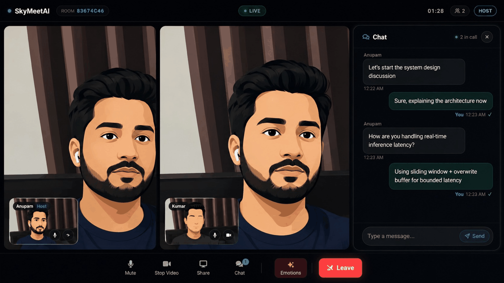
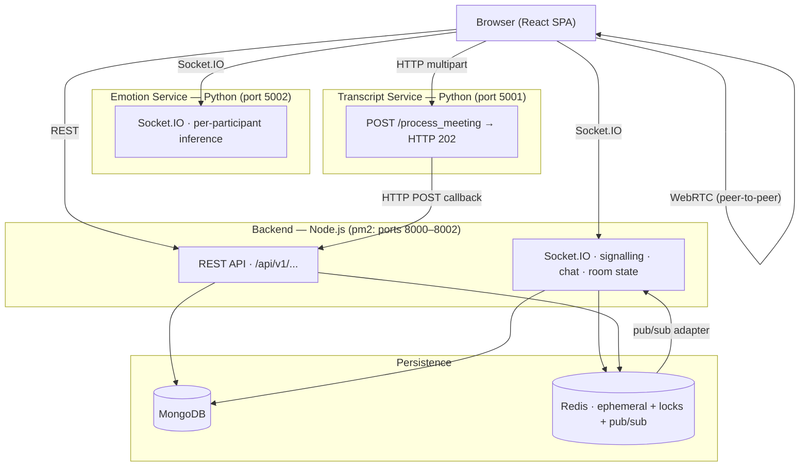
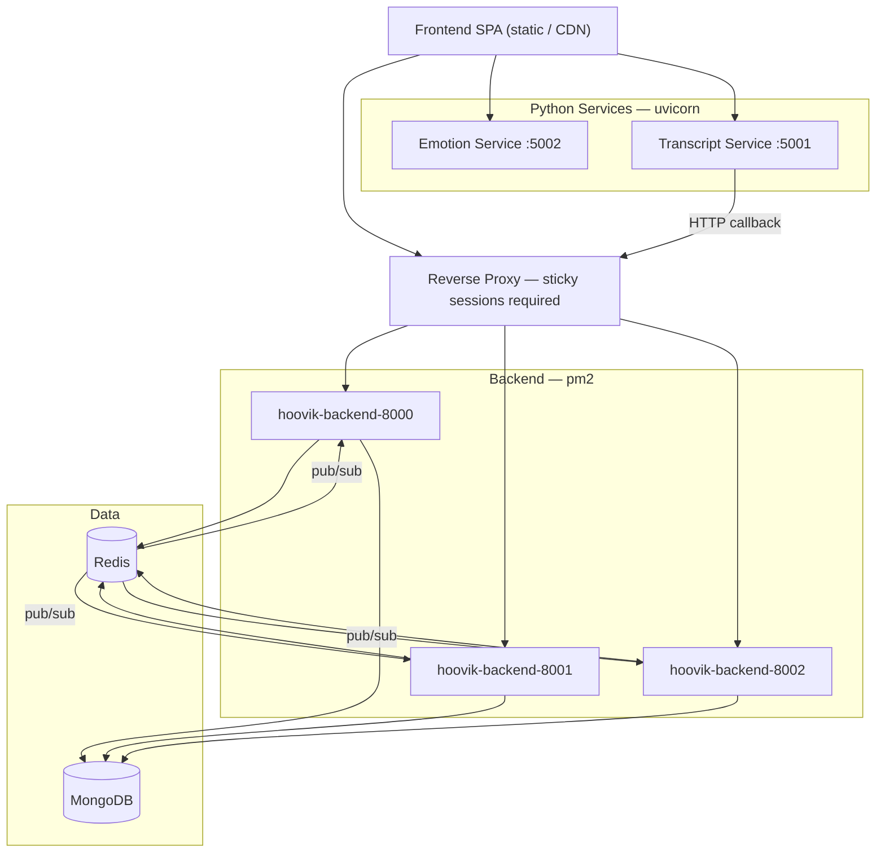

<div align="center">

<br/>



<br/><br/>

<p align="center">
  <a href="https://github.com/AnupamKumar-1/Hoovik/stargazers"></a>
  &nbsp;
  <a href="https://github.com/AnupamKumar-1/Hoovik/actions/workflows/ci.yml"></a>
  &nbsp;
  
  &nbsp;
  
</p>

<p align="center">
  
  &nbsp;
  
  &nbsp;
  
</p>

<br/>

> **If Hoovik has been useful, please give it a ⭐ — it takes 2 seconds and means the world.**

<br/>

<a href="https://hoovik.onrender.com">
  
</a>

<br/><br/>



</div>


---

## ✨ What Makes Hoovik Different

Most video tools record a meeting and leave you with a wall of audio. Hoovik goes further — every meeting is automatically transcribed, each speaker's emotional tone is tracked per segment, and an LLM generates a structured summary with a **discrepancy report** that flags where what someone *said* didn't match how they *felt*.

<br/>

<div align="center">

| Feature | Details |
|---|---|
| 🎥 **P2P Video & Audio** | WebRTC — streams never touch the backend |
| 😮 **Live Emotion AI** | Facial landmarks + audio → ~300–500 ms P50 latency |
| 📝 **Auto Transcription** | Whisper ASR per speaker, delivered post-meeting |
| 🤖 **AI Meeting Summary** | Groq LLM summary + NLP-vs-live emotion discrepancy detection |
| ⚡ **Distributed Backend** | 3 pm2 processes unified by Redis pub/sub |
| 🔒 **Auth & Rate Limiting** | JWT + refresh rotation, Redis Lua locks, account lockout |

</div>

---

## 📝 Meeting Transcripts & AI Summaries

This is Hoovik's flagship post-meeting feature — and the reason you'll actually use it every day.

### How it works

```
Meeting ends
    │
    ▼
Browser uploads audio blob(s) → Transcript Service (HTTP multipart)
    │
    ▼  HTTP 202 returned immediately; pipeline runs in background
    ▼
ffmpeg → mono 16 kHz WAV
    │
    ▼
Whisper (small) transcribes → raw segments
    │
    ▼
Consecutive segments merged (gap ≤ 2 s, ≤ 60 words)
    │
    ▼
DistilRoBERTa classifies emotion per segment
    │
    ▼
Cross-speaker segments merged + sorted by timestamp
    │
    ▼
build_intelligent_summary() → summary, key points, emotion distribution,
                               top topics, per-speaker stats, WPM
    │
    ▼
HTTP POST callback → Backend (3 retries: 5 s → 15 s → 30 s on network/5xx)
    │
    ▼
Backend stores transcript + metadata in MongoDB
    │
    ▼
POST /api/v1/transcripts/:id/summary  (rate-limited: 2× per 2 hours)
    │
    ▼
Groq LLM annotates Whisper segments with live facial/audio emotion per speaker
    + detects NLP-vs-live discrepancies
    → returns structured summary + `discrepancies[]` array
```

### What you get

After every meeting, the transcript viewer in the frontend shows:

- **Full transcript** — timestamped, speaker-attributed segments
- **Per-segment emotion** — what the speaker's tone was at each moment
- **AI Summary** — structured LLM-generated recap of the whole meeting
- **Discrepancy Report** — segments where a speaker's detected live emotion contradicted their spoken sentiment (e.g. saying "that's fine" with stressed vocal tone and a tense facial expression)

### API

The transcript service POSTs the full structured result to the backend, which stores it in MongoDB. The AI summary endpoint then enriches it with live emotion data:

```http
POST /api/v1/transcripts/:id/summary
Content-Type: application/json

{ "emotionData": {...}, "emotionNames": {...} }
```

Response:

```json
{
  "summary": "...",
  "key_points": ["..."],
  "discrepancies": [
    {
      "speaker": "Alice",
      "segment": "That timeline works for me.",
      "nlp_emotion": "positive",
      "live_emotion": "stressed"
    }
  ],
  "insights": {
    "dominant_emotion": "neutral",
    "emotion_distribution": { "neutral": 60, "joy": 25, "anger": 15 },
    "speaker_stats": {
      "Alice": { "turns": 12, "dominant_emotion": "neutral", "word_count": 342 }
    },
    "top_topics": ["deadline", "budget", "Q3"],
    "speaking_pace_wpm": 148
  }
}
```

> **Note:** The frontend polls every 20 s (up to 30 attempts) for transcript availability after the meeting ends. Summary generation is rate-limited to 2 requests per 2 hours per transcript.

---

## 🏗 Architecture

<details>
<summary><strong>System diagram</strong></summary>



</details>

<details>
<summary><strong>Deployment topology</strong></summary>



</details>

### State map

| Store | What lives there |
|---|---|
| **MongoDB** | Users, rooms, meetings, chat history (cap: 500), transcripts, AI summaries |
| **Redis** | Participant maps, socket-ID arrays, join locks, rate limit counters, account lock flags, TTL caches |
| **In-process — Backend** | Nothing — all room state is in Redis |
| **In-process — Emotion Service** | Embedding buffers, EMA state, pump coroutine handles |
| **Browser localStorage** | JWT, `host:<code>` secret, emotion data for AI summary |

---

## 🧠 Real-Time Emotion Analysis

Per-participant pipeline running at ~300–500 ms P50 latency (load tested with 10 concurrent participants, 2026-05-07):

```
Video frame (JPEG)          Audio chunk (Float32 PCM)
        │                              │
        ▼                              ▼
MediaPipe face landmarks         Wav2Vec2 embedding
(136 landmarks + 51 blendshapes  (audeering/wav2vec2-large-
 + head pose)                     robust-12-ft-emotion-msp-dim)
        │                              │
        └──────────────┬───────────────┘
                       ▼
              Z-score normalisation
               (norm_stats.npz)
                  │           │
                  ▼           ▼
           Ensemble        Anomaly detection
      (EmotionTransformer  (per-modality IsolationForest
         + XGBoost,         + PCA; flags suspect cycles)
       temp-calibrated)
                  │           │
                  └─────┬─────┘
                        ▼
               EMA smoothing (α=0.65, TTL=2 s)
                        │
                        ▼
              emotion.result → frontend overlay
```

Live stats at `GET /stats` (browser dashboard) and `GET /stats/json` — P50 / P90 / P95 per modality + active participant count. Server-side backpressure throttles clients when face queue depth hits 3.

---

## 🔧 Key Technical Highlights

| Area | What was built |
|---|---|
| **WebRTC signalling** | SDP/ICE relay over Socket.IO; Redis adapter fans events across 3 pm2 processes; distributed join lock (`SET NX PX 10000` + Lua CAS) serialises concurrent joins |
| **Multimodal emotion inference** | MediaPipe (136 landmarks + blendshapes + head pose) + Wav2Vec2 → `EmotionTransformer` + XGBoost (temp-calibrated) + per-modality IsolationForest anomaly detection → EMA (α=0.65); graceful `both/audio_only/video_only` modality fallback; ~300–500 ms P50 |
| **Browser media pipeline** | `AudioWorklet` + `AnalyserNode` for RMS-gated noise detection; `MediaRecorder` per participant; SSRC-based active speaker with RMS fallback |
| **Async transcript pipeline** | HTTP 202 immediately; background: ffmpeg → Whisper (`small`) → segment merging → DistilRoBERTa per-segment emotion → `build_intelligent_summary` → HTTP POST callback (3 retries: 5 s → 15 s → 30 s on network/5xx; 4xx not retried) |
| **Multi-process backend** | 3 pm2 instances via `@socket.io/redis-adapter`; participant map as Redis Hash (`HSET`/`HDEL` per event); no in-process room state |
| **Auth & rate limiting** | JWT + HttpOnly refresh token rotation; Redis Lua INCR+EXPIRE per-IP and per-username; account lockout after 10 failed logins (900 s TTL); uniform `401` prevents username enumeration |
| **AI summary** | `generateAiSummaryService` accepts `emotionData`/`emotionNames` from browser; `buildGroqPrompt` annotates each Whisper segment with matched live facial/audio emotion via `buildSpeakerLiveMap`; returns `discrepancies[]` and `live_dominant_emotion` per speaker; rate-limited 2× per 2 hours |
| **Redis test suite** | 25 tests covering distributed cache, locks, rate limiting, pub/sub, batch ops, reconnection recovery; CI runs 20 via `npm run test:redis:ci` |

---

## 🚀 Services

| Service | Runtime | Hosted on | Role |
|---|---|---|---|
| **Frontend** | React SPA | Render | UI, WebRTC, emotion capture, chat, transcript viewer |
| **Backend** | Node.js / Express + Socket.IO | Render | Signalling, auth, room management, transcript storage |
| **Emotion Service** | Python / FastAPI + Socket.IO | Azure | Real-time multimodal emotion inference |
| **Transcript Service** | Python / FastAPI | Azure | Post-meeting ASR, per-segment emotion, callback delivery |

### Transports

| Transport | Between | Purpose |
|---|---|---|
| WebRTC | Browser ↔ Browser | Live audio/video — never proxied |
| Socket.IO / WS | Frontend ↔ Backend | SDP/ICE relay, chat, participant state |
| Socket.IO / WS | Frontend ↔ Emotion Service | `emotion.frame`, `audio_chunk`, `emotion.result` |
| HTTP multipart | Frontend → Transcript Service | Audio blob upload after meeting ends |
| HTTP REST | Frontend ↔ Backend | Auth, rooms, transcripts, meeting history |

---

## ⚡ Running Locally

### Quick start

```bash
chmod +x dev.sh   # one-time
./dev.sh          # starts all 4 services with colour-coded output
```

| Prefix | Service | Port |
|---|---|---|
| `FRONTEND` | React SPA | `3000` |
| `BACKEND` | Node.js / Express | `8000` |
| `EMOTION` | FastAPI emotion inference | `5002` |
| `TRANSCRIPT` | FastAPI transcription | `5001` |

> Start MongoDB and Redis first. Python venvs must exist at `emotion_service/venv` and `transcript_service/venv` — `dev.sh` invokes them directly via `./emotion_service/venv/bin/python` and `./transcript_service/venv/bin/python`. `Ctrl+C` sends `SIGINT` and kills all child processes cleanly.
>
> **Windows:** `dev.sh` is a bash script. Use WSL2 (recommended), Git Bash, or start each service manually in four separate terminals — see [`docs/CONTRIBUTING.md`](docs/CONTRIBUTING.md) for the PowerShell commands.

### Step by step

**1 — MongoDB + Redis**
```bash
mongod --dbpath /data/db
redis-server
```

**2 — Backend**
```bash
cd backend && npm install
cp .env.example .env             # fill in JWT_SECRET, MONGO_URI, GROQ_API_KEY etc.
npm run dev                      # single-process dev (nodemon)
npm run prod                     # production: pm2 start ecosystem.config.cjs (3 processes)
```

Redis tests:
```bash
npm run test:redis      # 25 tests (kills + restarts local Redis)
npm run test:redis:ci   # 20 tests (no recovery tests — safe for CI)
```

**3 — Emotion Service**
```bash
cd emotion_service
python3.12 -m venv venv && source venv/bin/activate
pip install -r requirements.txt
cp .env.example .env
uvicorn app:app --host 0.0.0.0 --port 5002 --reload
```
> `models/` must contain `best_modal.pt`, `xgb_model.joblib`, `weights.json`, anomaly detectors, and `embeddings/face_landmarker.task`. The server refuses to start if any model fails to load.

**4 — Transcript Service**
```bash
cd transcript_service
python3.13 -m venv venv && source venv/bin/activate
pip install -r requirements.txt
cp .env.example .env
uvicorn app:app --host 0.0.0.0 --port 5001
```
> `ffmpeg` must be in `PATH` — validated at startup. Whisper + DistilRoBERTa download from HuggingFace on first run. Do **not** use `python app.py` — invoke via `uvicorn app:app` directly. (`dev.sh` runs this without `--reload`; the emotion service uses `--reload`.)

**5 — Frontend**
```bash
cd frontend && npm install
npm start        # dev
npm run build    # production
```

---

## 🧩 Engineering Challenges

**1 — Multi-process Socket.IO fan-out** — `@socket.io/redis-adapter` delivers events across all 3 pm2 instances via Redis pub/sub. All room state lives in Redis so any process can serve any client.

**2 — Concurrent join races** — A Redis distributed lock (`SET NX PX 10000`, Lua CAS release) serialises participant state mutations within a 10-second window per room.

**3 — CPU-bound inference without blocking** — The emotion service offloads PyTorch and MediaPipe to a thread-pool executor. Backpressure events throttle the client when the face queue depth hits 3.

**4 — Async transcript delivery with no shared state** — Services share no DB or queue. The transcript service delivers via HTTP POST callback. The frontend polls every 20 s (up to 30 attempts) — fully decoupled.

**5 — Parallel media capture in the browser** — Host simultaneously captures frames for emotion, records audio for transcription, and plays WebRTC video via three independent tap points.

**6 — Reconnect state gap** — Backend reconstructs participant records from Redis on reconnect; the emotion service holds per-participant state in process memory. The two stores are not reconciled — stale buffers may persist after reconnect.

---

## ⚠️ Known Limitations

| Area | Limitation |
|---|---|
| **Inference scaling** | Emotion service in-process state cannot be horizontally scaled without externalising to Redis. Transcript service model singletons have the same constraint. |
| **Transcript delivery** | An empty merged-segment result causes a silent no-callback. A 4xx response from the backend also causes silent loss (only network errors and 5xx are retried). |
| **NODE_API timeout** | `requests.post(..., timeout=None)` — a hung backend blocks the transcript background thread indefinitely across all retry attempts. |
| **Cleanup timer** | `cleanupOldMeetings` runs in all 3 pm2 processes independently every hour — no distributed leader election. |
| **Transcription language** | Whisper hardcoded to `language="en"` — multilingual meetings produce degraded output. |
| **Orchestration** | No unified supervisor across 4 services. Only the emotion service exposes `GET /health` and `GET /ready`. |
| **CORS** | Backend allows `localhost:3000` + one `CLIENT_ORIGIN`. Additional origins require a code change. |
| **Chat history** | Capped at 500 messages — no archival or export. |
| **Inference concurrency** | Shared `asr_model` and `emotion_pipeline` singletons in the transcript service have no explicit locking; thread safety depends on upstream library internals. |

---

## 📦 Dataset

The `EmotionTransformer` + XGBoost ensemble was trained on RAVDESS and CREMA-D datasets with actor-disjoint train/val/test splits (strict speaker-independent evaluation). Hyperparameters were tuned via Optuna separately for the Transformer and XGBoost models.

**Download:** [dataset.npz — Google Drive](https://drive.google.com/file/d/135wYH7DB8_10Jc8g08MfC6Poews_Lkgp/view?usp=sharing)

Place under `emotion_service/extracted_dataset/` before running the training pipeline. Pre-trained model files under `models/` are all that's needed to run the inference server. See [`docs/emotion-service.md`](docs/emotion-service.md) for the full training procedure.

---

## 🤝 Contributing

See [`docs/CONTRIBUTING.md`](docs/CONTRIBUTING.md) — covers prerequisites, local setup, env configuration, load testing, and PR checklist.

---

## 📚 Documentation

| File | Contents |
|---|---|
| [`docs/frontend.md`](docs/frontend.md) | Hook architecture, WebRTC lifecycle, emotion pipeline, event contracts, error handling |
| [`docs/backend.md`](docs/backend.md) | Routes, Socket.IO handlers, Redis lock design, pm2 config, API contracts, security |
| [`docs/realTimeEmotionService.md`](docs/realTimeEmotionService.md) | Inference pipeline, model training, configuration schema, performance |
| [`docs/transcript_service.md`](docs/transcript_service.md) | ASR pipeline, segment merging, callback schema, error handling |
| [`docs/CONTRIBUTING.md`](docs/CONTRIBUTING.md) | Setup guide, prerequisites, contribution workflow |

---

## License

MIT — see [LICENSE](LICENSE).

---

<div align="center">

<br/>

**Built something cool with Hoovik? Open a PR — contributions are welcome.**

<br/>

⭐ **Star this repo if it's useful — it helps more people find it.**

<br/><br/>

</div>