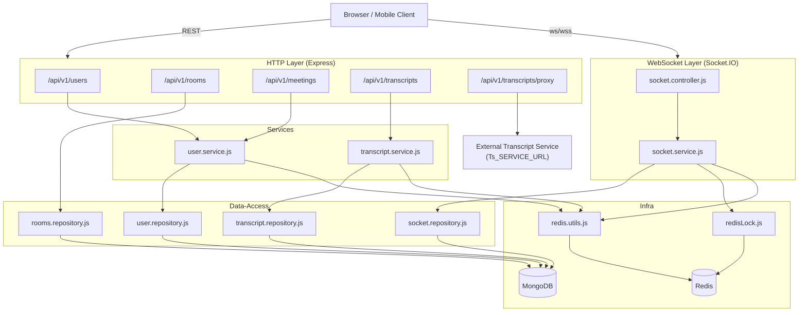
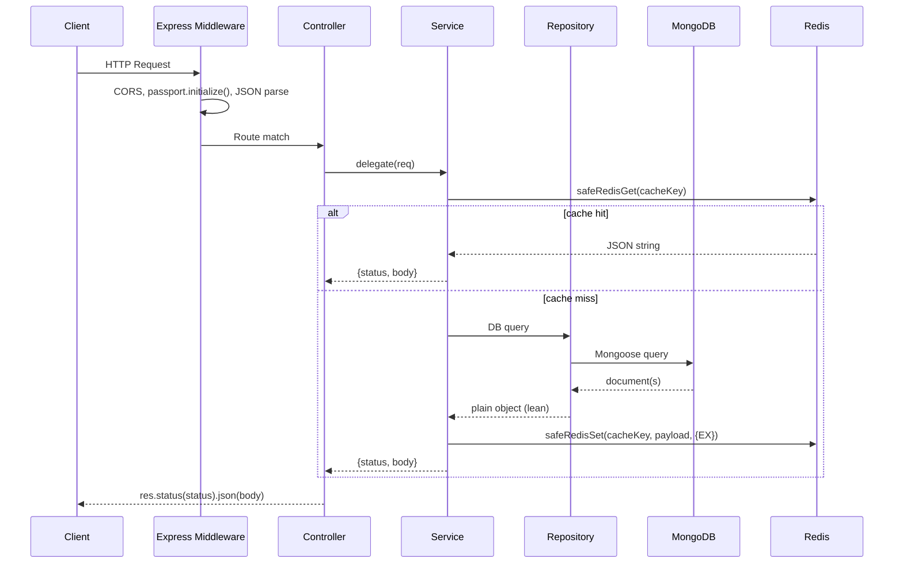
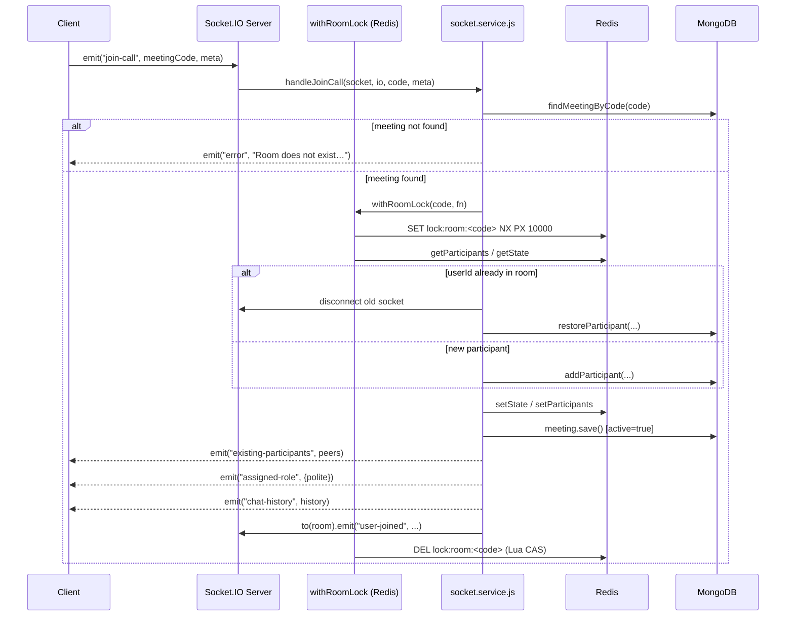
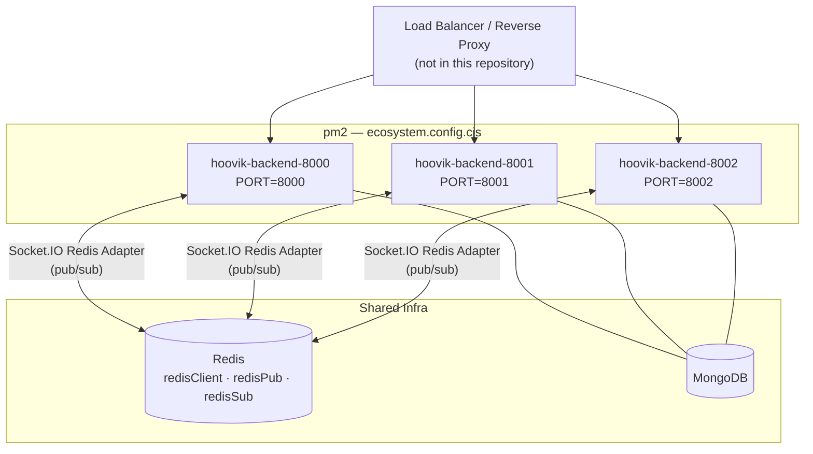
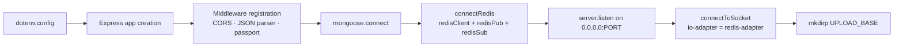

# Hoovik Backend (Node.js)

A Node.js/Express HTTP and WebSocket server that manages real-time video-meeting rooms, chat, transcription storage, and user authentication. The implementation uses MongoDB for persistence, Redis for ephemeral state and distributed locking, and Socket.IO with a Redis adapter for multi-process event fan-out.

---

## Table of Contents

1. [Overview](#overview)
2. [Features](#features)
3. [Architecture](#architecture)
4. [Data Flow](#data-flow)
5. [Core Modules](#core-modules)
6. [Configuration](#configuration)
7. [Deployment](#deployment)
8. [Runtime Behaviour](#runtime-behaviour)
9. [API Contracts](#api-contracts)
10. [WebSocket Event Contracts](#websocket-event-contracts)
11. [Performance Considerations](#performance-considerations)
12. [Logs and Monitoring](#logs-and-monitoring)
13. [Error Handling](#error-handling)
14. [Security Considerations](#security-considerations)
15. [Known Limitations](#known-limitations)
16. [Future Improvements](#future-improvements)

---

## Overview

`app.js` is the entry point. It bootstraps Express, connects to MongoDB and Redis, binds the HTTP server, and then initialises the Socket.IO manager (`connectToSocket`). All three Redis clients (`redisClient`, `redisPub`, `redisSub`) are created in `redis.js` and passed explicitly to the socket adapter.

The application is split into four logical layers:

```
routes → controllers → services → repositories (data-access)
```

Models are declared in `src/models/` and imported independently of the layered flow where Mongoose document methods are needed directly.

---

## Features

The following capabilities are directly evidenced by source code:

- **JWT authentication** via `passport-jwt` (`config/passport.js`); tokens are signed with `JWT_SECRET` and expire per `process.env.JWT_EXPIRES_IN` (falls back to `cfg.user.jwtExpiresIn`, default `"1h"`). The logout blacklist TTL is derived from the same value via `parseExpiresInToSeconds` so it always matches the actual token lifetime.
- **User registration and login** with bcrypt hashing (`cfg.user.bcryptSaltRounds`, default `10`) and per-IP / per-username rate limiting backed by a Redis Lua INCR+EXPIRE script (`redis.utils.js:isRateLimited`).
- **Account lockout** after `ACCOUNT_LOCK_THRESHOLD` (default `10`) consecutive failed logins; lock TTL is `ACCOUNT_LOCK_SEC` (default `900` seconds) — implemented in `user.service.js`.
- **Meeting room creation** with a randomly generated 8-hex-character `meetingCode` (`crypto.randomBytes(4).toString("hex").toUpperCase()`) and a `sha256`-hashed host secret (`rooms.js`).
- **Real-time WebSocket room management**: join, leave, signal relay, chat, transcription chunk relay, and keyword relay — all implemented in `socket.service.js` / `socket.controller.js`.
- **Distributed room-join serialisation** via a Redis-backed distributed mutex with retry polling (`redisLock.js`); each `join-call` runs inside `withRoomLock`.
- **Transcript persistence** with upsert-on-conflict semantics, Redis caching (default TTL `300` seconds), and noise-line filtering (`transcript.service.js`).
- **Transcript proxy** — forwards multipart requests to an external service at `process.env.Ts_SERVICE_URL` (`transcriptProxy.routes.js`).
- **Latency instrumentation** using `process.hrtime.bigint()` written to a per-port log file under `logs/latency-<PORT>.log` (`latency.service.js`).
- **Inactive meeting cleanup** running on a `setInterval` of `3,600,000` ms (1 hour) inside `meeting.model.js:cleanupOldMeetings`; removes documents with `active: false` and `updatedAt` older than 24 hours by default.

---

## Architecture



### Process Model

The codebase is designed for `pm2` multi-process deployment (`ecosystem.config.cjs`). Socket.IO uses the `@socket.io/redis-adapter` to fan events across processes via the `redisPub` / `redisSub` clients. In-process room state (participant maps, meeting state arrays) is stored in Redis, not in Node.js heap, so that multiple processes share it.

`ecosystem.config.cjs` declares three `pm2` app instances from a shared `base` config:

| pm2 name | `PORT` | `NODE_ENV` |
|---|---|---|
| `hoovik-backend-8000` | `8000` | `production` |
| `hoovik-backend-8001` | `8001` | `production` |
| `hoovik-backend-8002` | `8002` | `production` |

Shared `base` settings (all three processes):

| pm2 option | Value | Effect |
|---|---|---|
| `script` | `./src/app.js` | Entry point |
| `interpreter` | `node` | No transpiler in production |
| `env_file` | `.env` | Loaded by pm2 before process start |
| `watch` | `false` | File-watch restart disabled |
| `max_memory_restart` | `512M` | pm2 restarts the process if RSS exceeds 512 MiB |
| `exp_backoff_restart_delay` | `100` | Initial restart delay in ms; pm2 applies exponential backoff on successive crashes |
| `merge_logs` | `true` | stdout/stderr from all instances merged into a single pm2 log stream |
| `time` | `true` | pm2 prefixes each log line with a timestamp |
| `log_date_format` | `YYYY-MM-DD HH:mm:ss` | Timestamp format applied by pm2 to merged logs |

Because each process binds to a distinct port, a load balancer or reverse proxy (not included in this repository) is required to distribute incoming HTTP and WebSocket connections across the three ports. The Redis adapter ensures Socket.IO events emitted on one process are delivered to sockets connected to any other process.

---

## Data Flow

### HTTP Request Flow



### WebSocket Join Flow



---

## Core Modules

### `src/app.js`

Entry point. Configures:
- `trust proxy: 1` for correct IP extraction behind a reverse proxy.
- CORS allowlist: `http://localhost:3000` is always allowed and one production origin can be supplied via `CLIENT_ORIGIN`. Supporting multiple production origins currently requires code changes.
- Route mounting order (proxy route registered before the generic transcript route to prevent shadowing).
- Sequential startup: MongoDB → Redis → HTTP listen → Socket.IO init.

### `src/infra/redis.js`

Creates three `redis` v4/v5 clients (`redisClient`, `redisPub`, `redisSub`) with conditional TLS (`tls: true` only when `REDIS_URL` starts with `rediss://`, plain `redis://` connects without TLS) and exponential-jitter reconnect: `Math.min(attempts * 100 + random * 100, 3000)` ms, capped at 3,000 ms.

### `src/infra/redisLock.js`

Implements a Redis-backed distributed mutex:
- Acquire: `SET key token NX PX <LOCK_TTL_MS>` — default TTL `10,000` ms (env `REDIS_LOCK_TTL_MS`).
- Release: Lua CAS script — only deletes the key if the stored value matches the caller's token.
- Max wait: `REDIS_LOCK_MAX_WAIT_MS` (default `8,000` ms); throws `Error("timeout acquiring lock")` on expiry.
- Retry interval: `50 ms + 0–50 ms jitter`.

### `src/services/socket.service.js`

Contains all socket business logic. Participant state is maintained in two Redis structures per room:
- `meeting:state:<code>` — a String key holding a JSON array of socket IDs (join order).
- `meeting:participants:<code>` — a Redis Hash where each field is a `userId` and each value is the JSON-serialised `{socketId, userId, meta}` object. Writes are targeted: join and reconnect call `HSET` for the single affected field; leave calls `HDEL` for the departing field (or `DEL` for the whole key when the room empties). Only `getParticipants` (used by `broadcastParticipants`) reads the full Hash via `HGETALL`. Meta updates in `handleUpdateParticipantState` and `handleUpdateMeta` fetch and rewrite only the single affected Hash field.

Room capacity is enforced at `MAX_PARTICIPANTS_PER_ROOM` (default `50`, env override).

Emotion AI state is tracked per room in Redis under the key `emotion:active:<code>` via three helpers (`getEmotionState`, `setEmotionState`, `deleteEmotionState`). State is therefore consistent across all pm2 processes; there is no longer an in-process `roomEmotionState` Map.

Chat messages are rate-limited per `userId` via `isSocketRateLimited`, which uses `safeRedisIncr` + `safeRedisExpire` (two separate commands, not a Lua script): `SOCKET_CHAT_RATE_MAX` requests (default `20`) per `SOCKET_CHAT_RATE_WIN_SEC` seconds (default `10`). Redis key: `socket:chat:rate:<userId>`.

Partial upload state is tracked via:
- `partial:<key>` — binary data key.
- `partial:meta:<key>` — JSON metadata; TTL `PARTIAL_UPLOAD_TTL_SEC` (derived from `PARTIAL_UPLOAD_TTL_MS`, default `600,000` ms → `600` seconds via `Math.ceil`).

**Redis null-guards**: `handleJoinCall`, `handleLeave`, `broadcastParticipants`, and `getPartialMeta` call sites explicitly check for the `REDIS_READ_FAILED` sentinel returned by `safeRedisGetResult`. On a Redis failure, `handleJoinCall` emits an `"error"` to the socket and aborts instead of proceeding with fabricated empty participant state; `handleLeave` guards `stateArr` before mutation; `broadcastParticipants` skips the emit when Redis is unavailable. Redis failures are logged as warnings rather than being silently swallowed.

### `src/services/transcript.service.js`

- **Noise filtering**: lines are dropped if they fail any of: minimum word count (`NOISE_MIN_WORDS`, default `4`), alpha ratio < `NOISE_MIN_ALPHA_RATIO` (default `0.6`), unique-word ratio < `NOISE_MIN_UNIQUE_RATIO` (default `0.4`), excessive character repetition (run > `NOISE_MAX_CHAR_REPEAT`, default `4`), match `FILLER_ONLY_RE`, or zero surviving lines < `NOISE_MIN_LINES` (default `1`). After per-line filtering the whole text is rejected if the number of clean lines is below `NOISE_MIN_LINES`.
- **Max text length**: `TRANSCRIPT_MAX_TEXT_LENGTH` (default `500,000` characters).
- **Cache**: Redis TTL `TRANSCRIPT_CACHE_TTL_SEC` (default `300` seconds); separate keys for by-`_id` (`transcript:cache:<id>`) and by-`meetingCode` (`transcript:cache:code:<code>`) lookups.
- **Rate limiting**: `TRANSCRIPT_RATE_LIMIT_MAX` (default `30`) requests per `TRANSCRIPT_RATE_LIMIT_WIN_SEC` (default `60`) seconds per `userId`. Implemented via `safeRedisIncr` + `safeRedisExpire` (two commands, not a Lua script). Redis key: `transcript:rate:<uid>`.
- **AI summary generation** (`generateAiSummaryService`): calls Groq (`https://api.groq.com/openai/v1/chat/completions`) with model `llama-3.1-8b-instant`. The prompt is built by `buildGroqPrompt` from two sources: (1) `metadata.segments` — Whisper NLP output with speaker label, timestamp, and `nlp_emotion` per segment; and (2) optional live emotion data (`emotionData`, `emotionNames`) sent in the request body by the client from `localStorage`. Speaker identity resolution is performed by `buildSpeakerLiveMap`, which normalises display names and matches Whisper diarization labels to participant user IDs via exact then prefix name comparison. Each segment is annotated with the matched participant's live facial/audio emotion events captured within that segment's time window; unresolved speakers include all participants' events as `live_unmatched=[]` so the model can reason from context. The prompt instructs the model to identify discrepancies where `nlp_emotion` contradicts live capture. The response JSON includes `discrepancies` (array of `{ participant, at_sec, said, nlp_emotion, live_emotion, modality, note }`), `live_dominant_emotion` per speaker in `speaker_stats`, and the standard `summary`, `key_points`, `insights`, and `emotional_moments` fields. Response is parsed as JSON and saved to `Transcript.aiSummary` via `findByIdAndUpdate($set)`; both by-`_id` and by-`meetingCode` Redis cache keys are invalidated on save.
- **AI summary rate limiting**: `AI_SUMMARY_RATE_LIMIT_MAX` (default `2`) requests per `AI_SUMMARY_RATE_LIMIT_WIN_SEC` (default `7,200`) seconds per `userId`; Redis key `transcript:aisummary:rate:<uid>`. Applied to both `generateAiSummaryService` and `updateAiSummaryService`. Implemented via `safeRedisIncr` + `safeRedisExpire`.

### `src/services/user.service.js`

- Login rate limits: `LOGIN_RATE_MAX` (default `10`) per `LOGIN_RATE_WIN_SEC` (default `60` s) — checked independently for username key (`login:rate:{<username>}`) and IP key (`login:rate:{ip}:<ip>`), both via the Redis Lua INCR+EXPIRE script in `redis.utils.js:isRateLimited`.
- Registration rate limit: `REGISTER_RATE_MAX` (default `5`) per `REGISTER_RATE_WIN_SEC` (default `60` s) per IP, also via the Lua script.
- History cache TTL: `HISTORY_CACHE_TTL_SEC` (default `120` s).
- Meetings list cache TTL: `MEETINGS_CACHE_TTL_SEC` (default `60` s).
- User cache TTL: `USER_CACHE_TTL_SEC` (default `300` s).
- `getMeetingsService` queries up to `cfg.user.meetingsQueryLimit` (default `200`) documents.
- `upsertMeetingService` generates a `hostSecret` only when the meeting does not yet exist; the secret is not regenerated on subsequent upserts, preserving the host's stored value.
- **Username enumeration prevention**: `loginService` returns `401 Unauthorized` with `"Invalid username or password."` for both unknown-username and wrong-password cases.
- **Refresh token flow**: `issueTokens()` generates both a signed JWT access token and a 40-byte opaque refresh token. `loginService` stores the refresh token in Redis (`refresh:<token>` → user payload, TTL `REFRESH_TOKEN_TTL_SEC`, default `7` days) and delivers it via `HttpOnly` `Set-Cookie` only — it is not included in the response body. `refreshTokenService` reads the token from the `HttpOnly` cookie, validates it, rotates it (old token deleted, new pair issued), and returns a fresh access token; the new refresh token is again delivered via `HttpOnly` cookie only. `logoutService` deletes the refresh token associated with the cookie from Redis in addition to blacklisting the access token.

### `src/observability/latency/latency.service.js`

Writes a structured latency log line per measured operation to `logs/latency-<PORT>.log`. On process start, the file is **not** truncated; a `[PROCESS START]` separator is appended so runs remain distinguishable in a single file. Entries from previous runs are preserved across restarts. Measurements use `process.hrtime.bigint()` for nanosecond resolution, converted to milliseconds.

### `src/models/meeting.model.js`

Mongoose model with instance methods:
- `addParticipant` — upserts by `socketId` or `userId`; sets `active = true`, updates `lastActivityAt`.
- `markParticipantLeft` — two atomic `updateOne` calls: first sets `participants.$.leftAt`; second uses a `$expr` filter to set `active = false` only when no participant remains without a `leftAt`. Returns the updated document via a final `findById`, replacing what was previously a three-round-trip read-then-write-then-read pattern with two targeted writes plus one read.
- `restoreParticipant` — finds a participant with a matching `userId` or `name` (within a 5-minute cutoff) that has `leftAt` set.
- `addChatMessage` — appends to `chat`; trims array to last `500` messages.
- `cleanupOldMeetings` (static) — deletes where `active: false` and `updatedAt < now - maxAgeHours * 3,600,000`.
- `verifyHostSecret` (static) — looks up the meeting by `meetingCode`, rejects if absent or if `hostSecretExpiresAt` is set and has passed, then compares a `sha256` hash of the provided secret against `hostSecretHash`; returns the meeting document on match, `null` otherwise.
- `upsertByMeetingCode` (static) — `findOneAndUpdate` with `{ $set: payload }` and `upsert: true`; uses `$set` explicitly to prevent document replacement on existing meetings.

### `src/utils/redis.utils.js`

Provides safe wrappers for all Redis operations (`safeRedisGet`, `safeRedisGetResult`, `safeRedisSet`, `safeRedisDel`, `safeRedisIncr`, `safeRedisExpire`, `batchDel`) that catch exceptions, log a warning, and return `null`. Also exports `makeLogger` (structured JSON logger) and `isRateLimited` (atomic Lua INCR+EXPIRE script used by `user.service.js` for login and registration rate limiting).

### `src/utils/helpers.utils.js`

Stateless utility functions: `sleep`, `hashBuffer`, `hashFile`, `sha256Hex` (used by `transcript.service.js:resolveAuth`), `getFileSize`, `safeUnlink`, `toBuffer`, `writeTempFile`.

---

## Configuration

### `src/config/config.json`

| Key path | Default | Description |
|---|---|---|
| `upload.baseDir` | `"meet_uploads"` | Subdirectory under `os.tmpdir()` for partial uploads |
| `upload.maxChunks` | `50000` | Max chunks per upload session |
| `sanitize.maxNameLength` | `200` | Participant display name character limit |
| `sanitize.maxChatLength` | `2000` | Chat message character limit |
| `sanitize.maxTranscriptionChunkLength` | `500` | Per-chunk transcription character limit |
| `sanitize.maxKeywordLength` | `100` | Per-keyword character limit |
| `sanitize.defaultName` | `"Guest"` | Fallback display name |
| `socket.transports` | `["websocket","polling"]` | Socket.IO transport list |
| `socket.allowEIO3` | `true` | Engine.IO v3 compatibility |
| `redisKeys.meetingStatePrefix` | `"meeting:state:"` | Redis key prefix for socket-ID arrays |
| `redisKeys.meetingParticipantsPrefix` | `"meeting:participants:"` | Redis key prefix for participant maps |
| `redisKeys.partialPrefix` | `"partial:"` | Redis key prefix for partial upload data |
| `redisKeys.partialMetaPrefix` | `"partial:meta:"` | Redis key prefix for partial upload metadata |
| `transcript.listDefaultLimit` | `50` | Default page size for transcript list |
| `transcript.listMaxLimit` | `200` | Hard cap for transcript list |
| `user.bcryptSaltRounds` | `10` | bcrypt work factor |
| `user.jwtExpiresIn` | `"1h"` | JWT expiry string passed to `jsonwebtoken` |
| `user.meetingsQueryLimit` | `200` | Hard cap for meetings queries |
| `user.hostPopulateFields` | `"name username"` | Fields populated on `host` in meeting queries |
| `user.mePopulateFields` | `"_id username name"` | Fields returned by `GET /me` |

### Environment Variables

| Variable | Default (in code) | Description |
|---|---|---|
| `MONGO_URI` | — | MongoDB connection string (required) |
| `REDIS_URL` | `redis://localhost:6379` | Redis connection URL. TLS is enabled automatically when the URL starts with `rediss://`; plain `redis://` connects without TLS. |
| `JWT_SECRET` | — | JWT signing secret (required; startup calls `process.exit(1)` if absent; logs a warning if present but shorter than 32 chars) |
| `JWT_EXPIRES_IN` | `"1h"` (from `config.json`) | JWT lifetime and logout blacklist TTL; supports `"1h"`, `"7d"`, integer seconds |
| `REFRESH_TOKEN_TTL_SEC` | `604800` (7 days) | Refresh token TTL in Redis in seconds |
| `PORT` | `8000` | HTTP listen port (also used as latency log filename suffix) |
| `CLIENT_ORIGIN` | — | Production origin added to CORS allowlist; also used to construct meeting links in history responses. `http://localhost:3000` is always allowed. |
| `Ts_SERVICE_URL` | — | Upstream URL for transcript proxy |
| `REDIS_LOCK_TTL_MS` | `10000` | Lock TTL in milliseconds |
| `REDIS_LOCK_MAX_WAIT_MS` | `8000` | Max spin-wait before lock timeout |
| `SOCKET_MAX_HTTP_BUFFER` | `104857600` (100 MiB) | Socket.IO `maxHttpBufferSize` |
| `MAX_PARTICIPANTS_PER_ROOM` | `50` | Per-room participant cap |
| `PARTIAL_UPLOAD_MAX_BYTES` | `209715200` (200 MiB) | Maximum bytes for a partial upload |
| `PARTIAL_UPLOAD_TTL_MS` | `600000` (10 min) | Partial upload metadata TTL in milliseconds |
| `SOCKET_CHAT_RATE_MAX` | `20` | Chat messages allowed per rate window per userId |
| `SOCKET_CHAT_RATE_WIN_SEC` | `10` | Chat rate limit window in seconds |
| `SOCKET_CHUNK_RATE_MAX` | `100` | Transcription/binary chunks allowed per rate window per userId |
| `SOCKET_CHUNK_RATE_WIN_SEC` | `10` | Chunk rate limit window in seconds |
| `TRANSCRIPT_MAX_TEXT_LENGTH` | `500000` | Transcript text character cap |
| `TRANSCRIPT_CACHE_TTL_SEC` | `300` | Redis TTL for transcript cache entries |
| `TRANSCRIPT_RATE_LIMIT_MAX` | `30` | Transcript requests per window per user |
| `TRANSCRIPT_RATE_LIMIT_WIN_SEC` | `60` | Transcript rate limit window in seconds |
| `TRANSCRIPT_NOISE_MIN_WORDS` | `4` | Minimum word count for a transcript line to pass noise filter |
| `TRANSCRIPT_NOISE_MIN_UNIQUE_RATIO` | `0.4` | Minimum unique-word ratio for noise filter |
| `TRANSCRIPT_NOISE_MAX_CHAR_REPEAT` | `4` | Maximum consecutive identical-char run before a word is flagged |
| `TRANSCRIPT_NOISE_MIN_ALPHA_RATIO` | `0.6` | Minimum alpha-character ratio for noise filter |
| `TRANSCRIPT_NOISE_MIN_LINES` | `1` | Minimum clean lines required after noise filtering |
| `GROQ_API_KEY` | — | Groq API key for AI summary generation; required for `POST /:id/summary` |
| `AI_SUMMARY_RATE_LIMIT_MAX` | `2` | AI summary requests per window per user |
| `AI_SUMMARY_RATE_LIMIT_WIN_SEC` | `7200` | AI summary rate limit window in seconds |
| `METRIC_TTL_SEC` | `2592000` (30 days) | TTL applied to `transcript:requests:*` metric counters on first increment; counters reset after this period |
| `LOGIN_RATE_MAX` | `10` | Login attempts per window |
| `LOGIN_RATE_WIN_SEC` | `60` | Login rate window in seconds |
| `REGISTER_RATE_MAX` | `5` | Registration attempts per window per IP |
| `REGISTER_RATE_WIN_SEC` | `60` | Registration rate window in seconds |
| `ACCOUNT_LOCK_THRESHOLD` | `10` | Failed logins before account lock |
| `ACCOUNT_LOCK_SEC` | `900` | Account lock TTL in seconds |
| `HISTORY_CACHE_TTL_SEC` | `120` | Redis TTL for meeting history cache |
| `MEETINGS_CACHE_TTL_SEC` | `60` | Redis TTL for meetings list cache |
| `USER_CACHE_TTL_SEC` | `300` | Redis TTL for user object cache |
| `MAX_NAME_LEN` | `100` | Max user name length in user.service.js |
| `MAX_USERNAME_LEN` | `50` | Max username length |
| `MAX_MEETINGCODE_LEN` | `32` | Max meeting code length |

---

## Deployment

### pm2 Lifecycle Commands

| Script | Command | Effect |
|---|---|---|
| `npm run dev` | `nodemon src/app.js` | Single process with file-watch restart; development only |
| `npm start` | `node src/app.js` | Single process, no pm2 |
| `npm run prod` | `pm2 start ecosystem.config.cjs` | Start all three instances |
| `npm run restart` | `pm2 restart ecosystem.config.cjs` | Graceful rolling restart of all instances |
| `npm run stop` | `pm2 delete all` | Remove all pm2 managed processes |
| `npm run deploy` | `pm2 delete all \|\| true && pm2 start ecosystem.config.cjs --update-env && pm2 save && pm2 list` | Hard restart: deletes all processes, re-starts with updated env, saves process list, prints status |

### Multi-Process Architecture



### Memory and Restart Behaviour

- pm2 restarts a process automatically when its RSS exceeds `512M` (`max_memory_restart`).
- On crash, pm2 applies exponential backoff starting at `100 ms` (`exp_backoff_restart_delay`).
- Each process re-runs the full startup sequence (MongoDB connect → Redis connect → HTTP listen → Socket.IO init) on restart. A failed MongoDB or Redis connection at startup calls `process.exit(1)`, triggering another pm2 restart cycle.
- On each restart, `latency.service.js` appends a `[PROCESS START]` marker to `logs/latency-<PORT>.log` without truncating it; historical latency entries are preserved across pm2 restarts.

### Log Aggregation

With `merge_logs: true` and `time: true`, pm2 routes all three instances' stdout/stderr into a single merged stream with `YYYY-MM-DD HH:mm:ss` timestamps prepended by pm2. Structured JSON lines emitted by `makeLogger` in `redis.utils.js` are interleaved in this stream; they carry their own `ts` field and are not re-formatted by pm2.

---

## Runtime Behaviour

### Startup Sequence



Any failure in steps D or E calls `process.exit(1)`. Failure in step G is logged but does not terminate the process.

### Participant Reconnection

When a socket emits `join-call` with a `userId` already present in the Redis participants map, `handleJoinCall` (inside `withRoomLock`):

1. Retrieves the old socket ID from the map.
2. Removes the old socket ID from the state array.
3. Calls `io.sockets.sockets.get(oldSocketId)` and, if found, sets `replaced = true`, removes listeners, replaces `emit` with a no-op, and calls `disconnect(true)`.
4. Updates the map entry with the new socket ID.
5. Calls `meeting.restoreParticipant(...)` instead of `addParticipant`.

The `disconnect` handler in `socket.controller.js` returns early if `socket.data.replaced === true`, preventing a double-leave.

### Chat History Normalisation

On join, the server emits `chat-history` with each message normalised to:
`{ id, text, from, userId, name, meta, ts }` where `ts` is forced to a Unix millisecond integer and `id` falls back to a random hex string if absent.

### Participants Broadcast Debounce

`broadcastParticipants` in `socket.controller.js` debounces per room with a `150 ms` `setTimeout`. Rapid successive updates (e.g., `update-meta` followed immediately by `join-call`) collapse into a single `participants-updated` emit.

---

## API Contracts

### Authentication

All protected routes use `passport.authenticate("jwt", { session: false })`. The JWT must be supplied as `Authorization: Bearer <token>`.

Some routes use optional auth: the handler runs regardless, but `req.user` is populated only when a valid token is present.

### User Routes — `/api/v1/users`

| Method | Path | Auth | Description |
|---|---|---|---|
| `POST` | `/login` | None | Returns `{ accessToken, expiresIn, user }` on success; refresh token delivered via `HttpOnly` cookie only |
| `POST` | `/register` | None | Returns `201` on success |
| `POST` | `/logout` | JWT (required) | Blacklists the bearer token in Redis; deletes the refresh token from Redis; clears `refreshToken` cookie |
| `POST` | `/refresh` | None | Reads the opaque refresh token from the `HttpOnly` cookie, validates it, rotates it, and returns `{ accessToken, expiresIn }`; new refresh token delivered via `HttpOnly` cookie only |
| `GET` | `/me` | JWT (required) | Returns `{ user: { _id, username, name } }` |
| `GET` | `/get_all_activity` | JWT (required) | Returns `{ meetings }` array |
| `POST` | `/add_to_activity` | JWT (required) | Body: `{ meeting_code \| meetingCode, link? }` |
| `POST` | `/meetings` | JWT (required) | Upserts a meeting; returns `{ meeting, hostSecret }` on creation only — `hostSecret` is omitted on subsequent upserts |
| `POST` | `/meetings/:code/participants` | JWT (required) | Adds or updates participant record |
| `POST` | `/add_participant` | JWT (required) | Same as above; code from body |

### Room Routes — `/api/v1/rooms`

| Method | Path | Auth | Description |
|---|---|---|---|
| `POST` | `/` | Optional JWT (`aAuth`) | Body: `{ hostName }`. Returns `{ message, roomCode, hostSecret, owner }`. `owner: true` only if a valid JWT is present. |
| `GET` | `/mine` | JWT (required) | Returns rooms owned by authenticated user. Registered before `/:roomCode` to prevent Express route-order shadowing. |
| `GET` | `/:roomCode` | None | Returns `{ roomCode, hostName, createdAt, participantsCount, hasOwner }` for meetings where `active: true`; `404` otherwise. |

### Meeting Routes — `/api/v1/meetings`

| Method | Path | Auth | Description |
|---|---|---|---|
| `GET` | `/` | Optional JWT (`optionalAuth`) | Query: `mine=true\|false`. Returns `{ meetings }` |
| `POST` | `/` | JWT (required) | Upserts a meeting; body: `{ meetingCode, hostName? }` |
| `POST` | `/:code/participants` | JWT (required) | Adds/updates participant |
| `POST` | `/add_participant` | JWT (required) | Adds/updates participant; code from body |

### Transcript Routes — `/api/v1/transcripts`

Route-level rate limit: 500 requests per 60 seconds per IP (`express-rate-limit`, standard headers enabled).

Service-level rate limit: 30 requests per 60 seconds per `userId` (tracked in Redis via `safeRedisIncr`/`safeRedisExpire`).

| Method | Path | Auth | Description |
|---|---|---|---|
| `POST` | `/` | Optional JWT (`aAuth`) | Body: `{ meetingCode, transcriptText, fileName?, metadata? }`. Requires `x-host-secret` header or valid JWT. |
| `GET` | `/` | Optional JWT (`aAuth`) | Query: `meeting_code?`, `limit?`. Returns `{ transcripts }`. List query uses `{ ownerId: userId }` if JWT present, else `{ hostSecretHash: secretHash }`. |
| `GET` | `/:id` | Optional JWT (`aAuth`) | `id` may be a MongoDB ObjectId or `meetingCode`. Returns `{ transcript }` |
| `POST` | `/:id/summary` | Optional JWT (`aAuth`) | Body: `{ emotionData?, emotionNames? }` — live emotion snapshot from `localStorage` keyed by participant user ID. Generates AI summary via Groq (`llama-3.1-8b-instant`) from `metadata.segments` annotated with live emotion events per segment; identifies NLP-vs-live discrepancies; saves full result (including `discrepancies` array) to `aiSummary` field. Rate limited: 2 per 2 hours per user. |
| `PATCH` | `/:id/summary` | Optional JWT (`aAuth`) | Saves a pre-built `aiSummary` object to the transcript; invalidates Redis cache. Rate limited: 2 per 2 hours per user. |

### Transcript Proxy — `/api/v1/transcripts/proxy`

| Method | Path | Description |
|---|---|---|
| `POST` | `/` or `/process_meeting` | Accepts `multipart/form-data`; proxies to `Ts_SERVICE_URL`. Passes `x-host-secret` and `x-user-token` headers. |

---

## WebSocket Event Contracts

All events are handled in `socket.controller.js`, which delegates to `socket.service.js`.

### Client → Server

| Event | Payload | Description |
|---|---|---|
| `join-call` | `(meetingCode: string, meta: object)` | Join a room. `meta` may include `{ name, userId, muted, video, screen }`. |
| `declare-host` | `(meetingCode: string, hostSecret: string, ack?)` | Verifies `hostSecret` against `hostSecretHash` via `Meeting.verifyHostSecret`; sets `socket.data.isHost = true` on success. Ack receives `{ ok: true }` or `{ ok: false, reason: "invalid_code" \| "not_in_room" \| "unauthorized" }`. |
| `update-participant-state` | `{ muted?: boolean, screen?: boolean }` | Updates mute/screen state in Redis and MongoDB; broadcasts to room. |
| `update-meta` | `metaUpdate: object` | Merges `{ name?, muted?, video?, screen? }` into `socket.data.meta`; broadcasts `participant-meta-updated`. |
| `signal` | `(targetId: string, message: any)` | Relays `message` to `targetId` socket. Before forwarding, `fetchSockets()` is called on `meeting:<code>` to verify `targetId` is a member of the same room; unverified targets are silently dropped and logged as warnings. |
| `chat-message` | `(meetingCode: string, msg: { text: string, id?: string }, ack?)` | Sends a chat message. Rate limited: `SOCKET_CHAT_RATE_MAX` (default `20`) per `SOCKET_CHAT_RATE_WIN_SEC` (default `10` s) per `userId`. Optional acknowledgement callback receives `{ ok, reason? }`. |
| `transcription-update` | `(chunk: string)` | Relays sanitised chunk to room; persists to `meeting.analytics.transcription`. |
| `keywords-update` | `(keywords: string[])` | Relays sanitised keywords to room; persists to `meeting.analytics.keywords`. |
| `leave-call` | `(meetingCode: string)` | Marks participant left; emits `user-left` to room. |
| `end-meeting` | `(meetingCode: string)` | Host only (`socket.data.isHost` checked); deletes the `emotion:active:<code>` Redis key and calls `handleLeave` for the host — participants are NOT notified, their meeting continues. Non-host sockets receive a warning and the event is dropped. |
| `emotion-status` | `{ active: boolean }` | Host only (`socket.data.isHost` checked); writes `active` to `emotion:active:<code>` in Redis via `setEmotionState` and broadcasts `emotion-status` to all non-host sockets in the room. |
| `get-emotion-status` | _(no payload)_ | Returns current emotion AI state for the room to the requesting socket via `emotion-status` emit. Reads from Redis (`getEmotionState`); defaults to `false` if no entry exists. |

### Server → Client

| Event | Payload | Description |
|---|---|---|
| `existing-participants` | `Array<{ id, meta, polite }>` | Emitted to joining socket only. |
| `assigned-role` | `{ polite: boolean }` | `polite = true` if the joiner's socket ID is not first in the state array. |
| `chat-history` | `Array<{ id, text, from, userId, name, meta, ts }>` | Emitted to joining socket only. |
| `user-joined` | `{ id, meta, polite }` | Broadcast to room excluding joining socket. |
| `user-left` | `socketId: string` | Broadcast to room when a participant leaves or disconnects. |
| `participants-updated` | `Array<{ id, meta }>` | Debounced broadcast (150 ms) to full room after any membership change. |
| `participant-meta-updated` | `{ id, meta }` | Broadcast to room when `update-meta` is received. |
| `update-participant-state` | `{ peerId, muted }` | Broadcast to room on `update-participant-state`. |
| `chat-message` | `{ id, text, from, fromSocketId, userId, name, meta, ts }` | Broadcast to room excluding sender. |
| `chat-ack` | Same shape as `chat-message` | Emitted to sender as delivery confirmation. |
| `transcription-update` | `{ from, text }` | Broadcast to room excluding sender. |
| `keywords-update` | `{ from, keywords }` | Broadcast to room excluding sender. |
| `signal` | `(fromSocketId, message)` | Forwarded to target socket after verifying `targetId` is in the same room via `fetchSockets()`. |
| `emotion-status` | `{ active: boolean }` | Broadcast to non-host sockets when host toggles emotion AI; also emitted to a single socket in response to `get-emotion-status`. |
| `error` | `string` | Emitted on validation failure or unhandled error. |

---

## Performance Considerations

The following are implementation-level observations, not benchmarks:

- **Redis caching** is applied to: user objects, meeting history, meetings list, and transcript lookups. Cache TTLs are configurable via environment variables; see the configuration table above.
- **`getParticipants` / participant writes** — `getParticipants` calls `HGETALL` and is used only for full-room broadcasts. Join, reconnect, meta updates, and leave all use targeted `HSET` or `HDEL` on the individual Hash field, so write payload is bounded to a single serialised participant object regardless of room size.
- **`addParticipant` and `markParticipantLeft`** — `addParticipant` issues a `findOne` + `save` per event. `markParticipantLeft` issues two targeted `updateOne` calls followed by a `findById` to return the updated document, replacing a previous three-round-trip read-then-write pattern with two writes plus one read.
- **`broadcastParticipants`** debounces at `150 ms` per room, reducing redundant `getParticipants` Redis reads under burst join/meta-update traffic.
- **`setInterval` cleanup** in `meeting.model.js` runs every `3,600,000` ms. This is a process-local timer; in multi-process deployments all three pm2 processes execute it independently.
- **Transcript noise filter** runs synchronously in the service layer before any DB or Redis I/O; complexity is O(n) in transcript line count.
- **`SOCKET_MAX_HTTP_BUFFER`** defaults to `100 MiB`, accommodating binary chunk uploads over the WebSocket connection.
- **Partial uploads** are bounded by `PARTIAL_UPLOAD_MAX_BYTES` (default `200 MiB`) and expire after `PARTIAL_UPLOAD_TTL_MS` (default `600,000` ms).

---

## Logs and Monitoring

### Structured JSON Logs

`redis.utils.js:makeLogger` emits JSON lines to stdout/stderr:

```json
{ "level": "info|warn|error", "service": "<name>", "msg": "<message>", "<key>": "<value>", "ts": "<ISO8601>" }
```

Services using this logger: `user`, `transcript`, `socket`, `redis`.

### Latency Log

`latency.service.js` writes a human-readable columnar log to `logs/latency-<PORT>.log`. Each line format:

```
[HH:MM:SS]  <label padded to 20>  <latency padded to 10>  key: value  ·  key: value
```

Instrumented labels (defined in `latency.constants.js`):

| Label constant | Value | Used at |
|---|---|---|
| `SOCKET_JOIN` | `"socket.join"` | `handleJoinCall` exit, `POST /rooms` |
| `SOCKET_MESSAGE` | `"socket.message"` | `handleChatMessage` exit |
| `SOCKET_SIGNAL` | `"socket.signal"` | `signal` event handler |

On each process start a `[PROCESS START]` marker is appended to the log file; entries from previous runs are retained. No automatic log rotation or archival is implemented.

### Redis Metric Counters

`transcript.service.js` increments the following Redis keys via the `incr()` helper, which sets `METRIC_TTL_SEC` (default `2,592,000` s / 30 days) on first increment. Counters reset after each TTL period rather than accumulating indefinitely:

| Key | Incremented when |
|---|---|
| `transcript:requests:total` | Every `createTranscriptService`, `getTranscriptService`, `listTranscriptsService` call |
| `transcript:requests:cached` | Transcript served from Redis cache |
| `transcript:requests:failed` | Caught exception in transcript service |

---

## Error Handling

- **Unhandled promise rejections**: caught via `process.on("unhandledRejection")` in `app.js`; logged but process is **not** terminated.
- **Uncaught exceptions**: caught via `process.on("uncaughtException")`; logged and `process.exit(1)` is called.
- **HTTP handler errors**: the global Express error middleware returns a JSON body with `err.status` (or `500`) and `err.message`.
- **Redis operation failures**: all `safeRedis*` functions in `redis.utils.js` catch exceptions, log a warning, and return `null`. Key call sites in `socket.service.js` check for the `REDIS_READ_FAILED` sentinel and abort or warn rather than propagating bad values into socket event handlers.
- **Socket event errors**: each event handler in `socket.controller.js` is wrapped in a `try/catch`; on catch it logs and optionally emits `"error"` to the socket.
- **Lock timeout**: `withRoomLock` throws `Error("timeout acquiring lock for room: <code>")` after `REDIS_LOCK_MAX_WAIT_MS`; this propagates to the `join-call` handler, which emits `"error"` to the socket.
- **Transcript duplicate key (`11000`)**: `createTranscriptDoc` uses `findOneAndUpdate` with `upsert: true` as its primary write path, avoiding most race-condition conflicts. If the upsert itself throws a duplicate-key error (`11000`) due to a concurrent write race, the catch block falls back to `findOne` to return the existing document.
- **MongoDB connection failure at startup**: `process.exit(1)`.
- **Redis connection failure at startup**: `process.exit(1)`.

---

## Security Considerations

The following mitigations are implemented in source:

- **JWT secret validation**: startup calls `process.exit(1)` if `JWT_SECRET` is absent, preventing the process from starting without a signing key. Logs a warning if present but shorter than 32 characters.
- **Password hashing**: bcrypt with configurable salt rounds (default `10`).
- **Per-username and per-IP login rate limiting** backed by an atomic Redis Lua INCR+EXPIRE script (`redis.utils.js:isRateLimited`).
- **Account lockout** after `ACCOUNT_LOCK_THRESHOLD` (default `10`) consecutive failures; implemented as a separate Redis key with TTL (`ACCOUNT_LOCK_SEC`, default `900` s).
- **Per-IP registration rate limiting** via the same Lua script.
- **Input sanitisation**: `sanitize-html` is applied to chat messages, participant names, transcription chunks, and keywords.
- **Meeting code validation**: regex `^[A-Z0-9\-]{3,32}$` enforced at both socket and transcript service layers.
- **Host secret**: stored as `sha256` hash only; raw secret returned once at room creation (`POST /rooms`) and never persisted. On subsequent `upsertMeeting` calls the secret is not regenerated. The `declare-host` socket event verifies the provided raw secret against the stored hash via `Meeting.verifyHostSecret` before granting host status; unverified claims are rejected with a reason code. The frontend sets `isHost` state only after receiving a successful ACK from `declare-host`, so host UI and host actions are both gated on server verification.
- **Username enumeration prevention**: `loginService` returns uniform `401 Unauthorized` with `"Invalid username or password."` for both unknown-username and wrong-password cases.
- **Redis lock CAS release**: the release Lua script compares the stored token to the caller's token before deleting, preventing accidental release of another process's lock.
- **CORS**: `http://localhost:3000` is always allowed and one production origin can be supplied via `CLIENT_ORIGIN`. Supporting multiple production origins currently requires code changes.
- **`trust proxy: 1`**: enabled; IP extraction in `getClientIp` uses `x-forwarded-for` first. Misconfigured proxy chains could allow IP spoofing.
- **`signal` relay**: `targetId` is verified as a member of the same room via `io.in("meeting:<code>").fetchSockets()` before forwarding; cross-room relay is rejected.
- **Transcript proxy**: forwards `x-host-secret` and `x-user-token` headers as-is; no validation of these values before forwarding.
- **TLS on Redis**: all three Redis clients in `redis.js` enable TLS conditionally — `socket.tls: true` is set only when `REDIS_URL` starts with `rediss://`. Plain `redis://` URLs connect without TLS, supporting local development without infrastructure workarounds.

---

## Known Limitations

The following are grounded in implementation constraints visible in the source:

1. **Cleanup timer runs in every process**: `setInterval` for `cleanupOldMeetings` is registered at module import time in `meeting.model.js`. In a three-process `pm2` deployment, all processes run the cleanup independently every hour.

2. **Chat history is capped at 500 messages** (`meeting.model.js:addChatMessage`); older messages are discarded in-place on the document. No archival mechanism is implemented.

3. **`User` model has an unused `token` field**: `user.model.js` declares `token: { type: String }` which is never written or read by any service or repository.

---

> **Resolved in prior work** — the following items from earlier versions have been fixed:
> - ~~Latency log truncated on restart~~ — log now appends a `[PROCESS START]` marker; previous entries are preserved
> - ~~`safeRedis*` null returns not uniformly handled in `socket.service.js`~~ — `REDIS_READ_FAILED` sentinel guards added to `handleJoinCall`, `handleLeave`, `broadcastParticipants`, and `getPartialMeta` call sites
> - ~~Username enumeration via distinct 404 / 401 login responses~~ — `loginService` now returns uniform `401` for both cases
> - ~~`GET /rooms/mine` always returning 404 due to route shadowing by `/:roomCode`~~ — static route now registered before parameterised route
> - ~~CORS allowlist hardcoded~~ — production origin now read from `CLIENT_ORIGIN` env var
> - ~~`signal` relay unscoped~~ — `fetchSockets()` now verifies `targetId` is in the same room before forwarding
> - ~~`end-meeting` has no host guard~~ — `socket.data.isHost` check added, matching `declare-host` and `emotion-status`
> - ~~`roomEmotionState` is in-process only~~ — state externalised to Redis (`emotion:active:<code>`); consistent across all pm2 processes
> - ~~No refresh token implementation~~ — `POST /refresh` route added; `loginService` issues and stores opaque refresh tokens; `refreshTokenService` validates and rotates; `logoutService` deletes refresh token from Redis
> - ~~TLS unconditionally enabled on Redis clients~~ — `redis.js` now enables TLS only when `REDIS_URL` starts with `rediss://`
> - ~~Missing `JWT_SECRET` does not halt startup~~ — `user.service.js` now calls `process.exit(1)` when `JWT_SECRET` is absent, matching the behaviour already applied to missing MongoDB and Redis connections
> - ~~Refresh token readable via response body~~ — removed from `loginService` and `refreshTokenService` response bodies; delivered via `HttpOnly` cookie only
> - ~~Refresh token body fallback in `refreshTokenService` and `logoutService`~~ — both functions now read exclusively from `req.cookies.refreshToken`
> - ~~Redis metric counters accumulate indefinitely~~ — `incr()` in `transcript.service.js` now applies `METRIC_TTL_SEC` (default 30 days) on first increment; counters reset each period
> - ~~Participant map serialisation: full map read/write on every event~~ — `meeting:participants:<code>` migrated from a JSON String key to a Redis Hash; join/reconnect/leave/meta updates now use targeted `HSET`/`HDEL` on individual fields; `HGETALL` is used only for full-room participant broadcasts
> - ~~AI summary prompt uses only Whisper NLP emotion; live emotion data unused~~ — `generateAiSummaryService` now accepts `{ emotionData, emotionNames }` from the request body; `buildGroqPrompt` annotates each Whisper segment with the matched participant's live facial/audio emotion events via `buildSpeakerLiveMap` (exact + prefix name matching); prompt instructs the model to detect NLP-vs-live discrepancies; response schema extended with `discrepancies` array and `live_dominant_emotion` per speaker

---

## Future Improvements

These follow directly from the limitations documented above:

- Coordinate the cleanup timer via a Redis-based leader election or distributed cron to prevent duplicate execution across pm2 processes.
- Remove or repurpose the unused `token` field on the `User` model.
- Add archival or export for chat history beyond the 500-message cap.