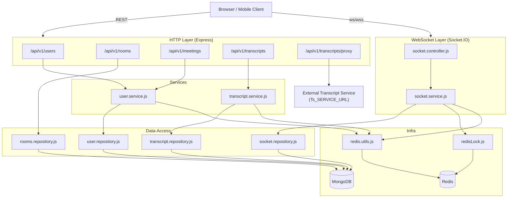
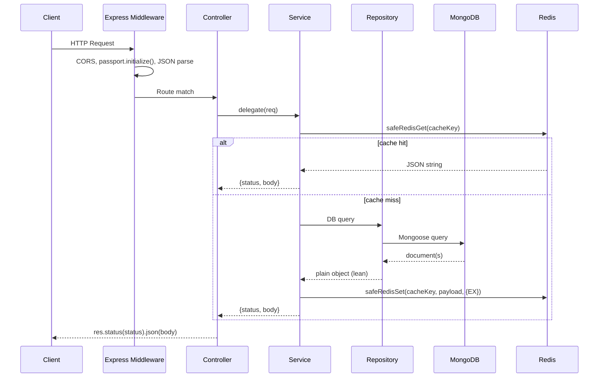
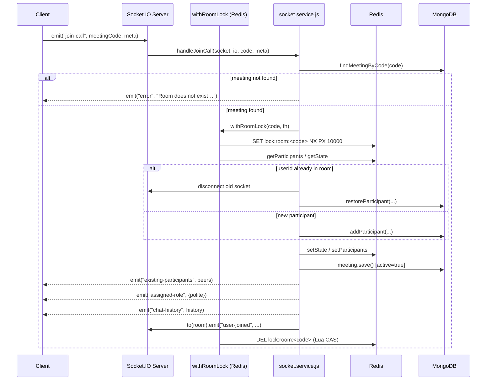
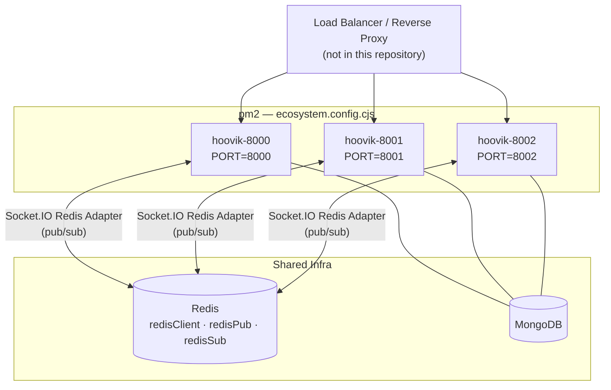
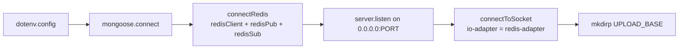

# Hoovik Backend

A Node.js/Express HTTP and WebSocket server that manages real-time video-meeting rooms, chat, transcription storage, and user authentication. The implementation uses MongoDB for persistence, Redis for ephemeral state and distributed locking, and Socket.IO with a Redis adapter for multi-process event fan-out.

---

## Table of Contents

1. [Overview](#overview)
2. [Features](#features)
3. [Architecture](#architecture)
4. [Data Flow](#data-flow)
5. [Core Modules](#core-modules)
6. [Configuration](#configuration)
7. [Deployment](#deployment)
8. [Runtime Behaviour](#runtime-behaviour)
9. [API Contracts](#api-contracts)
10. [WebSocket Event Contracts](#websocket-event-contracts)
11. [Performance Considerations](#performance-considerations)
12. [Logs and Monitoring](#logs-and-monitoring)
13. [Error Handling](#error-handling)
14. [Security Considerations](#security-considerations)
15. [Known Limitations](#known-limitations)
16. [Future Improvements](#future-improvements)

---

## Overview

`app.js` is the entry point. It bootstraps Express, connects to MongoDB and Redis, binds the HTTP server, and then initialises the Socket.IO manager (`connectToSocket`). All three Redis clients (`redisClient`, `redisPub`, `redisSub`) are created in `redis.js` and passed explicitly to the socket adapter.

The application is split into four logical layers:

```
routes → controllers → services → repositories (data-access)
```

Models are declared in `src/models/` and imported independently of the layered flow where Mongoose document methods are needed directly.

---

## Features

The following capabilities are directly evidenced by source code:

- **JWT authentication** via `passport-jwt` (`config/passport.js`); tokens are signed with `JWT_SECRET` and expire per `process.env.JWT_EXPIRES_IN` (falls back to `cfg.user.jwtExpiresIn`, default `"1h"`). The logout blacklist TTL is derived from the same value via `parseExpiresInToSeconds` so it always matches the actual token lifetime.
- **User registration and login** with bcrypt hashing (`cfg.user.bcryptSaltRounds`, default `10`) and per-IP / per-username rate limiting backed by a Redis Lua script (`redis.utils.js:isRateLimited`).
- **Account lockout** after `ACCOUNT_LOCK_THRESHOLD` (default `10`) consecutive failed logins; lock TTL is `ACCOUNT_LOCK_SEC` (default `900` seconds) — implemented in `user.service.js`.
- **Meeting room creation** with a randomly generated 8-hex-character `meetingCode` and a `sha256`-hashed host secret (`rooms.js`).
- **Real-time WebSocket room management**: join, leave, signal relay, chat, transcription chunk relay, and keyword relay — all implemented in `socket.service.js` / `socket.controller.js`.
- **Distributed room-join serialisation** via a Redis-backed spin lock (`redisLock.js`); each `join-call` runs inside `withRoomLock`.
- **Transcript persistence** with upsert-on-conflict semantics, Redis caching (default TTL `300` seconds), and noise-line filtering (`transcript.service.js`).
- **Transcript proxy** — forwards multipart requests to an external service at `process.env.Ts_SERVICE_URL` (`transcriptProxy.routes.js`).
- **Latency instrumentation** using `process.hrtime.bigint()` written to a per-port log file under `logs/latency-<PORT>.log` (`latency.service.js`).
- **Inactive meeting cleanup** running on a `setInterval` of 3,600,000 ms (1 hour) inside `meeting.model.js:cleanupOldMeetings`; removes documents with `active: false` and `updatedAt` older than 24 hours by default.

---

## Architecture



### Process Model

The codebase is designed for `pm2` multi-process deployment (`ecosystem.config.cjs` referenced in `package.json`). Socket.IO uses the `@socket.io/redis-adapter` to fan events across processes via the `redisPub` / `redisSub` clients. In-process room state (participant maps, meeting state arrays) is stored in Redis, not in Node.js heap, so that multiple processes share it.

`ecosystem.config.cjs` declares three `pm2` app instances from a shared `base` config:

| pm2 name | `PORT` | `NODE_ENV` |
|---|---|---|
| `hoovik-8000` | `8000` | `production` |
| `hoovik-8001` | `8001` | `production` |
| `hoovik-8002` | `8002` | `production` |

Shared `base` settings (all three processes):

| pm2 option | Value | Effect |
|---|---|---|
| `script` | `./src/app.js` | Entry point |
| `interpreter` | `node` | No transpiler in production |
| `env_file` | `.env` | Loaded by pm2 before process start |
| `watch` | `false` | File-watch restart disabled |
| `max_memory_restart` | `512M` | pm2 restarts the process if RSS exceeds 512 MiB |
| `exp_backoff_restart_delay` | `100` | Initial restart delay in ms; pm2 applies exponential backoff on successive crashes |
| `merge_logs` | `true` | stdout/stderr from all instances merged into a single pm2 log stream |
| `time` | `true` | pm2 prefixes each log line with a timestamp |
| `log_date_format` | `YYYY-MM-DD HH:mm:ss` | Timestamp format applied by pm2 to merged logs |

Because each process binds to a distinct port, a load balancer or reverse proxy (not included in this repository) is required to distribute incoming HTTP and WebSocket connections across the three ports. The Redis adapter ensures Socket.IO events emitted on one process are delivered to sockets connected to any other process.

---

## Data Flow

### HTTP Request Flow



### WebSocket Join Flow



---

## Core Modules

### `src/app.js`

Entry point. Configures:
- `trust proxy: 1` for correct IP extraction behind a reverse proxy.
- CORS allowlist: hardcoded to `http://localhost:3000` and `https://hoovik.onrender.com`; additional origins require code changes.
- Route mounting order (proxy route registered before the generic transcript route to prevent shadowing).
- Sequential startup: MongoDB → Redis → HTTP listen → Socket.IO init.

### `src/infra/redis.js`

Creates three `redis` v5 clients (`redisClient`, `redisPub`, `redisSub`) with exponential-jitter reconnect: `Math.min(attempts * 100 + random * 100, 3000)` ms, capped at 3 000 ms.

### `src/infra/redisLock.js`

Implements a spin-wait distributed lock:
- Acquire: `SET key token NX PX <LOCK_TTL_MS>` — default TTL `10 000` ms (env `REDIS_LOCK_TTL_MS`).
- Release: Lua CAS script — only deletes the key if the stored value matches the caller's token.
- Max wait: `REDIS_LOCK_MAX_WAIT_MS` (default `8 000` ms); throws `Error("timeout acquiring lock")` on expiry.
- Retry interval: `50 ms + 0–50 ms jitter`.

### `src/services/socket.service.js`

Contains all socket business logic. Participant state is maintained in two Redis keys per room:
- `meeting:state:<code>` — JSON array of socket IDs (join order).
- `meeting:participants:<code>` — JSON object serialisation of a `Map<userId, {socketId, userId, meta}>`.

Room capacity is enforced at `MAX_PARTICIPANTS_PER_ROOM` (default `50`, env override).

Partial upload state is tracked via:
- `partial:<key>` — binary data key.
- `partial:meta:<key>` — JSON metadata; TTL `PARTIAL_UPLOAD_TTL_SEC` (derived from `PARTIAL_UPLOAD_TTL_MS`, default `600 000` ms → `600` seconds).

**Redis null-guards** ([#5](https://github.com/AnupamKumar-1/Hoovik/issues/5)): `handleJoinCall`, `handleLeave`, `broadcastParticipants`, and `getPartialMeta` call sites now explicitly check for `null` returns from `safeRedisGet`. On a Redis failure, `handleJoinCall` emits an `"error"` to the socket and aborts instead of proceeding with fabricated empty participant state; `handleLeave` guards `stateArr` before mutation; `broadcastParticipants` skips the emit when Redis is unavailable. Redis failures are logged as warnings rather than being silently swallowed.

### `src/services/transcript.service.js`

- **Noise filtering**: lines are dropped if they fail any of: minimum word count (`NOISE_MIN_WORDS`, default `4`), alpha ratio < `NOISE_MIN_ALPHA_RATIO` (default `0.6`), unique-word ratio < `NOISE_MIN_UNIQUE_RATIO` (default `0.4`), excessive character repetition (run > `NOISE_MAX_CHAR_REPEAT`, default `4`), or match `FILLER_ONLY_RE`.
- **Max text length**: `TRANSCRIPT_MAX_TEXT_LENGTH` (default `500 000` characters).
- **Cache**: Redis TTL `TRANSCRIPT_CACHE_TTL_SEC` (default `300` seconds); separate keys for by-`_id` and by-`meetingCode` lookups.
- **Rate limiting**: `TRANSCRIPT_RATE_LIMIT_MAX` (default `30`) requests per `TRANSCRIPT_RATE_LIMIT_WIN_SEC` (default `60`) seconds per `userId`.

### `src/services/user.service.js`

- Login rate limits: `LOGIN_RATE_MAX` (default `10`) per `LOGIN_RATE_WIN_SEC` (default `60` s) — checked independently for username key and IP key.
- Registration rate limit: `REGISTER_RATE_MAX` (default `5`) per `REGISTER_RATE_WIN_SEC` (default `60` s) per IP.
- History cache TTL: `HISTORY_CACHE_TTL_SEC` (default `120` s).
- Meetings list cache TTL: `MEETINGS_CACHE_TTL_SEC` (default `60` s).
- User cache TTL: `USER_CACHE_TTL_SEC` (default `300` s).
- `getMeetingsService` queries up to `cfg.user.meetingsQueryLimit` (default `200`) documents.
- **Username enumeration fix**: `loginService` returns `401 Unauthorized` with `"Invalid username or password."` for both unknown-username and wrong-password cases. The previous `404 Not Found` + `"User not found."` path that allowed username enumeration has been removed ([#15](https://github.com/AnupamKumar-1/Hoovik/issues/15)).

### `src/observability/latency/latency.service.js`

Writes a structured latency log line per measured operation to `logs/latency-<PORT>.log`. On process start, the file is **not** truncated; instead, a `[PROCESS START]` separator is appended via `fs.appendFileSync` so runs remain distinguishable in a single file. Entries from previous runs are preserved across restarts ([#12](https://github.com/AnupamKumar-1/Hoovik/issues/12)). Measurements use `process.hrtime.bigint()` for nanosecond resolution, converted to milliseconds.

### `src/models/meeting.model.js`

Mongoose model with instance methods:
- `addParticipant` — upserts by `socketId` or `userId`; sets `active = true`, updates `lastActivityAt`.
- `markParticipantLeft` — two atomic `updateOne` calls: first sets `participants.$.leftAt`; second uses a `$expr` filter to set `active = false` only when no participant remains without a `leftAt`, eliminating the race condition from the previous read-then-write pattern.
- `restoreParticipant` — finds a participant with a matching `userId` or `name` (within a 5-minute cutoff) that has `leftAt` set.
- `addChatMessage` — appends to `chat`; trims array to last `500` messages.
- `cleanupOldMeetings` (static) — deletes where `active: false` and `updatedAt < now - maxAgeHours * 3600000`.
- `upsertByMeetingCode` (static) — `findOneAndUpdate` with `{ $set: payload }` and `upsert: true`; uses `$set` explicitly to prevent document replacement on existing meetings.

---

## Configuration

### `src/config/config.json`

| Key path | Default | Description |
|---|---|---|
| `upload.baseDir` | `"meet_uploads"` | Subdirectory under `os.tmpdir()` for partial uploads |
| `upload.maxChunks` | `5000` | Max chunks per upload session |
| `sanitize.maxNameLength` | `200` | Participant display name character limit |
| `sanitize.maxChatLength` | `2000` | Chat message character limit |
| `sanitize.maxTranscriptionChunkLength` | `500` | Per-chunk transcription character limit |
| `sanitize.maxKeywordLength` | `100` | Per-keyword character limit |
| `socket.transports` | `["websocket","polling"]` | Socket.IO transport list |
| `socket.allowEIO3` | `true` | Engine.IO v3 compatibility |
| `redisKeys.meetingStatePrefix` | `"meeting:state:"` | Redis key prefix for socket-ID arrays |
| `redisKeys.meetingParticipantsPrefix` | `"meeting:participants:"` | Redis key prefix for participant maps |
| `transcript.listDefaultLimit` | `50` | Default page size for transcript list |
| `transcript.listMaxLimit` | `200` | Hard cap for transcript list |
| `user.bcryptSaltRounds` | `10` | bcrypt work factor |
| `user.jwtExpiresIn` | `"1h"` | JWT expiry string passed to `jsonwebtoken` |
| `user.meetingsQueryLimit` | `200` | Hard cap for meetings queries |

### Environment Variables

| Variable | Default (in code) | Description |
|---|---|---|
| `MONGO_URI` | — | MongoDB connection string (required) |
| `REDIS_URL` | `redis://localhost:6379` | Redis connection URL |
| `JWT_SECRET` | — | JWT signing secret (required; warns if < 32 chars) |
| `JWT_EXPIRES_IN` | `1h` (from `config.json`) | JWT lifetime and logout blacklist TTL; supports `"1h"`, `"7d"`, integer seconds |
| `PORT` | `8000` | HTTP listen port |
| `Ts_SERVICE_URL` | — | Upstream URL for transcript proxy |
| `REDIS_LOCK_TTL_MS` | `10000` | Lock TTL in milliseconds |
| `REDIS_LOCK_MAX_WAIT_MS` | `8000` | Max spin-wait before lock timeout |
| `SOCKET_MAX_HTTP_BUFFER` | `104857600` (100 MiB) | Socket.IO `maxHttpBufferSize` |
| `MAX_PARTICIPANTS_PER_ROOM` | `50` | Per-room participant cap |
| `TRANSCRIPT_MAX_TEXT_LENGTH` | `500000` | Transcript text character cap |
| `TRANSCRIPT_CACHE_TTL_SEC` | `300` | Redis TTL for transcript cache entries |
| `TRANSCRIPT_RATE_LIMIT_MAX` | `30` | Transcript requests per window per user |
| `TRANSCRIPT_RATE_LIMIT_WIN_SEC` | `60` | Transcript rate limit window in seconds |
| `LOGIN_RATE_MAX` | `10` | Login attempts per window |
| `LOGIN_RATE_WIN_SEC` | `60` | Login rate window in seconds |
| `REGISTER_RATE_MAX` | `5` | Registration attempts per window per IP |
| `REGISTER_RATE_WIN_SEC` | `60` | Registration rate window in seconds |
| `ACCOUNT_LOCK_THRESHOLD` | `10` | Failed logins before account lock |
| `ACCOUNT_LOCK_SEC` | `900` | Account lock TTL in seconds |
| `CLIENT_ORIGIN` | `http://localhost:<CLIENT_PORT\|3000>` | Used to construct meeting links in history responses |
| `HISTORY_CACHE_TTL_SEC` | `120` | Redis TTL for meeting history cache |
| `MEETINGS_CACHE_TTL_SEC` | `60` | Redis TTL for meetings list cache |
| `USER_CACHE_TTL_SEC` | `300` | Redis TTL for user object cache |

---

## Deployment

### pm2 Lifecycle Commands

Derived directly from `package.json` scripts:

| Script | Command | Effect |
|---|---|---|
| `npm run dev` | `nodemon src/app.js` | Single process with file-watch restart; development only |
| `npm start` | `node src/app.js` | Single process, no pm2 |
| `npm run prod` | `pm2 start ecosystem.config.cjs` | Start all three instances without forcing env reload |
| `npm run restart` | `pm2 restart ecosystem.config.cjs` | Graceful rolling restart of all instances |
| `npm run stop` | `pm2 delete all` | Remove all pm2 managed processes |
| `npm run deploy` | `pm2 delete all \|\| true && pm2 start ecosystem.config.cjs --update-env && pm2 save && pm2 list` | Hard restart: deletes all processes, re-starts with updated env, saves process list, prints status |

### Multi-Process Architecture



### Memory and Restart Behaviour

- pm2 restarts a process automatically when its RSS exceeds `512M` (`max_memory_restart`).
- On crash, pm2 applies exponential backoff starting at `100 ms` (`exp_backoff_restart_delay`).
- Each process re-runs the full startup sequence (MongoDB connect → Redis connect → HTTP listen → Socket.IO init) on restart. A failed MongoDB or Redis connection at startup calls `process.exit(1)`, triggering another pm2 restart cycle.
- On each restart, `latency.service.js` appends a `[PROCESS START]` marker to `logs/latency-<PORT>.log` without truncating it; historical latency entries are preserved across pm2 restarts ([#12](https://github.com/AnupamKumar-1/Hoovik/issues/12)).

### Log Aggregation

With `merge_logs: true` and `time: true`, pm2 routes all three instances' stdout/stderr into a single merged stream with `YYYY-MM-DD HH:mm:ss` timestamps prepended by pm2. Structured JSON lines emitted by `makeLogger` in `redis.utils.js` are interleaved in this stream; they carry their own `ts` field and are not re-formatted by pm2.

---

## Runtime Behaviour

### Startup Sequence



Any failure in steps B or C calls `process.exit(1)`. Failure in step E is logged but does not terminate the process.

### Participant Reconnection

When a socket emits `join-call` with a `userId` already present in the Redis participants map, `handleJoinCall` (inside `withRoomLock`):

1. Retrieves the old socket ID from the map.
2. Removes the old socket ID from the state array.
3. Calls `io.sockets.sockets.get(oldSocketId)` and, if found, sets `replaced = true`, removes listeners, replaces `emit` with a no-op, and calls `disconnect(true)`.
4. Updates the map entry with the new socket ID.
5. Calls `meeting.restoreParticipant(...)` instead of `addParticipant`.

The `disconnect` handler in `socket.controller.js` returns early if `socket.data.replaced === true`, preventing a double-leave.

### Chat History Normalisation

On join, the server emits `chat-history` with each message normalised to:
`{ id, text, from, userId, name, meta, ts }` where `ts` is forced to a Unix millisecond integer and `id` falls back to a random hex string if absent.

### Participants Broadcast Debounce

`broadcastParticipants` in `socket.controller.js` debounces per room with a `150 ms` `setTimeout`. Rapid successive updates (e.g., `update-meta` followed immediately by `join-call`) collapse into a single `participants-updated` emit.

---

## API Contracts

### Authentication

All protected routes use `passport.authenticate("jwt", { session: false })`. The JWT must be supplied as `Authorization: Bearer <token>`.

Some routes (e.g., `GET /api/v1/meetings`) use optional auth: the handler runs regardless, but `req.user` is populated only when a valid token is present.

### User Routes — `/api/v1/users`

| Method | Path | Auth | Description |
|---|---|---|---|
| `POST` | `/login` | None | Returns `{ accessToken, expiresIn, user }` on success |
| `POST` | `/register` | None | Returns `201` on success |
| `POST` | `/logout` | None | Clears `refreshToken` cookie |
| `GET` | `/me` | JWT | Returns `{ user: { _id, username, name } }` |
| `GET` | `/get_all_activity` | JWT | Returns `{ meetings }` array |
| `POST` | `/add_to_activity` | JWT | Body: `{ meeting_code \| meetingCode, link? }` |
| `POST` | `/meetings` | JWT | Upserts a meeting; returns `{ meeting, hostSecret }` on creation only — `hostSecret` is omitted on subsequent upserts to avoid invalidating the host's stored secret |
| `POST` | `/meetings/:code/participants` | JWT | Adds or updates participant record |
| `POST` | `/add_participant` | JWT | Same as above; code from body |

### Room Routes — `/api/v1/rooms`

| Method | Path | Auth | Description |
|---|---|---|---|
| `POST` | `/` | None (optional via `req.user`) | Body: `{ hostName }`. Returns `{ roomCode, hostSecret, owner }` |
| `GET` | `/mine` | Requires `req.user` set by caller | Returns rooms owned by `req.user.id`. Registered **before** `/:roomCode` to prevent Express route-order shadowing ([#26](https://github.com/AnupamKumar-1/Hoovik/issues/26)) |
| `GET` | `/:roomCode` | None | Returns room metadata if `active: true` |

### Meeting Routes — `/api/v1/meetings`

| Method | Path | Auth | Description |
|---|---|---|---|
| `GET` | `/` | Optional JWT | Query: `mine=true\|false`. Returns `{ meetings }` |
| `POST` | `/` | JWT | Upserts a meeting; body: `{ meetingCode, hostName? }` |
| `POST` | `/:code/participants` | JWT | Adds/updates participant |
| `POST` | `/add_participant` | JWT | Adds/updates participant; code from body |

### Transcript Routes — `/api/v1/transcripts`

Rate limited to 500 requests per 60 seconds per IP (express-rate-limit, standard headers enabled).

| Method | Path | Auth | Description |
|---|---|---|---|
| `POST` | `/` | Optional JWT | Body: `{ meetingCode, transcriptText, fileName?, metadata? }`. Requires `x-host-secret` header or valid JWT. |
| `GET` | `/` | Optional JWT | Query: `meeting_code?`, `limit?`. Returns `{ transcripts }` |
| `GET` | `/:id` | Optional JWT | `id` may be a MongoDB ObjectId or `meetingCode`. Returns `{ transcript }` |

### Transcript Proxy — `/api/v1/transcripts/proxy`

| Method | Path | Description |
|---|---|---|
| `POST` | `/` or `/process_meeting` | Accepts `multipart/form-data`; proxies to `Ts_SERVICE_URL`. Passes `x-host-secret` and `x-user-token` headers. |

### Auth Route

| Method | Path | Description |
|---|---|---|
| `POST` | `/api/v1/auth/logout` | Clears `refreshToken` cookie |

---

## WebSocket Event Contracts

All events are handled in `socket.controller.js`, which delegates to `socket.service.js`.

### Client → Server

| Event | Payload | Description |
|---|---|---|
| `join-call` | `(meetingCode: string, meta: object)` | Join a room. `meta` may include `{ name, userId, muted, video, screen }`. |
| `declare-host` | `(meetingCode: string, hostSecret: string, ack?)` | Verifies `hostSecret` against `hostSecretHash` via `Meeting.verifyHostSecret`; sets `socket.data.isHost = true` on success. Ack receives `{ ok: true }` or `{ ok: false, reason: "invalid_code" \| "not_in_room" \| "unauthorized" }`. |
| `update-participant-state` | `{ muted?: boolean, screen?: boolean }` | Updates mute/screen state in Redis and MongoDB; broadcasts to room. |
| `update-meta` | `metaUpdate: object` | Merges `{ name?, muted?, video?, screen? }` into `socket.data.meta`; broadcasts `participant-meta-updated`. |
| `signal` | `(targetId: string, message: any)` | Relays `message` to `targetId` socket as `emit("signal", socket.id, message)`. No validation of `targetId` membership. |
| `chat-message` | `(meetingCode: string, msg: { text: string, id?: string }, ack?)` | Sends a chat message. Optional acknowledgement callback receives `{ ok, reason? }`. |
| `transcription-update` | `(chunk: string)` | Relays sanitised chunk to room; persists to `meeting.analytics.transcription`. |
| `keywords-update` | `(keywords: string[])` | Relays sanitised keywords to room; persists to `meeting.analytics.keywords`. |
| `leave-call` | `(meetingCode: string)` | Marks participant left; emits `user-left` to room. |

### Server → Client

| Event | Payload | Description |
|---|---|---|
| `existing-participants` | `Array<{ id, meta, polite }>` | Emitted to joining socket only. |
| `assigned-role` | `{ polite: boolean }` | `polite = true` if joiner is not first in state array. |
| `chat-history` | `Array<{ id, text, from, userId, name, meta, ts }>` | Emitted to joining socket only. |
| `user-joined` | `{ id, meta, polite }` | Broadcast to room excluding joining socket. |
| `user-left` | `socketId: string` | Broadcast to room when a participant leaves or disconnects. |
| `participants-updated` | `Array<{ id, meta }>` | Debounced broadcast (150 ms) to full room after any membership change. |
| `participant-meta-updated` | `{ id, meta }` | Broadcast to room when `update-meta` is received. |
| `update-participant-state` | `{ peerId, muted }` | Broadcast to room on `update-participant-state`. |
| `chat-message` | `{ id, text, from, fromSocketId, userId, name, meta, ts }` | Broadcast to room excluding sender. |
| `chat-ack` | Same as `chat-message` | Emitted to sender as confirmation. |
| `transcription-update` | `{ from, text }` | Broadcast to room excluding sender. |
| `keywords-update` | `{ from, keywords }` | Broadcast to room excluding sender. |
| `signal` | `(fromSocketId, message)` | Forwarded directly to target socket. |
| `error` | `string` | Emitted on validation failure or unhandled error. |

---

## Performance Considerations

The following are implementation-level observations, not benchmarks:

- **Redis caching** is applied to: user objects, meeting history, meetings list, and transcript lookups. Cache TTLs are configurable via environment variables; see the configuration table above.
- **`getParticipants` / `setState`** perform a full Redis GET + JSON parse + JSON stringify + SET on each relevant socket event. For rooms approaching `MAX_PARTICIPANTS_PER_ROOM` (50), the serialised participant map grows proportionally.
- **`addParticipant` and `markParticipantLeft`** — `addParticipant` issues a `findOne` + `save` per event. `markParticipantLeft` now uses two atomic `updateOne` calls with no intermediate `findById`, eliminating the previous three-round-trip pattern.
- **`broadcastParticipants`** debounces at `150 ms` per room, reducing redundant `getParticipants` Redis reads under burst join/meta-update traffic.
- **`setInterval` cleanup** in `meeting.model.js` runs every `3 600 000 ms`. This is a process-local timer; in multi-process deployments all processes execute it independently.
- **Transcript noise filter** runs synchronously in the service layer before any DB or Redis I/O; complexity is O(n) in transcript line count.
- **`SOCKET_MAX_HTTP_BUFFER`** is set to 100 MiB by default, accommodating binary chunk uploads over the WebSocket connection.

---

## Logs and Monitoring

### Structured JSON Logs

`redis.utils.js:makeLogger` emits JSON lines to stdout/stderr:

```json
{ "level": "info|warn|error", "service": "<name>", "msg": "<message>", "<key>": "<value>", "ts": "<ISO8601>" }
```

Services using this logger: `user`, `transcript`, `socket`, `redis`.

### Latency Log

`latency.service.js` writes a human-readable columnar log to `logs/latency-<PORT>.log`. Each line format:

```
[HH:MM:SS]  <label padded to 20>  <latency padded to 10>  key: value  ·  key: value
```

Instrumented labels (defined in `latency.constants.js`):

| Label constant | Value | Used at |
|---|---|---|
| `SOCKET_JOIN` | `"socket.join"` | `handleJoinCall` exit, `POST /rooms` |
| `SOCKET_MESSAGE` | `"socket.message"` | `handleChatMessage` exit |
| `SOCKET_SIGNAL` | `"socket.signal"` | `signal` event handler |

On each process start a `[PROCESS START]` marker is appended to the log file; entries from previous runs are retained. No log rotation or archival beyond file-system limits is implemented.

### Redis Metric Counters

`transcript.service.js` increments the following Redis keys (no TTL set — they accumulate indefinitely):

| Key | Incremented when |
|---|---|
| `transcript:requests:total` | Every `createTranscriptService`, `getTranscriptService`, `listTranscriptsService` call |
| `transcript:requests:cached` | Transcript served from Redis cache |
| `transcript:requests:failed` | Caught exception in transcript service |

---

## Error Handling

- **Unhandled promise rejections**: caught via `process.on("unhandledRejection")` in `app.js`; logged but process is **not** terminated.
- **Uncaught exceptions**: caught via `process.on("uncaughtException")`; logged and `process.exit(1)` is called.
- **HTTP handler errors**: the global Express error middleware (`app.use((err, req, res, next) => ...)`) returns a JSON body with `err.status` (or `500`) and `err.message`.
- **Redis operation failures**: all `safeRedis*` functions in `redis.utils.js` catch exceptions, log a warning, and return `null`. Key call sites in `socket.service.js` now null-guard these returns and abort or warn rather than propagating `null` values into socket event handlers ([#5](https://github.com/AnupamKumar-1/Hoovik/issues/5)).
- **Socket event errors**: each event handler in `socket.controller.js` is wrapped in a `try/catch`; on catch it logs and optionally emits `"error"` to the socket.
- **Lock timeout**: `withRoomLock` throws `Error("timeout acquiring lock for room: <code>")` after `REDIS_LOCK_MAX_WAIT_MS`; this propagates to the `join-call` handler, which emits `"error"` to the socket.
- **Transcript duplicate key (11000)**: `createTranscriptDoc` catches Mongoose duplicate-key errors and falls back to `findOne`.
- **MongoDB connection failure at startup**: `process.exit(1)`.
- **Redis connection failure at startup**: `process.exit(1)`.

---

## Security Considerations

The following mitigations are implemented in source:

- **JWT secret validation**: warned (not fatal) if `JWT_SECRET` is absent or shorter than 32 characters.
- **Password hashing**: bcrypt with configurable salt rounds (default `10`).
- **Per-username and per-IP login rate limiting** backed by an atomic Redis Lua script.
- **Account lockout** after threshold consecutive failures; implemented as a separate Redis key with TTL.
- **Per-IP registration rate limiting**.
- **Input sanitisation**: `sanitize-html` is applied to chat messages, participant names, transcription chunks, and keywords.
- **Meeting code validation**: regex `^[A-Z0-9\-]{3,32}$` enforced at socket and transcript layers.
- **Host secret**: stored as `sha256` hash only; raw secret returned once at room creation (`POST /rooms`) and never persisted. On subsequent `upsertMeeting` calls the secret is not regenerated, preserving the host's stored value. The `declare-host` socket event verifies the provided raw secret against the stored hash via `Meeting.verifyHostSecret` before granting host status; unverified claims are rejected with a reason code.
- **Username enumeration prevention**: `loginService` returns `401 Unauthorized` with a uniform `"Invalid username or password."` message for both unknown-username and wrong-password cases. The previous code path that returned `404 Not Found` with `"User not found."` for absent usernames has been removed ([#15](https://github.com/AnupamKumar-1/Hoovik/issues/15)).
- **Redis lock CAS release**: the lock release Lua script compares the stored token to the caller's token before deleting, preventing accidental release of another process's lock.
- **CORS**: allowlist is hardcoded in `app.js`; origins outside `["http://localhost:3000", "https://hoovik.onrender.com"]` are rejected.
- **`trust proxy: 1`**: enabled; IP extraction in `getClientIp` uses `x-forwarded-for` first. Misconfigured proxy chains could allow IP spoofing.
- **`signal` relay**: no validation that `targetId` is a member of the same room. Any authenticated socket can relay to any other socket ID.
- **Transcript proxy**: forwards `x-host-secret` and `x-user-token` headers as-is; no validation of these values before forwarding.

---

## Known Limitations

The following are grounded in implementation constraints visible in the source:

1. **CORS allowlist is hardcoded** in two places (`app.js` CORS config and `connectToSocket` call). Adding new origins requires a code change and redeployment.

2. **Cleanup timer runs in every process**: `setInterval` for `cleanupOldMeetings` is registered at module import time in `meeting.model.js`. In a multi-process `pm2` deployment, all processes run the cleanup independently at the same interval.

3. **`signal` relay is unscoped**: `socket.controller.js` forwards `signal` events to any `targetId` without verifying room co-membership, allowing cross-room signal delivery.

4. **Participant map serialisation**: `getParticipants` / `setParticipants` serialise the full participant map on every read/write. For rooms near the 50-participant cap, this produces proportionally larger Redis payloads per event.

5. **Chat history is capped at 500 messages** (`meeting.model.js:addChatMessage`); older messages are discarded in-place on the document. No archival mechanism is implemented.

6. **No refresh token implementation**: `logout` clears a `refreshToken` cookie, but no route issues or validates a refresh token.

7. **`User` model has an unused `token` field**: `user.model.js` declares `token: { type: String }` which is never written or read by any service or repository. Likely a leftover from a pre-JWT session approach.

---

> **Resolved in recent PRs** — the following items from earlier versions of this list have been fixed:
> - ~~Latency log truncated on restart~~ — log now appends a `[PROCESS START]` marker; previous entries are preserved ([#12](https://github.com/AnupamKumar-1/Hoovik/issues/12) / [#13](https://github.com/AnupamKumar-1/Hoovik/pull/13))
> - ~~`safeRedis*` null returns not uniformly handled in `socket.service.js`~~ — null-guards added to `handleJoinCall`, `handleLeave`, `broadcastParticipants`, and `getPartialMeta` call sites ([#5](https://github.com/AnupamKumar-1/Hoovik/issues/5) / [#19](https://github.com/AnupamKumar-1/Hoovik/pull/19))
> - ~~Username enumeration via distinct 404 / 401 login responses~~ — `loginService` now returns uniform `401` for both cases ([#15](https://github.com/AnupamKumar-1/Hoovik/issues/15))
> - ~~`GET /rooms/mine` always returning 404 due to route shadowing by `/:roomCode`~~ — static route now registered before parameterised route ([#26](https://github.com/AnupamKumar-1/Hoovik/issues/26) / [#27](https://github.com/AnupamKumar-1/Hoovik/pull/27))

---

## Future Improvements

These follow directly from the limitations documented above:

- Externalise the CORS allowlist to environment configuration to avoid redeployment for origin changes.
- Coordinate the cleanup timer via a Redis-based leader election or distributed cron to prevent duplicate execution in multi-process deployments.
- Scope `signal` relay to verified room co-members by checking the Redis participant map before forwarding.
- Implement a refresh token flow so sessions can be extended without requiring re-login.