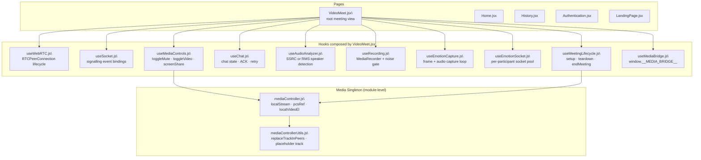
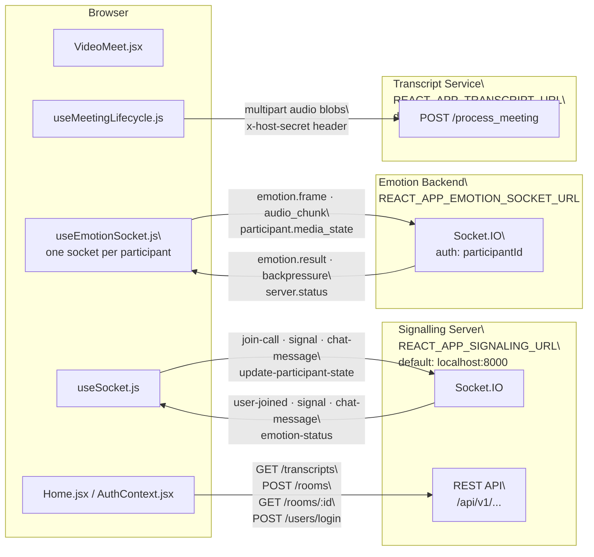
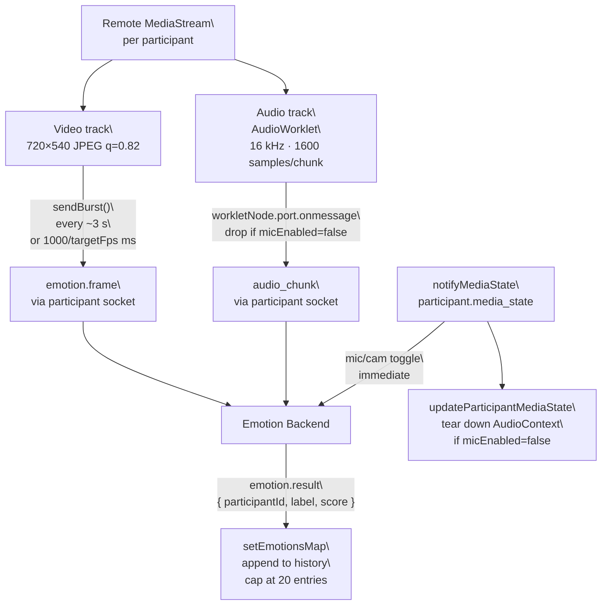
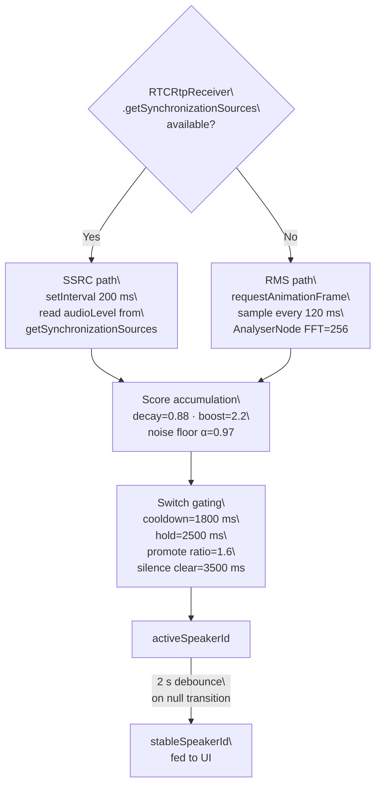
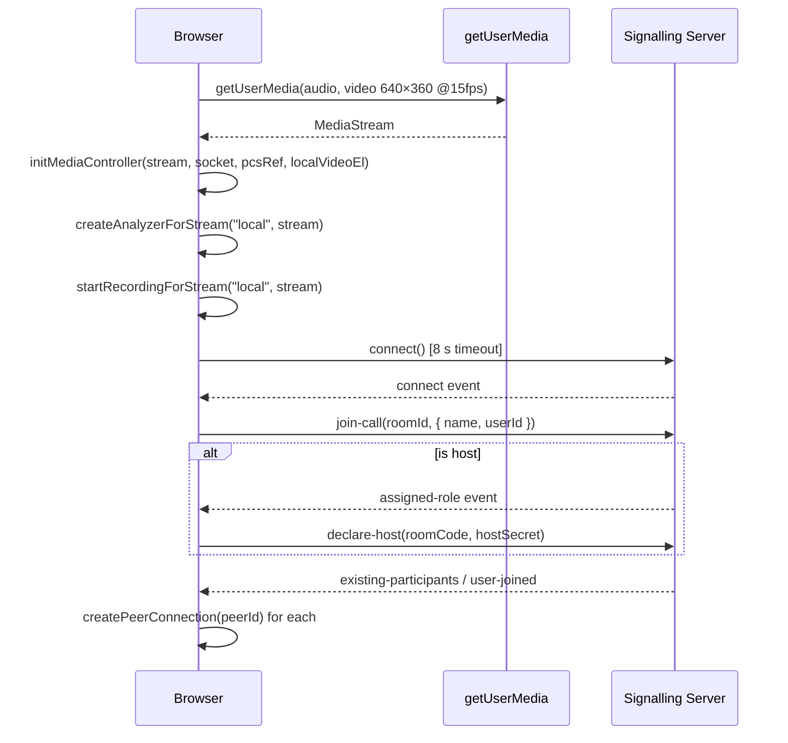

# Hoovik — Frontend

## Overview

Hoovik is a React-based browser application for multi-party video meetings. It combines WebRTC peer connections (negotiated via a Socket.IO signalling server), a real-time emotion analysis pipeline, an in-meeting chat system, and a post-meeting transcript viewer. The frontend is structured as a single-page application with React Router. Authentication is JWT-based; the token is persisted in `localStorage`.

---

## Features

The following features are implemented and directly observable in the source:

- **Multi-party video via WebRTC** — each remote peer gets its own `RTCPeerConnection`, managed in `useWebRTC.js`. Perfect-negotiation (polite/impolite roles) is implemented.
- **Active-speaker detection** — two independent detection paths exist: an SSRC-based path using `RTCRtpReceiver.getSynchronizationSources()` (used when available) and an RMS-based fallback using Web Audio API `AnalyserNode`. Both are in `useAudioAnalyzer.js`.
- **Real-time emotion analysis** — the host sends video frames (`emotion.frame`) and audio chunks (`audio_chunk`) for each remote participant over per-participant Socket.IO connections to a separate emotion backend (`REACT_APP_EMOTION_SOCKET_URL`). Implemented in `useEmotionCapture.js` and `useEmotionSocket.js`.
- **Noise-gated audio recording** — the host records each participant's audio stream using `MediaRecorder`. Chunks are gated by an RMS noise gate before being counted as speech. Implemented in `useRecording.js`.
- **In-meeting chat** — real-time, socket-delivered chat with pending/sent/failed delivery states, ACK timeout (`ACK_TIMEOUT_MS = 5000` ms, `useChat.js`), and retry support.
- **Screen sharing** — replaces the local video track in all peer connections via `replaceTrackInPeers` (`mediaControllerUtils.js`).
- **Post-meeting transcript submission** — after the host ends a meeting, recorded audio blobs are posted to `TRANSCRIPT_ENDPOINT` as multipart form data. The transcript is fetched on the Home page and displayed via `TranscriptViewer.jsx`.
- **Responsive mobile layout** — below 900 px (configurable in `VideoMeet.jsx` via `useIsMobile(900)`), the UI switches to a bottom-sheet panel for chat and emotion views, and the filmstrip becomes horizontal.
- **Meeting history** — participants and host are recorded via `addToUserHistory` in `AuthContext.jsx`. Server endpoints are tried in sequence with a `localStorage` fallback.

---

## Architecture

### Component & Hook Composition

### External Server Connections

### Emotion Capture Pipeline

### Active-Speaker Detection

---

## Data Flow

### Meeting setup (`useMeetingLifecycle.js → start()`)

### Peer connection lifecycle (`useWebRTC.js`)

- `createPeerConnection(peerId)` — creates `RTCPeerConnection` with `ICE_CONFIG` (STUN + TURN credentials from env vars in `meetConfig.js`), adds local tracks, wires `ontrack`, `onicecandidate`, `onnegotiationneeded`, `onconnectionstatechange`.
- Polite role is determined by `myId > peerId` (string comparison).
- A disconnected peer triggers teardown after `DISCONNECTED_TIMEOUT_MS = 12000` ms (`useWebRTC.js`).
- ICE failure triggers `pc.restartIce()`.

### Active-speaker detection (`useAudioAnalyzer.js`)

- **SSRC path** (preferred): runs at `SSRC_INTERVAL = 200` ms via `setInterval`. Reads `audioLevel` from `getSynchronizationSources()`.
- **RMS path** (fallback when `RTCRtpReceiver.prototype.getSynchronizationSources` is absent): runs via `requestAnimationFrame`, sampled every `RMS_INTERVAL = 120` ms. Uses `AnalyserNode` with `FFT_SIZE = 256`.
- Speaker score is accumulated with `SPEAK_DECAY = 0.88` and `SPEAK_BOOST = 2.2`. A noise floor per participant is tracked with `NOISE_FLOOR_ALPHA = 0.97`.
- Speaker switches are gated by `SWITCH_COOLDOWN = 1800` ms and `HOLD_DURATION = 2500` ms. A speaker is only promoted if their score exceeds the current speaker's score by `PROMOTE_RATIO = 1.6`.
- The active speaker is cleared after `SILENCE_CLEAR_MS = 3500` ms of silence.
- In `VideoMeet.jsx`, a debounce wrapper (`stableSpeakerTimerRef`, 2000 ms delay on null transition) feeds `stableSpeakerId` to the UI.

### Emotion capture (`useEmotionCapture.js`)

- Only runs when `isHost === true` and `EMOTIONS_ENABLED` is truthy.
- Interval defaults to `EMO_CONFIG.captureIntervalMs = 3000` ms (`meetConfig.js`) unless `serverCapsRef.targetFps` is set, in which case `Math.max(200, Math.round(1000 / targetFps))` ms is used.
- Each capture pass calls `sendBurst` for every remote stream. Burst count is `BURST_COUNT_DEFAULT = 1` or `BURST_COUNT_MANY = 1` (both currently 1; `MANY_THRESHOLD = 4`).
- Active speaker is deprioritised every `ACTIVE_SPEAKER_DEPRIORITISE_EVERY = 4` passes by moving them to the end of the iteration order.
- Frame resolution is `CAPTURE_WIDTH = 720 × CAPTURE_HEIGHT = 540`, JPEG quality `0.82`.
- Audio is captured from each remote participant's `MediaStream` (not the local stream) via an inline `AudioWorklet` processor (`emotion-chunk-processor`). Sample rate is `AUDIO_SAMPLE_RATE = 16000` Hz; chunk size is `AUDIO_CHUNK_SAMPLES = 1600` samples (100 ms at 16 kHz).
- Frames are emitted as `emotion.frame`; audio chunks as `audio_chunk` on the participant's dedicated socket.
- The server may emit `backpressure` with `suggestedFps`; the client reduces its interval and restores after `BACKPRESSURE_RESTORE_DELAY_MS = 8000` ms.

### Emotion socket pool (`useEmotionSocket.js`)

- `ensureSocket(participantId)` lazily creates a Socket.IO connection to `REACT_APP_EMOTION_SOCKET_URL` authenticated with `auth: { participantId }`.
- Incoming `emotion.result` events are handled by `handleEmotion`, which validates against `VALID_EMOTIONS` and a minimum confidence of `0.05` before appending to `emotionsMap`. History is capped at the last 20 entries per participant.
- `notifyMediaState(participantId, { micEnabled, cameraEnabled })` emits `participant.media_state` to the backend. It also calls `updateParticipantMediaState` in `useEmotionCapture` to immediately halt audio/video capture for that participant.
- `releaseSocket(participantId)` disconnects and removes the socket; called as `releaseEmotionSocket` from `closePeer` in `VideoMeet.jsx`.

### Noise-gated recording (`useRecording.js`)

- One `MediaRecorder` per participant, 1-second time slices.
- Preferred MIME type is `audio/webm;codecs=opus`, falling back to `audio/webm`, then browser default.
- Remote participant audio is re-encoded through a dedicated `AudioContext` before passing to `MediaRecorder`.
- Each 1-second chunk is evaluated against an RMS gate: `NOISE_GATE_RMS_THRESHOLD = 0.008` (env: `REACT_APP_NOISE_GATE_RMS`), hold time `NOISE_GATE_HOLD_MS = 1500` ms, smoothing `NOISE_GATE_SMOOTHING = 0.8`. All three are runtime-configurable via environment variables.
- `hasSufficientSpeech(rec)` returns `true` if `gateState.totalSpeechMs >= SPEECH_MIN_ACTIVE_MS` (default `800` ms, env: `REACT_APP_SPEECH_MIN_ACTIVE_MS`).
- On `endMeeting`, `stopAllRecorders()` is awaited before chunks are snapshotted and submitted to `TRANSCRIPT_ENDPOINT`.

### Transcript submission (`useMeetingLifecycle.js → uploadTranscriptWithRetry()`)

- Called directly inside `endMeeting()`, before navigation to `/home`. It blocks navigation until complete (or exhausted). Before calling, `endMeeting` builds an `emotionSnapshot` from `emotionsMap` (the in-memory live emotion history accumulated during the call) and saves it to `localStorage` under `emotions:<code>` and `emotionNames:<code>` for later retrieval by `TranscriptViewer.jsx`.
- Submits `audio_files` (one `.webm` blob per recorder), `meeting_code`, and `speaker_map` (socket ID → display name map, including `"local"` → host display name) as multipart form data to `TRANSCRIPT_ENDPOINT`.
- Retries up to `maxRetries = 3` times with exponential backoff (`2^(attempt-1) * 1000` ms). Client errors (4xx) abort immediately without retrying. If all retries are exhausted, the user is shown an `alert`.
- Only runs when `TRANSCRIPTS_ENABLED` is truthy and `hostData.hostSecret` is present in `localStorage`.

### Chat (`useChat.js`)

- Messages are inserted in timestamp order via `insertSorted`.
- Duplicate suppression uses `seenMsgIdsRef` (a `Set`).
- On send, the message is optimistically added with `status: "pending"` and an ACK timer of `ACK_TIMEOUT_MS = 5000` ms is armed. If no ACK arrives, status becomes `"failed"`. Retry is available via `retryMessage`.
- Maximum message length: `MAX_TEXT_LENGTH = 2000` characters.

---

## Core Modules

| File | Responsibility |
|---|---|
| `VideoMeet.jsx` | Root meeting view; state ownership; hook composition |
| `useWebRTC.js` | `RTCPeerConnection` lifecycle, perfect-negotiation, ICE |
| `useSocket.js` | All Socket.IO event bindings for the signalling server |
| `useMeetingLifecycle.js` | Join, leave, end-meeting, cleanup, transcript dispatch |
| `useChat.js` | Chat message state, send/ACK/retry logic |
| `useAudioAnalyzer.js` | SSRC and RMS active-speaker detection |
| `useRecording.js` | Per-participant `MediaRecorder` with noise gate |
| `useEmotionCapture.js` | Periodic frame + audio capture loop |
| `useEmotionSocket.js` | Per-participant emotion socket pool |
| `useMediaControls.js` | `toggleMute`, `toggleVideo`, `startScreenShare` |
| `useMediaBridge.js` | Exposes `window.__MEDIA_BRIDGE__` for cross-module calls |
| `mediaController.js` | Module-level singleton: local stream, PCs, video element |
| `mediaControllerUtils.js` | Pure helpers: `replaceTrackInPeers`, placeholder track, Safari preview |
| `emotionHelpers.js` | Score normalisation, label validation, emoji rendering |
| `AuthContext.jsx` | JWT auth, login, register, history, multi-endpoint fallback |
| `TranscriptViewer.jsx` | Transcript display with speaker filter, emotion filter, search, AI summary tab |
| `EmotionServicePanel.jsx` | Sidebar panel: per-participant emotion cards, group summary, AI insight |

---

## Configuration

All runtime-configurable values are read from `process.env` at module load time. The following are explicitly referenced in source:

| Environment Variable | Default | Used In |
|---|---|---|
| `REACT_APP_SIGNALING_URL` | `http://localhost:8000` | `meetConfig.js` |
| `REACT_APP_EMOTION_SOCKET_URL` | *(required)* | `useEmotionSocket.js` |
| `REACT_APP_TRANSCRIPT_URL` / `REACT_APP_AI_URL` | `http://localhost:5001/process_meeting` | `meetConfig.js` |
| `REACT_APP_API_URL` | `http://localhost:8000/api/v1` | `meetConfig.js`, `home.jsx` |
| `REACT_APP_SERVER_URL` | `http://localhost:8000` | `home.jsx` |
| `REACT_APP_TURN_URL_UDP` | *(optional)* | `meetConfig.js` |
| `REACT_APP_TURN_URL_80` | *(optional)* | `meetConfig.js` |
| `REACT_APP_TURN_URL_443` | *(optional)* | `meetConfig.js` |
| `REACT_APP_TURN_URL_443_TCP` | *(optional)* | `meetConfig.js` |
| `REACT_APP_TURN_URL_TLS` | *(optional)* | `meetConfig.js` |
| `REACT_APP_TURN_USERNAME` | *(optional)* | `meetConfig.js` |
| `REACT_APP_TURN_CREDENTIAL` | *(optional)* | `meetConfig.js` |
| `REACT_APP_NOISE_GATE_RMS` | `0.008` | `useRecording.js` |
| `REACT_APP_NOISE_GATE_HOLD_MS` | `1500` | `useRecording.js` |
| `REACT_APP_NOISE_GATE_SMOOTHING` | `0.8` | `useRecording.js` |
| `REACT_APP_SPEECH_MIN_ACTIVE_MS` | `800` | `useRecording.js` |
| `REACT_APP_SUPPORTS_GLOBAL_MEETINGS` | `true` | `AuthContext.jsx` |

Feature flags (imported from `../environment`):
- `TRANSCRIPTS_ENABLED` — gates transcript submission and the transcript list on the Home page.
- `EMOTIONS_ENABLED` — gates all emotion capture. If falsy, `startPeriodicEmotionCapture` returns immediately.

Static configuration in `meetConfig.js`:
- `ICE_CONFIG`: STUN (`stun:stun.l.google.com:19302`) + TURN (URLs and credentials read from environment variables `REACT_APP_TURN_URL_*`, `REACT_APP_TURN_USERNAME`, `REACT_APP_TURN_CREDENTIAL`). TURN entries with an undefined URL are filtered out at build time.
- `EMO_CONFIG.captureIntervalMs = 3000`.

---

## Runtime Behaviour

### Host determination

`localStorage.getItem("host:<ROOM_CODE>")` is used only to decide whether to attempt `declare-host`. The `isHost` React state in `VideoMeet.jsx` starts as `false` and is set to `true` only after the server returns `{ ok: true }` in the `declare-host` ACK callback. Host UI controls and host-only behaviour are therefore gated on server verification, not on `localStorage` alone.

### Host `declare-host` flow

After `join-call` is emitted, if `localStorage` contains a `hostSecret` for the room, the client waits for the server's `assigned-role` event before emitting `declare-host(roomCode, hostSecret, ackCallback)`. On `{ ok: true }` ACK, `isHostRef.current` is set to `true` and `onHostConfirmed()` is called, which sets `isHost` state to `true` in `VideoMeet.jsx`. If the server rejects the declaration, an error is logged and `isHost` remains `false`.

### Emotion data flow on mute/unmute

When a remote participant mutes, `useSocket.js` receives `update-participant-state` and updates `participantsMeta`. A `useEffect` in `VideoMeet.jsx` diffs the previous and current mute state; for changed participants, it calls `notifyMediaState(userId, { micEnabled: !nowMuted, cameraEnabled: true })`. This simultaneously:
1. Emits `participant.media_state` to the emotion backend via the participant's socket.
2. Calls `updateParticipantMediaState` in `useEmotionCapture`, which tears down the `AudioContext` for that participant immediately.

Camera state changes are handled analogously via `toggleVideo` in `useMediaControls.js`.

### `window.__MEDIA_BRIDGE__`

`useMediaBridge.js` populates `window.__MEDIA_BRIDGE__` with functions including `setupVolumeAnalyzer`, `stopVolumeAnalyzer`, `startTranscription`, `stopTranscription`, `startRecording`, `stopRecording`, `startEmotion`, `stopEmotion`, `notifyMediaState`, and `updateParticipantMediaState`. This is the intended cross-context access surface for components that cannot import hooks directly. The object is deleted on effect cleanup.

### `window.__MEDIA_CTRL`

In non-production builds (`process.env.NODE_ENV !== "production"`), `mediaController.js` also populates `window.__MEDIA_CTRL` with `getLocalStream`, `stopAll`, and `forceRelease` for debugging purposes.

### Safari handling

`mediaControllerUtils.js` detects Safari via UA string (`/^((?!chrome|android).)*safari/i`). On Safari, video preview is refreshed by setting `srcObject = null` then reassigning after `SAFARI_PREVIEW_REFRESH_DELAY_MS = 16` ms. A mic swap is performed when turning video off on mobile Safari (`_safariMicSwap` in `mediaController.js`).

### Placeholder video track

When video is turned off (`_turnVideoOff` in `mediaController.js`), a 16×12 px black canvas stream (`PLACEHOLDER_FPS = 1`) is created and sent to peers instead of nullifying the track. This avoids renegotiation in some browsers. The placeholder is torn down when video is re-enabled.

### Spotlight / filmstrip layout

`VideoMeet.jsx` computes `effectiveSpotlightId` as: manual pin (`spotlightPeerId`) if still present, else `stableSpeakerId` if present, else the first entry of `remoteEntries` (sorted alphabetically by peer ID). The spotlight peer is rendered in `SpotlightCard`; all others are rendered as compact `ParticipantCard` tiles in the filmstrip.

### Unread chat badge

`VideoMeet.jsx` tracks `unreadCount`. It increments by the delta of new messages when the chat panel is not visible. It resets to 0 when the chat panel is opened. On mobile, panel visibility is determined by `mobileSheet === "chat"`.

---

## Socket.IO / API Contracts

### Signalling server events (emitted by client)

| Event | Payload | Description |
|---|---|---|
| `join-call` | `roomId, { name, userId }` | Join the room |
| `declare-host` | `roomCode, hostSecret, ackCallback` | Declare self as host; emitted after `assigned-role` is received from server |
| `leave-call` | `roomId` | Leave the room |
| `end-meeting` | `roomId` | Host leaves the meeting; server treats this as a silent leave, participants stay in meeting |
| `signal` | `peerId, jsonString` | SDP / ICE candidate relay |
| `chat-message` | `roomId, msg, ackCallback` | Send a chat message |
| `update-participant-state` | `{ muted?, video?, screen? }` | Broadcast local media state |
| `emotion-status` | `{ active: boolean }` | Host broadcasts emotion capture on/off state to all participants |
| `get-emotion-status` | *(none)* | Non-host requests the current emotion capture state from the server |

### Signalling server events (received by client)

| Event | Handled In |
|---|---|
| `connect` | `useSocket.js` → sets `myId` |
| `assigned-role` | `useMeetingLifecycle.js` → triggers `declare-host` emission (host only) |
| `existing-participants` | `useSocket.js` → creates PCs for existing peers |
| `participants-updated` | `useSocket.js` → syncs participant list |
| `user-joined` | `useSocket.js` → creates PC for new peer |
| `user-left` | `useSocket.js` → calls `closePeer` and `removeAnalyzer` |
| `signal` | `useSocket.js` → calls `handleSignal` |
| `chat-history` | `useSocket.js` → seeds chat state |
| `chat-message` | `useSocket.js` → calls `handleIncomingMessage` |
| `chat-ack` | `useSocket.js` → calls `handleAck` |
| `update-participant-state` | `useSocket.js` → updates `participantsMeta.meta.muted` |
| `emotion-status` | `useSocket.js` + `VideoMeet.jsx` → updates `emotionLive` state (non-host only) |
| `disconnect` | `useSocket.js` → deferred cleanup after 15 s if no PCs remain |

### Emotion backend events (emitted by client)

| Event | Payload | Description |
|---|---|---|
| `emotion.frame` | `{ meetingId, participantId, buffer: Uint8Array }` | JPEG frame |
| `audio_chunk` | `Uint8Array` | 1600-sample Float32 PCM at 16 kHz |
| `participant.media_state` | `{ participantId, micEnabled, cameraEnabled }` | Immediate modality update |

### Emotion backend events (received by client)

| Event | Handled In |
|---|---|
| `emotion.result` | `useEmotionSocket.js` → `handleEmotion` |
| `server.status` | `useEmotionSocket.js` → updates `serverCapsRef.targetFps` |
| `backpressure` | `useEmotionSocket.js` → updates `serverCapsRef.suggestedFps` |
| `emotion.error` | `useEmotionSocket.js` → `console.warn` |

### REST API (client-side calls)

| Method + Path | Used In | Purpose |
|---|---|---|
| `POST /api/v1/rooms` | `home.jsx` | Create room, receive `roomCode` + `hostSecret` |
| `GET /api/v1/rooms/:id` | `home.jsx` | Validate room before joining |
| `GET /api/v1/transcripts?limit=200` | `home.jsx` | Fetch transcript list |
| `POST TRANSCRIPT_ENDPOINT` | `useMeetingLifecycle.js` | Submit audio for transcription |
| `POST /api/v1/users/register` | `AuthContext.jsx` | Register |
| `POST /api/v1/users/login` | `AuthContext.jsx` | Login, receive JWT |
| `GET /api/v1/users/me` | `AuthContext.jsx` | Hydrate user on load |
| `POST /api/v1/auth/logout` | `AuthContext.jsx` | Server-side logout |
| `GET /api/v1/users/get_all_activity` | `AuthContext.jsx` | Meeting history |
| `POST /api/v1/meetings` | `AuthContext.jsx` | Record meeting (with fallback) |
| `POST /api/v1/transcripts/:id/summary` | `TranscriptViewer.jsx` | Body: `{ emotionData, emotionNames }` read from `localStorage` keys `emotions:<code>` and `emotionNames:<code>`. Triggers Groq AI summary generation with live emotion annotation; response includes `discrepancies` array rendered inline in the OVERVIEW block. |

---

## Emotion Display Logic (`emotionHelpers.js`)

- `formatTopEmotion(emotion)` normalises a variety of input shapes (string, array, object with `probs`, object with `label`/`score`) to `{ label, score }`.
- `getTopEmotionLabel` applies a post-processing rule: `sad` with `score < 0.65` is remapped to `neutral/calm`.
- `EMOTION_DISPLAY_MIN_SCORE = 0.42` — emotions with a normalised score below this are not rendered.
- Valid emotion labels: `angry`, `fearful`, `disgust`, `happy`, `sad`, `neutral/calm`, `neutral`.
- `EmotionGroupSummary` aggregates emotion counts over the last 30 seconds. It renders up to 4 dominant emotions as percentage bars.
- `EmotionAIInsight` generates a single text insight string from the last 30 seconds of data. The logic is rule-based (threshold comparisons), not model-based. It runs inside `useMemo`.

---

## Error Handling

- **`getUserMedia` failures** in `useMeetingLifecycle.js` are caught; the user is alerted and the room key is removed from `_activeRooms`.
- **Socket connection timeout** (8 s) rejects the setup promise, caught by the same `try/catch`.
- **`MediaRecorder` init failure** in `useRecording.js` — caught per-participant; the affected recorder is skipped.
- **`AudioWorklet.addModule` failure** in `useEmotionCapture.js` — caught; `audioStateRef` entry is deleted, audio capture is skipped for that participant.
- **`RTCPeerConnection` ICE failure** — `restartIce()` is attempted. If connection state becomes `"failed"`, `teardown(peerId)` is called.
- **Chat ACK timeout** — after `ACK_TIMEOUT_MS = 5000` ms, message status is set to `"failed"`. Retry is user-initiated.
- **Transcript submission failures** — retried up to 3 times with exponential backoff. Client-side errors (4xx) abort immediately. After all retries are exhausted, the user is shown a browser `alert`.
- **`History.jsx` fetch failure** — error is stored in state and displayed in the UI. The `AuthContext.getHistoryOfUser` attempts multiple server endpoints before falling back to `localStorage`.
- **`AuthContext.jsx` `addToUserHistory`** — tries up to four endpoints in sequence; falls back to `localStorage`. All failures are logged via `console.warn`.
- Socket disconnect in `useSocket.js` — a 15-second timer is set. If the socket has not reconnected and no peer connections remain, `cleanupAll` is called and the user is navigated to `/home`.

---

## Security Considerations

The following are observable from the implementation:

- JWT is stored in `localStorage` and attached as a `Bearer` token in all API requests.
- `hostSecret` is stored in `localStorage` under the key `host:<ROOM_CODE>` and sent as `x-host-secret` header with transcript upload requests.
- The host role is server-verified: `localStorage` is used only to decide whether to attempt `declare-host`. `isHost` state is set to `true` only after the server returns `{ ok: true }` in the ACK, gating all host UI and behaviour on `Meeting.verifyHostSecret` passing.
- `home.jsx` calls `cleanInvalidHosts()` on mount to remove `localStorage` entries that lack a `hostSecret`.
- Socket authentication for the emotion backend uses `auth: { participantId }` in the Socket.IO connect options. The value is the participant's user ID or socket ID as resolved in `useEmotionCapture.js → resolveParticipantId`.
- TURN credentials are read entirely from environment variables (`REACT_APP_TURN_USERNAME`, `REACT_APP_TURN_CREDENTIAL`, `REACT_APP_TURN_URL_*`). No credentials are hardcoded in `meetConfig.js`.

---

## Known Limitations

All items below are grounded in code structure or explicit comments:

1. **`_activeRooms` is a module-level `Set`** — in `useMeetingLifecycle.js`. It persists across React hot-reloads in development, which can cause the guard to suppress room re-entry.
2. **Safari video preview refresh workaround** — explicitly implemented in `refreshSafariPreview` to ensure reliable video rendering on Safari.
3. **`AudioWorklet` blob URL is created per participant** — `useEmotionCapture.js` creates and revokes a `Blob` URL for the worklet processor code each time `ensureParticipantAudio` is called. If many participants join rapidly, multiple `AudioContext` instances may be initialised concurrently.
4. **Camera modality state defaults to `true`** — when syncing remote mute state in `VideoMeet.jsx`, `cameraEnabled` is always passed as `true` because camera state is not tracked in `prevParticipantMuteStateRef`. Only mic state is diffed.
5. **Transcript polling uses exponential backoff, capped at 10 minutes** — `startPollingForTranscript` in `home.jsx` uses backoff delays of `[5, 10, 20, 40]` seconds (with ±20% jitter), then repeats 40-second intervals until the 10-minute wall clock limit is reached. No fixed-interval polling or fixed attempt count is used.
6. **`MAX_TEXT_LENGTH` is enforced client-side only** — `useChat.js` truncates to 2000 characters via `String.slice`. The server is expected to enforce its own limit independently.

---

> **Resolved in recent PRs** — the following items from earlier versions of this list have been fixed:
> - ~~Transcript panel expands indefinitely when "Show more" is clicked~~ — the panel now uses a fixed-height scrollable container ([#9](https://github.com/AnupamKumar-1/Hoovik/issues/9) / [#23](https://github.com/AnupamKumar-1/Hoovik/pull/23))
> - ~~Local video preview overlaps chat input area on desktop when the chat panel is open~~ — preview now repositions dynamically when chat is expanded ([#10](https://github.com/AnupamKumar-1/Hoovik/issues/10))
> - ~~No retry for transcript upload~~ — `uploadTranscriptWithRetry` now retries up to 3 times with exponential backoff and alerts the user on final failure.
> - ~~Host role is client-enforced~~ — `isHost` state now starts as `false` and is set to `true` only after server returns `{ ok: true }` in the `declare-host` ACK; `localStorage` is used only to decide whether to attempt verification.
> - ~~Live emotion data captured during meetings was saved to `localStorage` but never used in AI summary generation~~ — `handleGenerateSummary` in `TranscriptViewer.jsx` now reads `emotions:<code>` and `emotionNames:<code>` from `localStorage` and sends them as `{ emotionData, emotionNames }` in the POST body; `SummaryPanel` renders the returned `discrepancies` inline in the OVERVIEW text block using `emotionMeta` colours and icons.
> - ~~Host "End Meeting" kicks all participants~~ — `end-meeting` is now a silent host leave; the server calls `handleLeave` for the host only and does not broadcast to participants.

---

## Future Improvements

Naturally following from the limitations above:

- Dynamic TURN credential provisioning (time-limited credentials from a server endpoint), even though credentials are currently sourced from env vars rather than being hardcoded.
- Camera mute state tracking in the remote mute diff to avoid always passing `cameraEnabled: true`.
- Reduce `AudioWorklet` module instantiation cost by sharing a single blob URL across participants within a session.