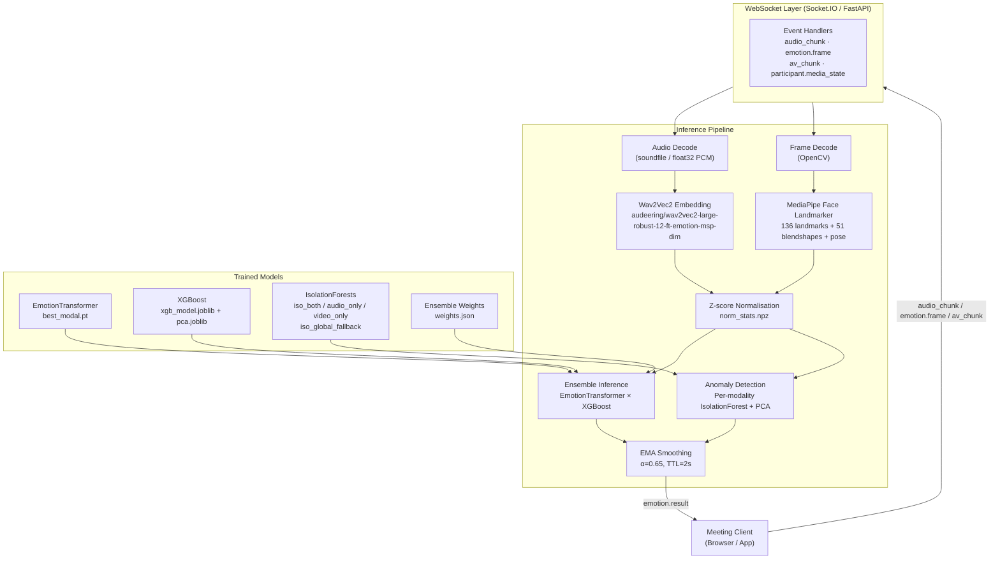
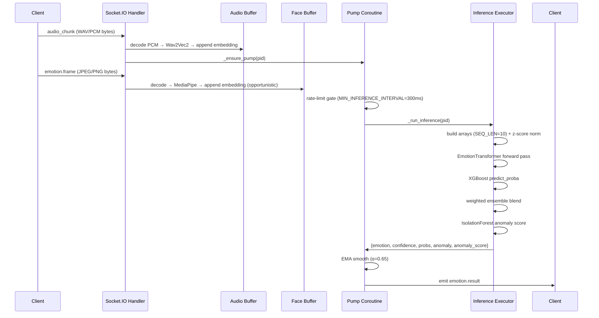
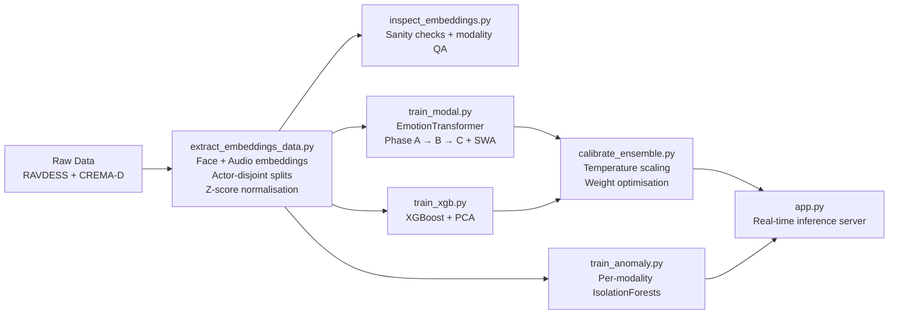

# Emotion Service - Hoovik


Real-time multimodal emotion recognition for video meetings. The service ingests live audio and video streams via WebSocket, extracts face and speech embeddings, and runs ensemble inference (Transformer + XGBoost) with modality-stratified anomaly detection — emitting per-participant emotion results at sub-second latency.

---

## Features

- **Real-time WebSocket inference** — audio-driven pump with video enrichment; median latency observed at 300–500 ms under a 10-participant load test (runtime logs, 2026-05-07)
- **Multimodal fusion** — simultaneous face (MediaPipe landmarks + blendshapes + head pose) and audio (Wav2Vec2) streams
- **Graceful modality degradation** — seamlessly switches between `both`, `audio_only`, and `video_only` as participants mute/unmute
- **Ensemble classifier** — weighted combination of an `EmotionTransformer` and an XGBoost model with temperature-calibrated probabilities
- **Modality-stratified anomaly detection** — per-modality IsolationForests with PCA compression flag suspect inference cycles
- **EMA smoothing** — exponential moving average over predictions with configurable history TTL
- **Back-pressure signalling** — server notifies clients to reduce frame rate when the face executor queue saturates
- **Actor-disjoint train/val/test splits** — strict speaker-independent evaluation across RAVDESS and CREMA-D
- **Optuna hyperparameter tuning** — separate search for the Transformer (`tune.py`) and XGBoost (`tune_xgb.py`)
- **Locust load testing** — WebSocket stress testing via `locustfile.py`
- **Health and readiness endpoints** — `GET /health` returns `{"status": "ok"}` (HTTP 200) as a lightweight liveness probe with no model dependency; `GET /ready` returns `{"status": "ready"}` (HTTP 200) only after successful model loading, or HTTP 503 if initialisation is incomplete — suitable for load balancer health checks
- **Live latency dashboard** — `GET /stats` renders a browser-friendly auto-refreshing dashboard showing P50/P90/P95/min/mean/max per modality plus active participant count; `GET /stats/json` exposes the same snapshot (including an `active_participants` field) for programmatic access ([#11](https://github.com/AnupamKumar-1/Hoovik/issues/11))

---

## System Architecture

### High-Level Overview



### Data Flow — Per Participant



### Training Pipeline



---

## Project Structure

```
emotion_service/
├── app.py                          # FastAPI + Socket.IO real-time server
├── config/
│   └── config.json                 # Unified config (model, training, processing, paths)
├── embeddings/
│   ├── extract_embeddings_data.py  # Feature extraction pipeline (face + audio)
│   ├── extract_config.json         # Extraction-specific config
│   └── face_landmarker.task        # MediaPipe face landmarker model asset
├── anomaly/
│   └── train_anomaly.py            # Modality-stratified IsolationForest training
├── inference/
│   ├── predict.py                  # EmotionPredictor (ensemble + anomaly wrapper)
│   └── ensemble.py                 # EmotionEnsemble (Transformer + XGBoost)
├── training/
│   ├── train_modal.py              # EmotionTransformer training (3-phase + SWA)
│   ├── train_xgb.py                # XGBoost feature engineering + training
│   ├── calibrate_ensemble.py       # Temperature scaling + weight calibration
│   ├── tune.py                     # Optuna search for Transformer hyperparams
│   └── tune_xgb.py                 # Optuna search for XGBoost hyperparams
├── scripts/
│   ├── create_sample.py            # Extract .npy test samples for offline inference
│   └── inspect_embeddings.py       # Dataset sanity checks
├── models/
│   ├── modal/
│   │   └── best_modal.pt           # Best EmotionTransformer checkpoint
│   ├── xgb/
│   │   ├── xgb_model.joblib
│   │   ├── pca.joblib
│   │   └── col_medians.npy
│   ├── ensemble/
│   │   └── weights.json
│   └── anomaly/
│       ├── iso_both.joblib
│       ├── iso_audio_only.joblib
│       ├── iso_video_only.joblib
│       ├── iso_global_fallback.joblib
│       └── meta.json
├── extracted_dataset/
│   ├── dataset.npz                 # Pre-extracted train/val/test splits
│   ├── norm_stats.npz              # Z-score mean/std per modality
│   └── splits.json                 # Actor-to-split assignments
├── logs/                           # Training and runtime logs
├── sample_inputs/                  # .npy files for offline inference testing
├── load_testing/
│   ├── locustfile.py               # WebSocket load test
│   └── src/                        # Participant face images for load testing (*.jpg)
├── observability/
│   └── stats.py                    # Live latency dashboard (GET /stats, GET /stats/json)
└── requirements.txt
```

---

## Tech Stack

| Layer | Technology |
|---|---|
| Server framework | FastAPI 0.135.3 |
| WebSocket | python-socketio 5.16.1 (ASGI mode) |
| Deep learning | PyTorch 2.6.0 (MPS / CUDA / CPU) |
| Audio embeddings | Wav2Vec2 (`audeering/wav2vec2-large-robust-12-ft-emotion-msp-dim`) via HuggingFace Transformers 4.40.0 |
| Face embeddings | MediaPipe 0.10.14 Face Landmarker |
| Gradient boosting | XGBoost 2.0.3 |
| Anomaly detection | scikit-learn 1.5.2 IsolationForest + PCA |
| Audio decode | soundfile 0.13.1, librosa 0.10.2 |
| Video decode | OpenCV 4.9.0 |
| Scheduling | APScheduler 3.11.2 |
| Hyperparameter tuning | Optuna |
| Load testing | Locust |
| Serialisation | joblib 1.5.3, numpy 1.26.4 |

---

## Core Modules

### `app.py` — Real-Time Inference Server

The central runtime process. Manages one async **pump coroutine per participant** that:

1. Drains the latest audio PCM from `_LATEST_AUDIO[pid]`
2. Optionally drains the latest frame from `_LATEST_FRAME[pid]`
3. Rate-limits to `MIN_INFERENCE_INTERVAL = 300 ms`
4. Submits Wav2Vec2 embedding to `_audio_executor` (2 threads)
5. Submits frame decode + MediaPipe to `_face_executor` (2 threads)
6. Submits ensemble inference to `_inference_executor` (1 thread, serialised)
7. Applies EMA smoothing, emits `emotion.result` back to all sockets for that pid

Modality is resolved at inference time via `_resolve_modality()` — consulting the authoritative `_PARTICIPANT_MEDIA_STATE`, freshness timestamps, and buffer lengths. Stale modalities (> `MODALITY_STALE_SEC = 0.4 s`) are masked out even if their rolling buffer still contains data.

### `inference/ensemble.py` — EmotionEnsemble

Wrapper loading `EmotionTransformer` and XGBoost as process-level singletons. The modal forward pass is protected by a class-level `threading.Lock` (`self._lock` in `_forward_modal`); the XGBoost prediction and probability blend are not locked, so full end-to-end thread safety for `predict()` relies on the single-worker `_inference_executor` architectural constraint. Builds the XGBoost feature matrix via `build_features_single()` (delegates to `train_xgb.build_features` — single source of truth), runs both models, and blends probabilities:

```
probs = w_modal × p_modal + w_xgb × p_xgb
```

When only one modality is active, weights collapse to `(0.0, 1.0)` or `(1.0, 0.0)`.

### `inference/predict.py` — EmotionPredictor

Thin wrapper adding input validation, anomaly detection, and latency tracking on top of `EmotionEnsemble`. Selects the appropriate per-modality `ModalityAnomalyModel` based on active masks, falling back to `iso_global_fallback` if no per-modality model is available.

### `training/train_modal.py` — EmotionTransformer

A dual-stream Transformer encoder with cross-modal attention:

- **Face stream**: `ModalityProjection` → `TemporalConvStem` → `PositionalEncoding` → `TransformerEncoder`
- **Audio stream**: same structure, separate weights
- **Cross-attention**: face queries attend to audio keys/values and vice versa, gated by a learned scalar `cross_gate`
- **Fusion head**: concatenated streams → `MaskedAttentionPooling` → MLP classifier
- **Auxiliary heads**: per-modality face and audio heads contribute 15% each to total training loss

Training uses a 3-phase curriculum:

| Phase | Data | Max Epochs | Features |
|---|---|---|---|
| A | `MODALITY_BOTH` only | 15 | No mixup; learns clean bimodal representations |
| B | All modalities | 40 | Mixup after warmup; RAVDESS upsampling |
| C | All modalities | 35 | Low-LR polish; SWA over last 4 epochs -- skipped if early stop fires before epoch 31 |

Observed test accuracy on current checkpoint: 74.25% (actor-disjoint test split, 2,299 samples; train_modal.log, 2026-05-08).

### `training/train_xgb.py` — XGBoost Classifier

Builds an **8,149-dimensional** feature vector per sample:

| Feature group | Dims | Description |
|---|---|---|
| Sequence stats — face | 326×4 = **1,304** | mean/std/min/max per dim over valid frames |
| Sequence stats — audio | 1024×4 = **4,096** | same |
| Temporal delta — face | **326** | last − first valid frame |
| Temporal delta — audio | **1,024** | same |
| Temporal slope — face | **326** | OLS slope in standardised time |
| Temporal slope — audio | **1,024** | same |
| Blendshape features | **32** | 15 emotion-relevant blendshapes (mean + max = 30) + 2 asymmetry (smile L/R, brow L/R) |
| Head-pose features | **6** | mean/std of pitch, yaw, roll |
| Audio rhythm | **3** | energy CV, slope, peak frame position |
| Face motion energy | **1** | frame-to-frame landmark MSE |
| Modality indicators | **7** | has_face, has_audio, face_coverage, audio_coverage, one-hot modality (3) |
| **Total** | **8,149** | |

PCA reduced to 512 dims (observed explained variance: 88.7% on current training split). `missing=np.nan` so XGBoost handles absent-modality entries natively. Observed test accuracy on current checkpoint: 66.03% (actor-disjoint test split, 2,299 samples; train_xgb.log, 2026-05-08).

### `anomaly/train_anomaly.py` — Modality-Stratified Anomaly Detection

Trains four `ModalityAnomalyModel` instances:

Thresholds below are calibrated to a target FPR of 10% on the val split and are specific to the current checkpoint set (train_anomaly.log, 2026-05-08). They will change on retraining.

| Model | n_train | n_val | PCA dims | Threshold (observed) | Val flagged |
|---|---|---|---|---|---|
| `both` | 6,645 | 1,526 | 256 | 0.05246 | 10.03% |
| `audio_only` | 1,492 | 384 | 384 | 0.08837 | 10.16% |
| `video_only` | 1,492 | 384 | 64 | -0.02637 [see Known Limitations] | 10.16% |
| `global_fallback` | 9,629 | 2,294 | 256 | 0.04952 | 10.03% |

Feature vector: **9,452 dims** (mean + std + min + max + IQR + valid-ratio + jitter per dim, plus first→last delta).

Per-source StandardScaler normalisation during training reduces RAVDESS vs CREMA-D distribution bias.

### `embeddings/extract_embeddings_data.py` — Feature Extraction Pipeline

Offline batch pipeline:

- **Face**: 136 key landmarks (nose-centred, eye-rotation-corrected, inter-ocular scale normalised) + 51 blendshapes + 3 head-pose angles = **326 dims**
- **Audio**: Wav2Vec2 last-hidden-state mean-pooled over a centred 0.6 s window = **1,024 dims**
- Sequence length: **10 frames** per sample
- Parallel face extraction via `ProcessPoolExecutor`; audio batched on GPU/MPS

Modality flags are assigned structurally from filename parsing — not retroactively from extraction success — ensuring training/inference consistency.

### `observability/stats.py` — Live Latency Dashboard

Mounted on the FastAPI app as a `stats_router` (`APIRouter`). Wired to `_LatencyTracker` through `set_tracker()`, called once during `app.py` startup before any request is served. Also wired to the participant state registry to expose `active_participants` — the count of participant IDs that currently have active pump coroutines, excluding empty or stale entries ([#11](https://github.com/AnupamKumar-1/Hoovik/issues/11)).

| Route | Response | Description |
|---|---|---|
| `GET /stats/json` | JSON | Snapshot of per-modality and overall P50/P90/P95/min/mean/max (ms) from the tracker's rolling 500-sample window, plus `active_participants` count |
| `GET /stats` | HTML | Self-contained auto-refreshing dashboard; polls `/stats/json` every 5 s and re-renders stat cards in-place without a full page reload; displays active participant count alongside latency metrics |

The module imports nothing from `app.py` — it holds only a module-level `_tracker` reference populated by `set_tracker`. Percentiles use linear interpolation on a sorted copy of the deque, consistent with `_LatencyTracker._report()`. Modality cards are rendered for `audio_only`, `video_only`, and `both`; an empty snapshot is returned safely when no tracker is wired or no samples have been recorded yet.

---

## Execution Flow

### Server Startup

```
1. lifespan() begins
2. load_extractor_models()  →  Wav2Vec2 + MediaPipe loaded (blocking executor call)
3. _load_norm_stats()       →  norm_stats.npz loaded
4. EmotionPredictor()       →  EmotionTransformer, XGBoost, IsolationForests, weights.json loaded
5. EmotionEnsemble warmup   →  one dummy forward pass to JIT model paths
6. Server ready
7. APScheduler starts       →  _gc_stale_participants scheduled every 30 s
```

### Per-Participant Lifecycle

The flow below reflects code paths in `app.py`. The step labels match log patterns emitted at runtime.

```
connect             → pid from auth.participantId (or sid fallback)
                    → server.status emitted: targetFps=5, modalityStaleSec=0.4

audio_chunk         → soundfile decode → Wav2Vec2 embedding → _AUDIO_BUFFER[pid]
                    → _ensure_pump(pid) spawns pump coroutine

emotion.frame       → OpenCV decode → MediaPipe embedding → _FACE_BUFFER[pid]
                    → if video_only mode: also _ensure_pump(pid)

_pump loop          → pulls _LATEST_AUDIO / _LATEST_FRAME (single-slot, coalesces bursts)
                    → 300 ms rate-limit gate
                    → concurrent Wav2Vec2 + MediaPipe in thread pools
                    → _run_inference → ensemble + anomaly scoring
                    → EMA smooth
                    → emit emotion.result

media_state event   → _PARTICIPANT_MEDIA_STATE updated immediately
                    → disabled modality: timestamp zeroed + buffer cleared
                    → enabled modality: timestamp refreshed for instant switch

pump halted         → logged as "all_modalities_disabled" when mic=False AND cam=False

disconnect          → _cleanup_participant frees all per-pid dicts
GC                  → inactive pids (> BUFFER_TTL=90 s, no sockets) evicted every 30 s
```

### Example Runtime Behaviour (log snapshot: 2026-05-07, 10:08:52--10:09:04 IST, 10 concurrent participants)

The following is an example drawn from a specific runtime log. Actual behaviour varies with participant count, network conditions, and hardware.

During that session the server:
- Ran `audio_only` inference (~300–700 ms latency) for muted-camera participants
- Switched to `video_only` on mic mute (`d9f26d40` → sad 0.975, `2d164cb6` → sad 0.879)
- Ran `both` modality inference for fully active participants (`7f7888f8` → disgust 0.486 → fearful 0.517)
- Halted pumps cleanly for all participants who disabled both streams
- Cleaned up all 10 participant states atomically on batch disconnect at 10:09:04

---

## WebSocket Events

### Client → Server

| Event | Payload | Description |
|---|---|---|
| `audio_chunk` | `bytes \| base64 \| {participantId, buffer}` | WAV / FLAC / OGG / raw float32 PCM |
| `frame` | `bytes \| base64 \| {participantId, buffer}` | JPEG or PNG video frame |
| `emotion.frame` | same as `frame` | Backwards-compatible alias |
| `av_chunk` | `{participantId, video?, audio?}` | Combined AV; routes each to its pipeline |
| `participant.media_state` | `{participantId?, micEnabled, cameraEnabled}` | Immediate modality toggle |
| `ping` | any | Keepalive |

### Server → Client

| Event | Payload | Description |
|---|---|---|
| `server.status` | `{status, participantId, device, seqLen, targetFps, modalityStaleSec, modalities}` | Emitted on connect |
| `emotion.result` | see schema below | Per-cycle inference result |
| `backpressure` | `{queueDepth, suggestedFps, ts}` | Face executor saturated — reduce frame rate |
| `emotion.error` | `{code, maxBytes}` | Oversized payload rejected |
| `pong` | `{ts}` | Keepalive response |

### `emotion.result` Payload

```json
{
  "participantId": "61f72281-371a-43f8-a9fb-b1dea5ed729a",
  "result": {
    "emotion": "neutral/calm",
    "confidence": 0.3130,
    "probs": {
      "angry":        0.0821,
      "fearful":      0.1045,
      "disgust":      0.0934,
      "happy":        0.1201,
      "sad":          0.1869,
      "neutral/calm": 0.4130
    },
    "modality": "audio_only",
    "anomaly": false,
    "anomaly_score": 0.063412
  },
  "latencyMs": 452.3,
  "ts": 1746847137101
}
```

---

## Configuration

All runtime and training parameters live in `config/config.json`.

### Processing

| Parameter | Value | Description |
|---|---|---|
| `seq_len` | 10 | Frames per inference window |
| `sample_rate` | 16000 | Audio sample rate (Hz) |
| `audio_window_sec` | 0.6 | Centred audio window per frame |
| `audio_dim` | 1024 | Wav2Vec2 embedding dimension |
| `face_dim` | 326 | MediaPipe embedding dimension |

### Runtime Tunable (in `app.py`)

| Parameter | Default | Description |
|---|---|---|
| `SMOOTHING_ALPHA` | 0.65 | EMA weight for current prediction |
| `CONFIDENCE_THRESHOLD` | 0.45 | Below this → report `neutral/calm` |
| `EMOTION_HISTORY_TTL` | 2.0 s | EMA state reset after inactivity |
| `MODALITY_STALE_SEC` | 0.4 s | Max age of a valid embedding |
| `MIN_INFERENCE_INTERVAL` | 0.30 s | Minimum gap between inferences per pid |
| `TARGET_CLIENT_FPS` | 5 | Communicated via `server.status` |
| `BACKPRESSURE_QUEUE_DEPTH` | 3 | Face executor queue depth threshold |
| `MAX_FRAME_SIZE` | 4 MB | Hard payload cap for video frames |
| `MAX_AUDIO_SIZE` | 2 MB | Hard payload cap for audio |
| `BUFFER_TTL` | 90 s | Inactivity TTL before GC eviction |

### Emotion Classes

| Index | Label |
|---|---|
| 0 | angry |
| 1 | fearful |
| 2 | disgust |
| 3 | happy |
| 4 | sad |
| 5 | neutral/calm |

### Anomaly Config (`config.json → "anomaly"`)

```json
{
  "target_fpr": 0.1,
  "pca_components": {
    "global_fallback": 256,
    "both": 256,
    "audio_only": 384,
    "video_only": 64
  },
  "n_estimators": 200,
  "min_train_samples": 50,
  "min_val_samples": 10
}
```

---

## Installation

```bash
# 1. Clone the repository
git clone <repo-url>
cd emotion_service

# 2. Create and activate virtual environment
python -m venv venv
source venv/bin/activate       # macOS/Linux
# venv\Scripts\activate        # Windows

# 3. Install dependencies
pip install -r requirements.txt

# 4. Download MediaPipe face landmarker asset
curl -L \
  "https://storage.googleapis.com/mediapipe-models/face_landmarker/face_landmarker/float16/latest/face_landmarker.task" \
  -o embeddings/face_landmarker.task
```

> **Hardware**: Training and inference tested on Apple Silicon (MPS), CUDA, and CPU. Device is auto-detected at startup.

---

## Running the Project

### 1. Feature Extraction (one-time)

Place raw data at `data/RAVDESS/` and `data/CREMA-D/` matching paths in `extract_config.json`:

```bash
python embeddings/extract_embeddings_data.py
```

Produces `extracted_dataset/dataset.npz` and `extracted_dataset/norm_stats.npz`.

### 2. Dataset Inspection

```bash
python scripts/inspect_embeddings.py
# Output logged to logs/inspect_<timestamp>.log
```

### 3. Training Pipeline

Run steps in order:

```bash
# Train the Transformer (Phase A + B + C)
python training/train_modal.py

# Train XGBoost
python training/train_xgb.py

# Train anomaly detectors
python anomaly/train_anomaly.py

# Calibrate ensemble weights + temperature
python training/calibrate_ensemble.py
```

Optional: hyperparameter search before training:

```bash
python training/tune.py --trials 30            # Transformer
python training/tune_xgb.py --trials 60        # XGBoost
```

### 4. Offline Inference Test

```bash
# Extract test samples (one per emotion class)
python scripts/create_sample.py --one-per-emotion

# Run offline inference
python inference/predict.py \
  --face   sample_inputs/xf_sad_0.npy \
  --audio  sample_inputs/xa_sad_0.npy \
  --face_mask  sample_inputs/fm_sad_0.npy \
  --audio_mask sample_inputs/am_sad_0.npy
```

### 5. Start the Real-Time Server

```bash
uvicorn app:app --host 0.0.0.0 --port 5002
```

Socket.IO endpoint: `ws://localhost:5002/socket.io`

### 6. Load Testing

```bash
# Place participant face images in load_testing/src/*.jpg
locust -f load_testing/locustfile.py --host http://localhost:5002
```

While a load test is running, open `http://localhost:5002/stats` in a browser to watch per-modality P50/P90/P95 latency update live. The JSON endpoint at `/stats/json` can be polled by scripts or external dashboards during the test.

---

## Logs and Monitoring

### Live Latency Dashboard

While the server is running, inference latency statistics are available without parsing log files:

| Endpoint | Access | Description |
|---|---|---|
| `GET /health` | HTTP | Liveness probe — returns `{"status": "ok"}` (HTTP 200); lightweight, no model dependency |
| `GET /ready` | HTTP | Readiness probe — returns `{"status": "ready"}` (HTTP 200) after successful model loading; returns HTTP 503 if not yet initialised |
| `GET /stats` | Browser | Auto-refreshing HTML dashboard showing P50/P90/P95/min/mean/max per modality and overall, plus active participant count; updates every 5 s |
| `GET /stats/json` | HTTP | JSON snapshot of the same data including `active_participants`; suitable for monitoring scripts or dashboards |

The dashboard reads from the `_LatencyTracker` rolling window (500 samples per modality). Data resets on server restart; no persistent latency store is maintained.

### Log Format

```
YYYY-MM-DD HH:MM:SS,mmm | LEVEL    | logger | message
```

### Key Runtime Log Patterns

| Pattern | Meaning |
|---|---|
| `connect sid=X pid=Y total=N` | New WebSocket connection established |
| `infer pid=X emotion=Y conf=Z mod=W anomaly=A lat=Lms` | Completed inference cycle |
| `media_state pid=X mic=Y cam=Z` | Participant toggled audio or video |
| `pump halted pid=X reason=all_modalities_disabled` | Both streams off; pump exits cleanly |
| `disconnect sid=X pid=Y remaining_sids=False` | Client fully disconnected |
| `state cleaned up pid=X` | Per-participant buffers and state freed |
| `Running job "_gc_stale_participants"` | APScheduler GC tick (every 30 s) |
| `Anomaly detected (score=X, threshold=Y)` | IsolationForest flagged sample; inference still runs |
| `backpressure queueDepth=N` | Face executor saturated; client notified |
| `inference timeout pid=X` | Inference exceeded 10 s; cycle skipped |

### Training Logs

| File | Content |
|---|---|
| `logs/train_modal.log` | Per-epoch loss/accuracy, per-dataset breakdown, test classification report |
| `logs/train_xgb.log` | Feature shape, PCA variance, early stopping, per-modality test results |
| `logs/train_anomaly.log` | Per-modality threshold, flagging rates, class/source breakdown |
| `logs/inspect_<ts>.log` | Dataset QA: NaN checks, mask coverage, actor overlap, class balance |

---

## AI/ML Models

### EmotionTransformer

| Attribute | Value |
|---|---|
| d_model | 256 |
| Attention heads | 8 |
| Encoder layers | 3 |
| dim_feedforward | 768 |
| Dropout | 0.152 |
| Training loss | FocalLoss (gamma=1.0) + SupCon + Triplet + separation margins (sad/fear/disgust) |
| Test accuracy (observed) | 74.25% (actor-disjoint test split, train_modal.log, 2026-05-08) |

### XGBoost

| Attribute | Value |
|---|---|
| n_estimators | 3,150 (best iteration observed: 3,145) |
| max_depth | 5 |
| learning_rate | 0.0308 |
| Input features | 8,149 → 512 (PCA, explained variance observed: 88.7%) |
| Test accuracy (observed) | 66.03% (actor-disjoint test split, train_xgb.log, 2026-05-08) |

### Ensemble

The figures below reflect the current checkpoint set (weights.json, 2026-05-08). Weights and temperature are regenerated by `calibrate_ensemble.py` on each run.

| Model | Calibrated weight | Test acc observed |
|---|---|---|
| EmotionTransformer | 0.455 | 74.25% |
| XGBoost | 0.545 | 66.03% |
| Ensemble | — | 74.34% |

Temperature: `T = 0.3` applied to Transformer logits before softmax (fit on val split, 2,294 samples).

### Anomaly Detection

Feature version `v2.0-iqr-ratio-jitter` — 9,452 dims per sample. Anomaly detection **does not block inference**; it only sets `anomaly: true` in the response. The downstream client decides how to act on the flag.

---

## Error Handling

- **Input validation** (`predict.py`): shape checks, binary mask validation, NaN/Inf detection, all-zero mask guard → structured `error_response` dict without raising
- **Payload size limits**: frames > 4 MB or audio > 2 MB rejected with `emotion.error` event
- **Inference timeout**: `asyncio.wait_for(..., timeout=10.0)` per inference call; timeouts skip the cycle with an error log
- **Audio decode fallback**: soundfile → raw float32 PCM → `None` on failure (logged at DEBUG)
- **MediaPipe failure**: `None` from face extraction handled silently; pump continues with audio-only
- **Post-toggle executor race**: Wav2Vec2/MediaPipe results completing after a participant mutes are discarded before updating timestamps — prevents stale modality refresh
- **Model loading failure**: `raise` in `lifespan()` — server refuses to start with incomplete models
- **Pump exceptions**: caught per-iteration with brief `asyncio.sleep` backoff; intended to keep the pump alive across transient errors, though unhandled exception types could still propagate

---

## Performance Considerations

- **Serialised inference**: single `_inference_executor` thread reduces GPU memory contention for most workloads; bottleneck beyond ~20 concurrent active participants
- **Parallel embedding**: face and audio run in separate 2-worker thread pools, overlapping with the rate-limit sleep
- **Latest-slot design**: `_LATEST_AUDIO` and `_LATEST_FRAME` are single-value slots — rapid bursts coalesce to the newest payload, preventing queue buildup
- **Frame-rate gate**: monotonic-clock `_FRAME_ACCEPT_AFTER[pid]` drops frames before any decode work; enforces `TARGET_CLIENT_FPS=5` server-side
- **Back-pressure**: dynamic `backpressure` event to clients when face queue depth ≥ 3
- **EMA TTL**: 2 s idle resets EMA to prevent stale emotional context bleeding across speech segments
- **Observed latency** (runtime log, 2026-05-07, 10 participants): median 300--500 ms; spikes to approximately 700 ms under concurrent load. Results will vary with hardware and participant count.

---

## Security Notes

- `cors_allowed_origins="*"` — **must be restricted to specific origins in production**
- Participant IDs from payload fields are validated against the session-established mapping; mismatches are logged and ignored
- No token authentication beyond optional `auth.participantId` on connect — production deployments require an auth layer
- Payload size limits (4 MB / 2 MB) provide basic DoS protection against oversized uploads

---

## Known Limitations

- **`video_only` anomaly threshold is negative** (-0.02637, observed in train_anomaly.log 2026-05-08): val scores cluster near zero with the current 64-component PCA; increasing `anomaly.pca_components.video_only` may improve threshold stability
- **RAVDESS `both` anomaly rate elevated**: higher than CREMA-D in the current checkpoint despite per-source scaling — likely reflects genuine distributional differences between acted and spontaneous speech
- **Ensemble marginal gain**: XGBoost contributes limited complementary signal at current feature/weight settings
- **`fearful` video-only recall**: insufficient video-only fearful training data; ensemble weight collapses so the Transformer carries that modality fully
- **MP3/AAC unsupported**: clients must send WAV, FLAC, OGG, or raw float32 PCM
- **Single inference thread**: hard scalability ceiling for large participant counts
- **No horizontal scaling**: pump state is in-process Python dicts; multi-host deployment requires an external state store (Redis, etc.)

---

## Future Improvements

- Batch inference across participants (collect N arrays, single forward pass) to increase throughput
- Persist per-participant EMA state across reconnects within a session window
- Integrate VAD (Voice Activity Detection) to skip silent audio frames before embedding
- Explore replacing XGBoost with a lightweight MLP on Transformer embeddings for tighter co-training
- Containerise with Docker for reproducible deployment