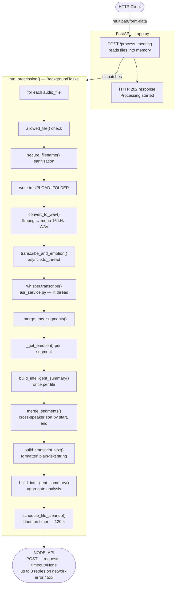
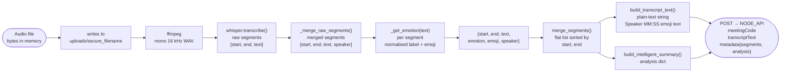

# Meeting Transcription & Emotion Analysis Service

A Python-based HTTP service that accepts multi-speaker audio uploads, performs speech-to-text transcription, per-segment emotion classification, and delivers structured transcript data to a configured downstream Node.js API.

---

## Table of Contents

- [Meeting Transcription \& Emotion Analysis Service](#meeting-transcription--emotion-analysis-service)
  - [Table of Contents](#table-of-contents)
  - [Overview](#overview)
  - [Features](#features)
  - [Architecture](#architecture)
  - [Data Flow](#data-flow)
  - [Core Modules](#core-modules)
    - [`app.py`](#apppy)
    - [`config.py`](#configpy)
    - [`services/asr_service.py`](#servicesasr_servicepy)
    - [`services/processing_service.py`](#servicesprocessing_servicepy)
    - [`utils/audio.py`](#utilsaudiopy)
    - [`utils/emotion.py`](#utilsemotionpy)
    - [`utils/helpers.py`](#utilshelperspy)
  - [Configuration](#configuration)
  - [API Contract](#api-contract)
    - [`POST /process_meeting`](#post-process_meeting)
    - [`NODE_API` Callback Payload](#node_api-callback-payload)
  - [Runtime Behaviour](#runtime-behaviour)
  - [Error Handling](#error-handling)
  - [Security Considerations](#security-considerations)
  - [Known Limitations](#known-limitations)
  - [Future Improvements](#future-improvements)

---

## Overview

This service exposes a single `POST /process_meeting` endpoint via FastAPI. It accepts one or more audio files alongside metadata (meeting code, speaker name map), processes each file through a transcription and emotion-detection pipeline, merges and sorts segments across speakers, and POSTs the resulting transcript and analysis JSON to a configurable Node.js callback URL.

Processing is intentionally dispatched as a background task (`BackgroundTasks`), so the HTTP response (HTTP 202) is returned immediately while the pipeline runs asynchronously. The `NODE_API` callback retries up to 3 times on transient network errors or HTTP 5xx responses (backoff: 5 s → 15 s → 30 s) before giving up ([#4](https://github.com/AnupamKumar-1/Hoovik/issues/4)).

---

## Features

- **Multi-file upload**: Accepts a list of audio files in a single request (`audio_files: list[UploadFile]`).
- **Format support**: Accepts `webm`, `wav`, `mp3`, `m4a`, `ogg`, `aac`, `mp4` (defined in `config.py` as `ALLOWED_EXT`).
- **Audio normalisation**: Converts all accepted formats to mono 16 kHz WAV via `ffmpeg` before transcription. `ffmpeg` availability is validated at service startup; the process exits immediately with a clear error message if `ffmpeg` is not found in `PATH` ([#7](https://github.com/AnupamKumar-1/Hoovik/issues/7)).
- **Speech-to-text**: Uses OpenAI Whisper `small` model, loaded once at module import in `asr_service.py`.
- **Segment merging**: Consecutive segments from the same speaker with a gap ≤ `MERGE_GAP_SEC` (2.0 s, hardcoded in `asr_service.py`) and combined word count ≤ `MERGE_MAX_WORDS` (60 words, hardcoded) are merged, unless the buffer ends with a sentence-terminal punctuation mark.
- **Emotion classification**: Uses `j-hartmann/emotion-english-distilroberta-base` via HuggingFace `transformers` pipeline. Segments with fewer than 4 words are assigned `"neutral"` without model inference.
- **Cross-speaker segment merge and sort**: `processing_service.merge_segments` collects all per-speaker segments, casts timestamps to `float`, and sorts by `(start, end)`.
- **Structured analysis**: `build_intelligent_summary` produces a summary, up to 5 scored key points, emotion distribution, top 8 word-frequency topics (after stop-word filtering), per-speaker stats, and speaking pace in WPM.
- **Transcript formatting**: `build_transcript_text` produces a human-readable string grouped by speaker turn, with timestamp and dominant emoji per block.
- **Temporary file cleanup**: Uploaded and converted files are scheduled for deletion after `CLEANUP_DELAY_SEC` (120 s, configured in `config.py`) using a daemon `threading.Timer`.

---

## Architecture



**Concurrency note**: `transcribe_and_emotion` is called via `asyncio.to_thread`, which runs it in the default `ThreadPoolExecutor`. Multiple audio files in a single request are processed sequentially (Python `for` loop over `audio_files_data`), not in parallel. The Whisper model and emotion pipeline are module-level singletons; concurrent requests from separate HTTP connections will share these objects without any explicit locking. Thread safety of these model objects depends on their upstream library implementations, not on any locking in this codebase.

> **Note on `build_intelligent_summary` calls**: `transcribe_and_emotion` calls `build_intelligent_summary` once per file on that file's segments. This per-file result is stored in the `results` dict but is **not forwarded** to the `NODE_API` callback — it is discarded. A second, aggregate call on the merged cross-speaker segments is what populates `analysis` in the callback payload. The architecture diagram above reflects only the aggregate call as significant.

---

## Data Flow



---

## Core Modules

### `app.py`

Entry point. Defines the FastAPI application, CORS middleware, the `POST /process_meeting` endpoint, and the `run_processing` async background function.

| Symbol | Role |
|---|---|
| `run_processing` | Async background task; orchestrates per-file processing and the Node.js callback. Retries the `NODE_API` POST up to 3 times on network errors or HTTP 5xx responses (backoff: 5 s → 15 s → 30 s); does not retry on 4xx ([#4](https://github.com/AnupamKumar-1/Hoovik/issues/4)) |
| `process_meeting` | FastAPI route handler; reads uploads into memory, delegates to `run_processing` via `BackgroundTasks` |

### `config.py`

Static and environment-derived configuration.

| Name | Type | Value / Source |
|---|---|---|
| `UPLOAD_FOLDER` | `str` | `"uploads"` (hardcoded) |
| `OUTPUT_FOLDER` | `str` | `"outputs"` (hardcoded) |
| `ALLOWED_EXT` | `set` | `{"webm","wav","mp3","m4a","ogg","aac","mp4"}` |
| `CLEANUP_DELAY_SEC` | `int` | `120` (hardcoded) |
| `NODE_API` | `str` | `NODE_API` env var, default `"http://localhost:8000/api/v1/transcripts"` |

### `services/asr_service.py`

Owns model loading, transcription, segment merging, emotion classification, scoring, and summary generation.

| Symbol | Role |
|---|---|
| `asr_model` | Whisper `small` model, loaded at import time |
| `emotion_pipeline` | HuggingFace `text-classification` pipeline, loaded at import time |
| `MERGE_GAP_SEC` | `2.0` — max silence gap for intra-speaker segment merging |
| `MERGE_MAX_WORDS` | `60` — max combined word count for merged segment |
| `STOP_WORDS` | Hardcoded `set` of 39 common words excluded from topic extraction |
| `transcribe_and_emotion` | Top-level function: transcribes WAV, merges segments, classifies emotions |
| `build_intelligent_summary` | Produces summary, key points, emotion distribution, speaker stats, pace |
| `_merge_raw_segments` | Merges consecutive same-speaker Whisper segments under gap/length thresholds |
| `_get_emotion` | Wraps emotion pipeline with cache; returns `"neutral"` for < 4-word segments |
| `_score_segment` | Heuristic scorer used for key-point selection and narrative summary construction |
| `_build_narrative_summary` | Selects best-scored segment from each third of the conversation |

### `services/processing_service.py`

Cross-speaker segment operations and transcript formatting.

| Symbol | Role |
|---|---|
| `merge_segments` | Flattens per-speaker segment dicts into a single list, sorts by `(start, end)` |
| `build_transcript_text` | Groups merged segments by speaker turn; formats as `[Speaker] (MM:SS) <emoji> <text>` |

### `utils/audio.py`

Wraps `ffmpeg` for audio conversion. Calls `ffmpeg -y -i <src> -ac 1 -ar 16000 -vn <dst>` as a subprocess with `check=True`. Raises `subprocess.CalledProcessError` on non-zero exit. A startup check (`shutil.which("ffmpeg")`) is performed at module import time; if `ffmpeg` is not found in `PATH` the service raises an error and refuses to start ([#7](https://github.com/AnupamKumar-1/Hoovik/issues/7)).

### `utils/emotion.py`

Defines `EMOJI_MAP`, `normalize_emotion`, and `get_emoji`. Normalises `"happy"/"happiness"` → `"joy"`, `"sad"` → `"sadness"`. Unknown labels fall through `normalize_emotion` unchanged; `get_emoji` returns `"😐"` for unrecognised keys.

### `utils/helpers.py`

| Symbol | Role |
|---|---|
| `allowed_file` | Extension check against `ALLOWED_EXT` |
| `clean_speaker` | Returns `"Guest"` if name is empty, `"unknown"`, or `"undefined"` |
| `schedule_file_cleanup` | Launches a daemon `threading.Timer` to delete a list of file paths after `delay` seconds |

---

## Configuration

All runtime-configurable values are read via environment variables (loaded with `python-dotenv`):

| Variable | Used in | Default | Effect |
|---|---|---|---|
| `NODE_API` | `config.py` | `http://localhost:8000/api/v1/transcripts` | POST destination for transcript results |
| `ALLOWED_ORIGINS` | `app.py` | `""` (empty → `[]`) | Comma-separated CORS allowed origins |

No other environment variables are referenced in the provided source files.

---

## API Contract

### `POST /process_meeting`

**Request** — `multipart/form-data`

| Field | Type | Required | Notes |
|---|---|---|---|
| `audio_files` | `UploadFile[]` | Yes | One or more audio files |
| `meeting_code` | `string` (form) | No | Default `"UNKNOWN"`; uppercased on receipt |
| `speaker_map` | `string` (JSON) | No | Default `"{}"`. Maps filename base (no extension) → display name |
| `x-host-secret` | Header | No | Forwarded as `x-host-secret` to `NODE_API` |
| `x-user-token` | Header | No | Forwarded as `Authorization: Bearer <token>` to `NODE_API` if present |

**Response** — HTTP 202

```json
{ "success": true, "message": "Processing started" }
```

The response is returned before processing completes. Results are delivered asynchronously to `NODE_API`.

---

### `NODE_API` Callback Payload

```json
{
  "meetingCode": "string",
  "transcriptText": "string",
  "metadata": {
    "segments": [
      {
        "start": float,
        "end": float,
        "speaker": "string",
        "text": "string",
        "emotion": "string",
        "emoji": "string"
      }
    ],
    "analysis": {
      "summary": "string",
      "key_points": ["string"],
      "insights": {
        "dominant_emotion": "string",
        "emotion_distribution": { "emotion_label": int_percent },
        "emotional_moments": [
          { "text": "string (max 80 chars)", "emotion": "string", "start": float }
        ],
        "top_topics": ["string"],
        "speaker_stats": {
          "<speaker_name>": {
            "turns": int,
            "dominant_emotion": "string",
            "word_count": int
          }
        },
        "total_words": int,
        "speaking_pace_wpm": int,
        "total_duration_sec": int
      }
    }
  }
}
```

`emotional_moments` is capped at 3 entries (non-neutral segments only). `top_topics` contains up to 8 entries. `transcriptText` groups output by speaker turn as `[Speaker] (MM:SS) <emoji> <text block>`.

If `merge_segments` returns an empty list, `run_processing` returns early and the `NODE_API` callback is not made.

---

## Runtime Behaviour

- **Model loading**: Both `asr_model` (Whisper) and `emotion_pipeline` (DistilRoBERTa) are loaded as module-level globals when `asr_service` is first imported. This happens at process startup, not per-request.
- **File lifecycle**: Uploaded files are written to `UPLOAD_FOLDER`; converted WAV files are written alongside them. Both are registered for deletion via `schedule_file_cleanup` with a 120-second delay. Deletion runs in a daemon thread; it will not prevent process exit.
- **Fallback on WAV conversion failure**: If `convert_to_wav` raises an exception, `wav_path` falls back to the original `save_path`, and transcription is attempted on the original file.
- **Segment text truncation**: Cleaned segment text exceeding 80 words is truncated with an ellipsis in `transcribe_and_emotion`.
- **Emotion inference skip**: Segments with fewer than 4 words bypass the emotion model and are assigned `"neutral"`.

---

## Error Handling

| Location | Caught Exception | Behaviour |
|---|---|---|
| `transcribe_and_emotion` | Any exception from `whisper.transcribe` | Logs to stdout; returns `{"segments": [], "analysis": build_intelligent_summary([])}` |
| `_get_emotion` | Any exception from `emotion_pipeline` | Logs to stdout; returns `"neutral"` |
| `run_processing` — `convert_to_wav` | Any exception | Falls back to original file path; logs nothing (bare `except Exception`) |
| `run_processing` — `json.loads(speaker_map)` | Any exception | Falls back to `{}` |
| `run_processing` — `requests.post` to NODE_API | Network error or HTTP 5xx | Retries up to 3 times with backoff (5 s → 15 s → 30 s); logs each attempt. After all retries exhausted logs `"Node API callback failed after retries: {e}"`. Does not retry on 4xx. |
| `run_processing` — `requests.post` to NODE_API (4xx) | HTTP 4xx response | No retry; logs `"Node API callback failed: {status}"` and exits |
| `schedule_file_cleanup` | `OSError` / any exception per file | Logs `"helpers: file cleanup failed for {p} — {e}"`; continues to next file |

No exceptions bubble up to the HTTP layer from `run_processing` (it is a background task). Client-visible errors are limited to request validation failures handled by FastAPI.

---

## Security Considerations

- **Filename sanitisation**: `werkzeug.utils.secure_filename` is applied to each uploaded filename before writing to disk.
- **File type restriction**: Only extensions in `ALLOWED_EXT` are processed; others are silently skipped.
- **CORS**: Origin allowlist is read from `ALLOWED_ORIGINS`; if the variable is empty or unset, `allow_origins` is set to `[]` (no origins allowed). A blanket `OPTIONS /{rest_of_path}` preflight handler returns HTTP 200 unconditionally regardless of origin.
- **Secret forwarding**: `x-host-secret` and `x-user-token` headers are accepted as strings with no validation and forwarded verbatim to `NODE_API`. No authentication of incoming requests is implemented in this service.
- **No path traversal guard beyond `secure_filename`**: Files are written directly under `UPLOAD_FOLDER` after `secure_filename`; no additional directory escape checks are present.

---

## Known Limitations

- **Sequential per-file processing**: Files in a single request are processed one at a time in a `for` loop. There is no intra-request parallelism.
- **No request deduplication or queueing**: Concurrent requests start independent background tasks with no backpressure or queue depth limit.
- **Shared model singletons without locking**: `asr_model` and `emotion_pipeline` are module-level objects. Thread safety under concurrent requests depends entirely on Whisper and HuggingFace Transformers internals.
- **No NODE_API timeout**: `requests.post(..., timeout=None)` means a hung downstream server will block the background thread indefinitely (even across retry attempts).
- **English-only transcription**: `whisper.transcribe` is called with `language="en"` hardcoded; other languages are not supported by the current configuration.
- **Retry does not cover 4xx or empty-segment results**: The `NODE_API` callback retries on network errors and 5xx responses ([#4](https://github.com/AnupamKumar-1/Hoovik/issues/4)), but 4xx responses and empty merged-segment results still cause silent data loss.

---

> **Resolved in recent PRs** — the following items from earlier versions of this list have been fixed:
> - ~~`ffmpeg` not validated at startup — failures only surfaced during audio conversion~~ — `utils/audio.py` now checks `ffmpeg` availability at module import and raises immediately if missing ([#7](https://github.com/AnupamKumar-1/Hoovik/issues/7) / [#8](https://github.com/AnupamKumar-1/Hoovik/pull/8))
> - ~~No retry on `NODE_API` callback failure — single `requests.post` with silent loss~~ — up to 3 retries added for network errors and 5xx responses ([#4](https://github.com/AnupamKumar-1/Hoovik/issues/4))

---

## Future Improvements

These follow directly from the limitations above and are not currently implemented:

- Configurable `language` parameter for Whisper to support multilingual audio.